52414 - lab 1
================
52414
27/4/2021

# *Lab 1: Basic Data Wrangling and Plotting*

<br/><br/>

<br/><br/>

### Submission Instructions

This lab will be submitted in pairs using GitHub (if you don’t have a
pair, please contact us).  
Please follow the steps in the Git Classroom assignment to create your
group’s Lab 1 repository.  
**Important: your team’s name must be
`FamilyName1_Name1_and_FamilyName2_Name2`**.  
You can collaborate with your partner using the git environment; You can
either make commits straight to master, or create individual branches
(recommended). However, once done, be sure to merge your branches to
master - you will be graded using the most recent master version - your
last push and merge before the deadline.  
**Please do not open/review other peoples’ repositories - we will be
notified by GitHub if you do.**

Your final push should include this Rmd file (with your answers
filled-in), together with the html file that is outputted automatically
by knitr when you knit the Rmd. Anything else will be disregarded. In
addition, please adhere to the following file format:  
`Lab_2_FamilyName1_Name1_and_FamilyName2_Name2.Rmd/html`

**Submission Deadline: 19/5/2021 at 23:59**

<br/><br/> The only allowed libraries are the following (**please do not
add your own**):

``` r
setwd(dirname(rstudioapi::getActiveDocumentContext()$path))

knitr::opts_chunk$set(warning=FALSE)
```

``` r
library(tidyverse) # This includes dplyr, stringr, ggplot2, .. 
```

    ## -- Attaching packages --------------------------------------- tidyverse 1.3.0 --

    ## v ggplot2 3.3.2     v purrr   0.3.4
    ## v tibble  3.0.4     v dplyr   1.0.2
    ## v tidyr   1.1.2     v stringr 1.4.0
    ## v readr   1.4.0     v forcats 0.5.0

    ## -- Conflicts ------------------------------------------ tidyverse_conflicts() --
    ## x dplyr::filter() masks stats::filter()
    ## x dplyr::lag()    masks stats::lag()

``` r
library(data.table)
```

    ## 
    ## Attaching package: 'data.table'

    ## The following objects are masked from 'package:dplyr':
    ## 
    ##     between, first, last

    ## The following object is masked from 'package:purrr':
    ## 
    ##     transpose

<br/><br/>

## Analysis of the World Covid-19 Dataset

The `world-of-data` website hosts world-wide epidemiological data on the
Corona Virus (COVID-19). The dataset is compiled by the Johns Hopkins
University Center for Systems Science and Engineering (JHU CCSE) from
various sources, and follows The dataset contains data since January
2020. For the data and more information about it, please visit
[here](https://github.com/owid/covid-19-data/tree/master/public/data).
<br>

You can see several nice visualizations of the data
[here](https://ourworldindata.org/covid-vaccinations)

In this lab we will focus on analyzing the Covid-19 cases, deaths and
vaccinations data over time for different countries.

### General Guidance

-   Your solution should be submitted as a full Rmd report integrating
    text, code, figures and tables. For each question, describe first in
    the text of your solution what you’re trying to do, then include the
    relevant code, then the results (e.g. figures/tables) and then a
    textual description of them.

-   In most questions the extraction/manipulation of relevant parts of
    the data-frame can be performed using commands fron the `tidyverse`
    and `dplyr` R packages, such as `head`, `arrange`, `aggregate`,
    `group-by`, `filter`, `select`, `summaries`, `mutate` etc.

-   When displaying tables, show the relevant columns and rows with
    meaningful names, and descirbe the results.

-   When displaying figures, make sure that the figure is clear to the
    reader, axis ranges are appropriate, labels for the axis , title and
    different curves/bars are displayed clearly (font sizes are large
    enough), a legend is shown when needed etc. Explain and descrie in
    text what is shown in the figure.

-   In many cases, data are missing (e.g. NA). Make sure that all your
    calculations (e.g. taking the maximum, average, correlation etc.)
    take this into account. Specifically, the calculations should ignore
    the missing values to allow us to compute the desired results for
    the rest of the values (for example, using the option
    `na.rm = TRUE`).

### Questions:

1.  \[3 pts\] First, load the complete covid19 dataset in csv format
    from the world-of-data
    [world-of-data](https://github.com/owid/covid-19-data/tree/master/public/data)
    into a data-frame in R.  
    Change if needed the class of the `date` variable to `Date` and
    check that the class is correct.

2.  \[6 pt\] List in a table the top 5 countries in terms of current
    `total_cases_per_million`. Show only the country, last-date, and the
    total number of cases per million. <br> Repeat the same with two
    additional separate tables for top 5 countries for
    `total_deaths_per_million` and `total_vaccinations_per_hundred`.

3.  \[12 pts\]

<!-- -->

1.  Write a function that recieves as input the data-frame, and a column
    name as string. The function plots the value of the input column as
    a function of the date for each of the six continents (`Africa`,
    `Asia`, `Europe`, `North America`, `Oceania`, `South America`),
    shown on the same graph with different colors or symbols. Make sure
    that the difference between the continents is visualized clearly,
    use meaningful axis and plot labels, and add an informative legend.
    NA or other no-number values should not be displayed.

2.  Use the function written in a. and plot of the number of `new_cases`
    for the continents. Next, make a similar plot for the *log* of the
    *smoothed* number of new cases. Which plot is easier to interpret?
    explain. <br> Similarly, make two additional separate plots for the
    *log* of the *smoothed* number of `new_deaths` and
    `new_vaccinations` as a function of date for the continents.
    Describe the plotted results.

<!-- -->

4.  \[12 pts\] We would like to make a similar plot to the ones in qu. 3
    for the number of new tests for each continent. However, some of the
    variables like `new_tests` and `new_test_smoothed` are not given at
    the continent level, but only at the individual country level. We
    therefore need to *complete* them for each continent.

<!-- -->

1.  Write a function that recieves as input the data-frame and a column
    to complete, and computes for each continent the corresponding
    values. The value for a given continent and a specific date
    (represented in one row of the data-frame) should be a *weighted
    average* over the values of all countires in the corresponding
    continent for the same date, with weights proportional to the
    individual countries’ `population`. <br> *Guidance:* Make sure you
    only update rows corresponding to entire continents (rows
    corresponding to individual countries should remain the same)

2.  Apply the function from a. to fill the `new_tests_smoothed` column
    for the continents, and plot the *log* of the *smoothed* number per
    continent vs. date using the function from qu. 3.

<!-- -->

5.  \[14 pt\]

<!-- -->

1.  Create a new data-frame with one row per country, that for each
    countrie will store as columns the current `total_cases_per_million`
    and `total_deaths_per_million`, in addition to the country name
    (`location`). <br> Next, make a scatter plot showing these two
    columns. Compute a linear regression line of the number of deaths
    per million as a function of the number of cases per million and add
    the fitted regression line to the plot. What is the slope and what
    does it represent?

2.  Find for each country the date at which the number of new `cases`
    was maximal, and the date at which the number of new `deaths` was
    maximal, and add them to the data-frame from a. <br> Make a scatter
    plot with a linear regression line as in a. Is the slope close to
    one? why? What is the intercept and what does it represent ?

<!-- -->

6.  \[9 pt\] We want to compute the world-wide number of `new_cases`,
    `new_deaths` and `new_vaccinations` by month. Aggregate the
    country-level data and store the results in a new dataframe called
    `monthly` with each row corresponding to a month, and columns
    correponding to the worldwide number of new cases, deaths or
    vaccinations in this month. <br> Show the three columns in three
    different barplots. <br> *Guidance:* (i) Beware to not double-count
    cases/deaths/vaccinations. (ii) Treat each month seperately
    (e.g. March 2020 and March 2021 are different).

7.  \[9 pt\] Add to the covid data-frame a new column called
    `death_rate`, defined for `location` and `date` as the number of
    `total_deaths` divided by the number of `total_cases`. This column
    represents the probability of a diagnosed Covid-19 case to die from
    the disease. <br> Next, make a histogram of the current death rates
    over all countries with 50 bins. <br> List in a table the top 3
    countries having the highest death rate.

8.  \[9 pt\] Given that most vaccinations (specifically *Pfizer* and
    *Moderna*) are given in two-doses, we want to investigate whether
    different countries employ different vaccination strategies. While
    some countries vaccinate only individuals for which there are two
    doseas of the vaccine given at proximity in time (usually less than
    one month apart), other countries first use the available vaccines
    to vaccninate as many poeple as possible using one dose, and may
    delay the second dose for these individuals. <br> Create an
    additional column called `two_dose_fraction`, defined as the number
    of *fully vaccinated* people divided by the number of *vaccinated*
    people. <br> Next, plot for `Israel`, `United Kingdom` and
    `United States` this value as a function of date, on the same plot
    with different colors. What do you think are the vaccination
    strategies for the different countries based on these plots?
    explain.

9.  \[14 pt\] We want to use the data in order to study the time delay
    between the diagnosis of Covid-19 and the death from Covid-19 for
    cases not surviving the disease. For two functions of time *X*(*t*)
    and *Y*(*t*) (here *t* is discrete, representing for example days)
    we define the *cross-correlation* as follows:
    *c**r**o**s**s*<sub>*c**o**r**r*</sub>(*Δ*<sub>*t*</sub>; *X*, *Y*) = *C**o**r**r*(*X*(*t*), *Y*(*t* + *Δ*<sub>*t*</sub>)).
    <br> That is, the cross-correlation function at the time-delay
    *Δ*<sub>*t*</sub> for two vectors of length *n* is obtained by
    computing the Pearson correlation coefficient of the vector
    *X*\[1, ..., *n* − *Δ*<sub>*t*</sub>\] with the vector
    *Y*\[*Δ*<sub>*t*</sub> + 1, ..., *n*\], for
    *Δ*<sub>*t*</sub> &gt; 0. For *Δ*<sub>*t*</sub> &lt; 0 we replace
    the role of *X* and *Y* in the formula.

<!-- -->

1.  Write a function that recieves as input the data-frame, a country
    name and the name of two columns, and computes the value of their
    cross-correlation in this country for time delay of up to two months
    apart, that is for all values of *Δ*<sub>*t*</sub> between  − 60
    days and 60 days. The function should return a vector of length 121
    representing these correlations.

Write the function as required based on First creates a time line as an
applicant which delimits the delta as required. Retrieves the input
column vectors, as well as the time in 1st place and in n place, as the
face mentioned in the instructions. Correlates by delta affiliation
depending on whether it is greater than zero or less than zero, exactly
as instructed in the instructions to this question.

2.  Compute the cross correlation between the number of `new_cases` and
    `new_deaths` for *Canada*, and plot it as a function of
    *Δ*<sub>*t*</sub>. At what time delay is the cross correlation
    maximized? what is your interpretation of this time-delay?

<!-- -->

10. \[12 pt\] Finally, we want to examine if the data shows evidence for
    the effectiveness of the vaccines in reducing the number of Covid-19
    cases. Compute the *ratio* between the *current* number of smoothed
    new cases (at April 23rd, 2021), and the *maximal* number of
    smoothed new cases for each country. <br> Extract also the total
    number of vaccinations per hundred people for each country at April
    1st, 2021. (We allow an approximately three weeks delay between the
    vaccinations and their effect). <br> Make a scatter-plot of the two
    with the ratio shown in *log*, i.e. comparing the vaccination rate
    to the *log* of the reduction in the number of current daily cases
    compared to its maximum. <br> Mark in red in the scatter-plot the
    points corresponding to Israel and to United Kingdom. How effective
    are vaccinations for these two countries based on the plot? do you
    see other countries where the effect of vaccination seems very
    different?

**Solution:**

1.  loading the complete covid19 dataset in csv format from the
    world-of-data and changing the class to date

``` r
df <- read.csv(url("https://covid.ourworldindata.org/data/owid-covid-data.csv"))
df$date = as.Date(df$date) # change Date from factor to date type
class(df$date)
```

    ## [1] "Date"

cleaning the data from rows with “world” and “international” values

``` r
df = filter(df, location!="World" & location!= "International" & location!= "European Union")
```

2.  Create a function that will use me on finding a maximum for three
    different columns.

First a sort is performed by a function aggregate. For sub-arrays by
country, then relatively manually the date is given to give the array by
a function which. The function will be activated three times, once for
each column requested in time. Later on for each function the column
name was also updated.

``` r
top_5 <- function(x){
  cases.agg <- aggregate(df[,as.numeric(x)]~location ,df, FUN = max)
  total.x.per.million.top <- head(cases.agg[order(cases.agg[2],decreasing = TRUE),],5) # Ordering by Value, desc
  last_date <- data.frame(location=NA, date = NA, total=NA)
  for (i in 1:nrow(total.x.per.million.top)){
    total_top <- total.x.per.million.top[i,2]
    ind <- which(total_top == df[,as.numeric(x)])
    y <- head(df[ind,][order(df[ind,]$date,decreasing = TRUE),],1)
    last_date <-rbind(last_date,data.frame(location = y$location,date = as.character.Date(y$date),total = y[,as.numeric(x)]))}
  last_date <- na.omit(last_date)
  last_date$date = as.Date(last_date$date)
  return(last_date)}
```

The top 5 of `total_cases_per_million`.

``` r
top.5 <- top_5(which( colnames(df)=="total_cases_per_million"))
names(top.5)[names(top.5) == "total"] <- "total_cases_per_million"
rownames(top.5)<-NULL
print(top.5)
```

    ##     location       date total_cases_per_million
    ## 1 Seychelles 2021-08-19                197173.1
    ## 2    Andorra 2021-08-19                193891.2
    ## 3 Montenegro 2021-08-19                172129.5
    ## 4    Bahrain 2021-08-19                159470.9
    ## 5    Czechia 2021-08-19                156600.2

The top 5 of `total_deaths_per_million`.

``` r
top.5 <- top_5(which( colnames(df)=="total_deaths_per_million"))
names(top.5)[names(top.5) == "total"] <- "total_deaths_per_million"
rownames(top.5)<-NULL
print(top.5)
```

    ##                 location       date total_deaths_per_million
    ## 1                   Peru 2021-08-19                 5996.510
    ## 2                Hungary 2021-08-19                 3110.239
    ## 3 Bosnia and Herzegovina 2021-08-19                 2962.983
    ## 4                Czechia 2021-08-19                 2837.058
    ## 5                 Brazil 2021-08-19                 2694.028

Top 5 of `total_vaccinations_per_hundred`.

``` r
top.5 <- top_5(which( colnames(df)=="total_vaccinations_per_hundred"))
names(top.5)[names(top.5) == "total"] <- "total_vaccinations_per_million"
rownames(top.5)<-NULL
print(top.5)
```

    ##               location       date total_vaccinations_per_million
    ## 1            Gibraltar 2021-08-17                         233.21
    ## 2                Malta 2021-08-18                         178.53
    ## 3 United Arab Emirates 2021-08-19                         177.61
    ## 4             Pitcairn 2021-08-02                         176.60
    ## 5       Cayman Islands 2021-08-18                         151.61

3a. Writing a function that recieves as input the data-frame, and a
column name as string. The function plots the value of the input column
as a function of the date for each of the six continents.

we filtered the data by rows, and created a smaller dataset with data
for every continent. We used the ggplot basic function, in order to
create a scatter plot of the input column by dates, and used a different
color for each line to tell apart every continent.

``` r
myfun = function(dat_frame,name){
  data_frame2<-dat_frame %>% drop_na(all_of(name)) %>% filter(continent=="")
  ggplot(data_frame2,aes_string(y=name,col="location"))+ geom_line(aes(x=as.Date(date)))+ylab(gsub("_"," ",name))+xlab("date")+theme_bw()}
```

3b.Using the function written in a. and plot of the number of
`new_cases` for the continents. making a similar plot for the *log* of
the *smoothed* number of new cases. Note that mathematically it isn’t
possible to calculate log function with not positive values, so we used
the log function only on the positive data.

``` r
myfun(df, "new_cases")
```

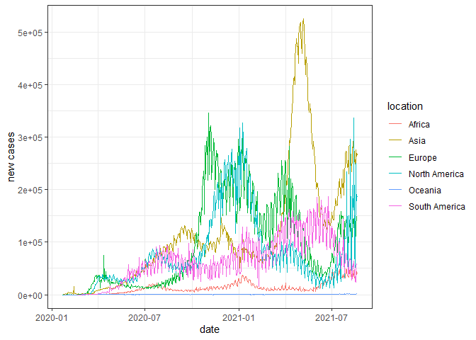<!-- -->

``` r
df$new_cases_smoothed_log=log(df$new_cases_smoothed)
myfun(df, "new_cases_smoothed_log")
```

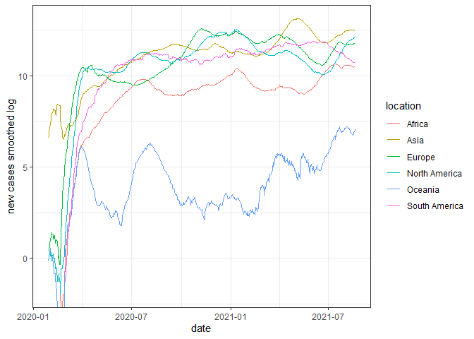<!-- -->

``` r
df$new_deaths_smoothed_log=log(df$new_deaths_smoothed)
myfun(df, "new_deaths_smoothed_log")
```

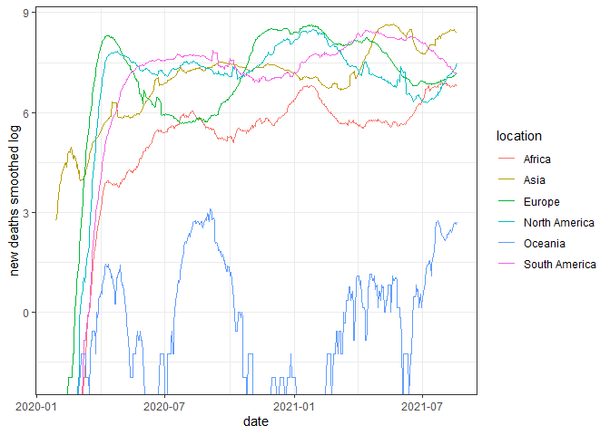<!-- -->

``` r
df$new_vaccinations_smoothed_log=log(df$new_vaccinations_smoothed)
myfun(df, "new_vaccinations_smoothed_log")
```

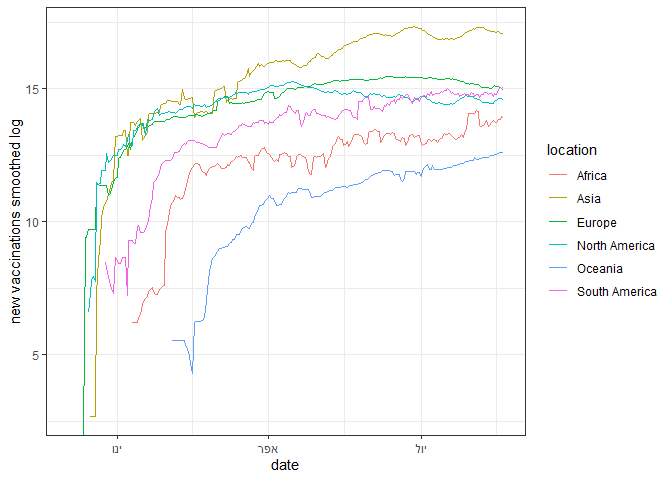<!-- --> Obviously it
is much easier to interpret the smoothed data graph than the
not-smoothed, because the log function makes the data clearer and
normalized, and the smoothed function on the data values makes it more
informative as it become more continuous, so you can see clearly the
trend for each continent.

4a. Writing a function that recieves as input the data-frame and a
column to complete, and computes for each continent the corresponding
values.

At first, we filtered the dataframe so it’ll include only country level
data. Then we created a vector of the continents, and for each continent
we created subdataframe with rows corresponded with the current
continent. We turned the Na values to 0 so they won’t influence the
results. Finally we aggregated the sum of values of the input column by
date, and joined all the subdataframes for each continent into one
dataframe.

``` r
myfun2 = function(dat_frame2,name2){
  data_frame2<-dat_frame2%>%filter((continent!="") & (location != "World"))
  continents=c("Africa","Asia","Europe","North America","Oceania","South America")
  contidata=data.frame()
  contitemp=data.frame()
  for(i in c(continents)){
    contitemp= filter(data_frame2, continent== all_of(i))
    sub=contitemp[c("date",all_of(name2))]
    sub[is.na(sub)]=0
    colnames(sub)=c("date","x")
    aggtemp=aggregate(sub$x, by=list(sub$date), sum)
    aggtemp$continent=i
    contidata=rbind(contidata,aggtemp)}
colnames(contidata)=c("date",all_of(name2),"continent")
return(contidata)}
```

4b.Applying the function from a. to fill the `new_tests_smoothed` column
for the continents, and plotting the *log* of the *smoothed* number per
continent vs. date using the function from qu. 3.

``` r
datab =myfun2(df,"new_tests_smoothed")

datab=filter(datab,new_tests_smoothed>0)
datab$log_new_tests_smoothed=log(datab$new_tests_smoothed)
datab$location=datab$continent
datab$continent=""
myfun(datab,"log_new_tests_smoothed")
```

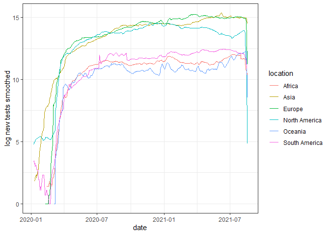<!-- --> Note that
when applying both functions on our dataframe and the
new\_tests\_smoothed column, we get a vericle line in the ggplot on the
last few dates (this is the reason we omitted the last day from the
plot, to minimize this anomaly). This happened because the number of new
tests decreased drastically in the last couple of days with the big
dicline in corona cases.

5a. Creating a new data-frame with one row per country, that for each
countrie will store as columns the current `total_cases_per_million` and
`total_deaths_per_million`, in addition to the country name
(`location`), and creating a scatter plot on this data.

The data frame

``` r
dat1 <- aggregate(total_deaths_per_million~location,df,FUN = max)
dat2 <- aggregate(total_cases_per_million~location,df,FUN = max)
sub.data.7 <- full_join(dat1,dat2,by = "location")
```

The scatter plot

``` r
cleandat = na.omit(sub.data.7)
options(scipen = 100)
plot(cleandat$total_cases_per_million, cleandat$total_deaths_per_million, main="number of deaths per million as a function of the number of cases per million",
   xlab="total cases per million ", ylab="total deaths per million ", pch=19)
abline(lm(cleandat$total_deaths_per_million~cleandat$total_cases_per_million), col="red")
```

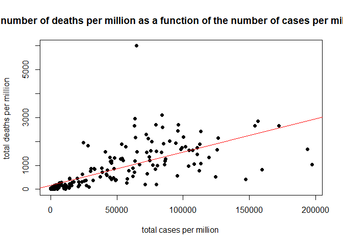<!-- -->

``` r
reg=lm(cleandat$total_deaths_per_million~cleandat$total_cases_per_million)
summary(reg)
```

    ## 
    ## Call:
    ## lm(formula = cleandat$total_deaths_per_million ~ cleandat$total_cases_per_million)
    ## 
    ## Residuals:
    ##     Min      1Q  Median      3Q     Max 
    ## -1873.7  -180.0  -143.3   149.6  4935.1 
    ## 
    ## Coefficients:
    ##                                    Estimate Std. Error t value
    ## (Intercept)                      159.636705  64.583569   2.472
    ## cleandat$total_cases_per_million   0.013902   0.001048  13.262
    ##                                             Pr(>|t|)    
    ## (Intercept)                                   0.0143 *  
    ## cleandat$total_cases_per_million <0.0000000000000002 ***
    ## ---
    ## Signif. codes:  0 '***' 0.001 '**' 0.01 '*' 0.05 '.' 0.1 ' ' 1
    ## 
    ## Residual standard error: 641.7 on 189 degrees of freedom
    ## Multiple R-squared:  0.482,  Adjusted R-squared:  0.4793 
    ## F-statistic: 175.9 on 1 and 189 DF,  p-value: < 0.00000000000000022

From The plot we can conclude that there is a positive correlation
between the total cases per million and the total deaths per million for
an arbitrary country. The slope is equal to 0.014, which means that for
every case of the virus, there will be 0.014 death. In other words, for
every 1000 cases, there will be approximately 13.902 death cases. Note
that the intercept we got from the regression summary is around 159.637,
which doesn’t seem possible, as it represents the number of total deaths
per million for zero total cases per million.

5b. Finding for each country the date at which the number of new `cases`
was maximal, and the date at which the number of new `deaths` was
maximal, and creating a scatter plot.

``` r
max.cases <-  df %>% filter(!(continent == '') & !is.na(new_cases)) %>% select(location, date, new_cases) %>% group_by(location) %>% top_n(1,new_cases ) %>% top_n(1,date)  
names(max.cases)[names(max.cases) == "date"] <- "date_of_max_cases"
max.deaths <-  df %>% filter(!(continent == '') & !is.na(new_deaths)) %>% select(location, date, new_deaths) %>% group_by(location) %>% top_n(1,new_deaths) %>% top_n(1,date) 
names(max.deaths)[names(max.deaths) == "date"] <- "date_of_max_deaths"
sub.data.7 <-  full_join(sub.data.7,max.cases,by = "location")
sub.data.7 <- na.omit(sub.data.7)
sub.data.7 <-  full_join(sub.data.7,max.deaths,by = "location")
sub.data.7=select(sub.data.7, c(location,total_deaths_per_million,total_cases_per_million,date_of_max_cases,new_cases,date_of_max_deaths,new_deaths))
```

a linear regression

``` r
reg <- lm(as.matrix(date_of_max_deaths)~as.matrix(date_of_max_cases),data=sub.data.7)
summary(reg)
```

    ## 
    ## Call:
    ## lm(formula = as.matrix(date_of_max_deaths) ~ as.matrix(date_of_max_cases), 
    ##     data = sub.data.7)
    ## 
    ## Residuals:
    ##     Min      1Q  Median      3Q     Max 
    ## -383.06  -61.14   32.64   84.42  293.96 
    ## 
    ## Coefficients:
    ##                                Estimate Std. Error t value         Pr(>|t|)    
    ## (Intercept)                  8233.20511 1343.66931   6.127 0.00000000534662 ***
    ## as.matrix(date_of_max_cases)    0.55833    0.07181   7.775 0.00000000000053 ***
    ## ---
    ## Signif. codes:  0 '***' 0.001 '**' 0.01 '*' 0.05 '.' 0.1 ' ' 1
    ## 
    ## Residual standard error: 124.7 on 183 degrees of freedom
    ## Multiple R-squared:  0.2483, Adjusted R-squared:  0.2442 
    ## F-statistic: 60.45 on 1 and 183 DF,  p-value: 0.0000000000005299

a scatter plot with a linear regression line

``` r
options(scipen = 100)
ggplot(data = sub.data.7, mapping = aes(x = date_of_max_cases, y = date_of_max_deaths))+geom_point()+geom_smooth(method="lm", se=T)+ylab(gsub("_"," ","date_of_max_deaths"))+xlab(gsub("_"," ","date_of_max_cases"))
```

    ## `geom_smooth()` using formula 'y ~ x'

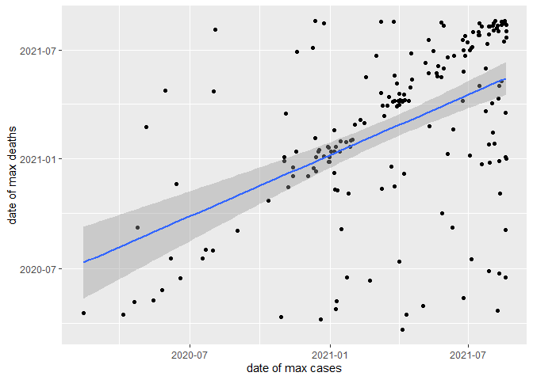<!-- -->

The slop of the graph represents the relation between the dates of max
new deaths and the dates of max new cases. If more dates of max new
deaths are equal to the dates of max new cases for each country
respectively, then the slope will be closer to 1, and according to the
regression summary it is equal to 0.558 According to the scatter plot it
doesn’t seem like the slope is close to 1, in addition the variance of
our observations is quite big,however it still looks like there is a
positive linear connection between the dates. its really make sense that
after a few weeks from the date with maximum new cases, it will be the
date with the maximum dates (As we will see in question 9). The x-axis
represents the dates of max new cases for each country, so in our
opinion the intercept represents the date of max new deaths for the
first country in our data frame.The intercept in our regression is equal
to 8233.205 , which is not very informative because the y axis
represents dates, and not numbers, whereas the regression interprets the
given dates as numeric.

6.  computing the world-wide number of `new_cases`, `new_deaths` and
    `new_vaccinations` by month. note that we have to aggregate all of
    the three columns using sum function, bacause those values are total
    values.

We changed the NA values to 0, because all of the NA data about the new
vaccinations means that there were no vaccinations yet, so the bar plot
created for the new vaccinations data is correct and logical.

The monthly dataframe

``` r
temp=data.frame(c(df$location),c(df$date),c(df$new_cases),c(df$new_deaths),c(df$new_vaccinations))
temp[is.na(temp)] <- 0
temp$c.df.new_cases.=as.numeric(temp$c.df.new_cases.)
temp$c.df.new_deaths.=as.numeric(temp$c.df.new_deaths.)
temp$c.df.new_vaccinations.=as.numeric(temp$c.df.new_vaccinations.)
short.date = strftime(temp$c.df.date., "%Y-%m")
aggr.stat1 = aggregate(temp$c.df.new_cases.~ short.date, FUN = sum)
aggr.stat2 = aggregate(temp$c.df.new_deaths.~ short.date, FUN = sum)
aggr.stat3 = aggregate(temp$c.df.new_vaccinations.~ short.date, FUN = sum)
monthly=data.frame(c(aggr.stat1),c(aggr.stat2[,2]),c(aggr.stat3[,2]))
colnames(monthly)=c("months","new_cases","new_deaths","new_vaccinations")
```

The barplots

``` r
# Fitting Labels
par(las=2) # make label text perpendicular to axis
par(mar=c(4,8,4,2)) # increase y-axis margin.
monthly.cases.plot <- barplot(monthly$new_cases, main = "new cases", xlab = "months", ylab = "number of cases",
        col = '#E94A4A', border="white", space=0.04, font.axis=2, 
        names.arg = c(as.character(monthly$months)), cex.axis = 0.55, cex.names = 0.55,las=2)

# Add text of the number of cases and a legend 
text(x=monthly.cases.plot,y=c(monthly$new_cases),label=c(monthly$new_cases), pos=3,cex=0.5, col="black")
```

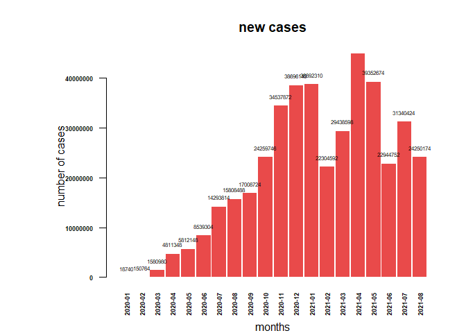<!-- -->

``` r
monthly.deaths.plot <- barplot(monthly$new_deaths, main = "new deaths", xlab = "months", ylab = "number of cases",
        col = '#F59158', border="white", space=0.04, font.axis=2, 
        names.arg = c(as.character(monthly$months)), cex.axis = 0.55, cex.names = 0.55,las=2)

# Add text of the number of cases and a legend 
text(x=monthly.cases.plot,y=c(monthly$new_deaths),label=c(monthly$new_deaths), pos=3, cex=0.5, col="black")
```

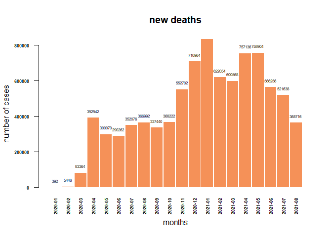<!-- -->

``` r
monthly.vaccinations.plot <- barplot(monthly$new_vaccinations, main = "new vaccinations", xlab = "months", ylab = "number of cases",
        col = '#F5c138', border="white", space=0.04, font.axis=2, 
        names.arg = c(as.character(monthly$months)), cex.axis = 0.55, cex.names = 0.55,las=2)

# Add text of the number of cases and a legend 
text(x=monthly.cases.plot,y=c(monthly$new_vaccinations),label=c(monthly$new_vaccinations), pos=3,cex=0.5, col="black")
```

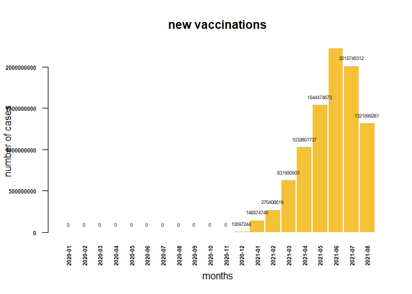<!-- -->

7.  making a histogram of the current death rates over all countries
    with 50 bins

creating the death rate

``` r
df <- mutate(df, death_rate = total_deaths / total_cases)
data <- df %>% drop_na(death_rate) %>% select(location, death_rate, date) %>% group_by(location) %>% top_n(1, date)
```

creating the histogram

``` r
hist(data$death_rate, breaks=50, main="death rate frequency",xlab = "death rate",col='#65BDED', border="white", font.axis=2)
```

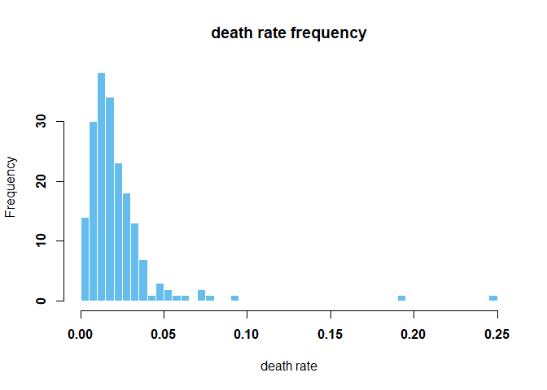<!-- -->

we can see that almost all of the death rates are under 5%.

Top 3 countries with highest death rate

``` r
top_3 <- head(data[order(data[2],decreasing = TRUE),],3) # Ordering by Value
rownames(top_3) <-NULL
top_3[1:2]
```

    ## # A tibble: 3 x 2
    ## # Groups:   location [3]
    ##   location death_rate
    ##   <chr>         <dbl>
    ## 1 Vanuatu      0.25  
    ## 2 Yemen        0.191 
    ## 3 Peru         0.0924

8.investigating whether different countries employ different vaccination
strategies

Create a new column as required by a function mutate.

``` r
df <-mutate(df, two_dose_fraction = people_fully_vaccinated / people_vaccinated)
```

Creating a sub-array in which only the countries of education are
included.

``` r
sub_data <- df %>% select(location, date, two_dose_fraction) %>% na.omit() %>% subset( location == "Israel" |location =='United Kingdom'|location =='United States')
```

Create a scatter plot for those countries.

``` r
ggplot(sub_data,aes_string(y='two_dose_fraction', col="location"),main="Rate of two vaccine doses by date")+ geom_line(aes(x=as.Date(date)), size=1)+ylab('two dose fraction')+xlab(NULL)+theme_bw()
```

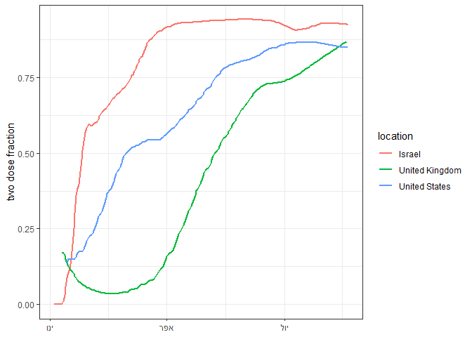<!-- -->

It can be seen that Israel used the two-dose vaccine method, as did the
United States, only that in Israel there was pressure and strong
publicity for vaccines. In the UK they started with two doses and then
switched to one dose for a while and thought it was more effective after
a while they switched again to two doses of vaccine (probably was not so
effective). And what explains the sharp rise is that there are an amount
of people who have been vaccinated once, now only the second vaccine
remains.

9.studying the time delay between the diagnosis of Covid-19 and the
death from Covid-19 for cases not surviving the disease.

1.  creating function that recieves as input the data-frame, a country
    name and the name of two columns, and computes the value of their
    cross-correlation in this country for time delay of up to two months
    apart, that is for all values of *Δ*<sub>*t*</sub> between  − 60
    days and 60 days.

``` r
cross_correlation <- function(data_frame,country,column1,column2){
  required.location <- filter(data_frame,location == country)
  X <- required.location[[column1]]
  Y <- required.location[[column2]]
  min_date <- min(required.location$date)
  max_date <- max(required.location$date)
  negative <- seq(60,0,-1)
  Positive <- seq(1:60)
  cross_correlation=c()
  for (i in negative){
    delta_t_y <- seq(min_date,max_date-i,by="days")
    delta_t_x <- seq(min_date+i,max_date,by="days")
    y_t <- required.location %>% filter(date %in% delta_t_y) %>% select(column2)
    x_t <- required.location %>% filter(date %in% delta_t_x) %>% select(column1)
    cross_correlation=c(cross_correlation, cor(y_t, x_t,use="complete.obs"))}
  for (i in Positive){
    delta_t_x <- seq(min_date, max_date-i, by="days")
    delta_t_y <- seq(min_date+i, max_date, by="days")
    x_t <- required.location %>% filter(date %in% delta_t_x) %>% select(column1)
    y_t <- required.location %>% filter(date %in% delta_t_y) %>% select(column2)
    cross_correlation = c(cross_correlation, cor(x_t,y_t, use="complete.obs"))}
  return(cross_correlation)}
```

2.  Computing the cross correlation between the number of `new_cases`
    and `new_deaths` for *Canada*, and plot it as a function of
    *Δ*<sub>*t*</sub>.

running the function.

``` r
candada.cross.correlation <- cross_correlation(df,"Canada","new_cases","new_deaths")
```

    ## Note: Using an external vector in selections is ambiguous.
    ## i Use `all_of(column2)` instead of `column2` to silence this message.
    ## i See <https://tidyselect.r-lib.org/reference/faq-external-vector.html>.
    ## This message is displayed once per session.

    ## Note: Using an external vector in selections is ambiguous.
    ## i Use `all_of(column1)` instead of `column1` to silence this message.
    ## i See <https://tidyselect.r-lib.org/reference/faq-external-vector.html>.
    ## This message is displayed once per session.

``` r
time_delay <- seq(-60,60,1)
p <- plot(time_delay, candada.cross.correlation, main= 'cross correlation between the new cases and new deaths for Canada', cex=.9, col='#0078FF', xlab='time delay', ylab='cross correlation of candada.')
```

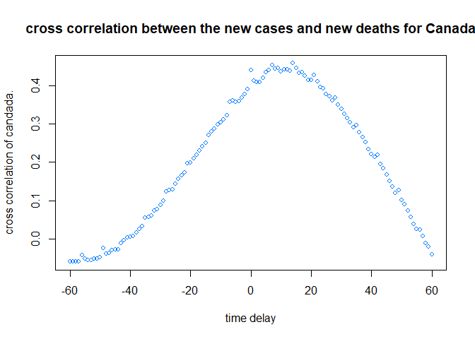<!-- -->

``` r
par(new=TRUE)
time_delay[which.max(candada.cross.correlation)]
```

    ## [1] 14

We can see according to the graph that the peak appears around the 14
day. The meaning of this fact, is that if someone gets infected by the
virus on a specific date, then he would likely die approximately 14 days
afterwards in canada. In other words, the peak in the graph represents
the approximated number of days between the infection day and the death
day for the same person.

10.examining if the data shows evidence for the effectiveness of the
vaccines in reducing the number of Covid-19 cases.

``` r
maximal.cases <-  aggregate(new_cases_smoothed~location,df,FUN = max) # In order for me to get the maximum as required.
current.cases <- df %>% filter(date == '2021-04-23') %>% select(location,new_cases_smoothed) # In order for me to get the data according to the mine date.
vaccinations.cases <- df %>% filter(date == '2021-04-1') %>% select(location,total_vaccinations_per_hundred) # In order for me to get the data according to the mine date.
colnames(maximal.cases)[colnames(maximal.cases) == 'new_cases_smoothed'] <- 'maximal_cases_smoothed' # Update a column name.
colnames(current.cases)[colnames(current.cases) == 'new_cases_smoothed'] <- 'current_cases_smoothed' # Update a column name.
#Consolidation of columns in order to get as required.
sub.data <- full_join(current.cases,maximal.cases,by = "location")
sub.data <- mutate(sub.data, ratio_between_current_maximal = current_cases_smoothed/maximal_cases_smoothed)
sub.data <- full_join(sub.data,vaccinations.cases,by = "location")
```

In order for me to highlight those countries as required.

``` r
outliers <- sub.data %>%  subset( location == "Israel" |location =='United Kingdom')
```

Create a scatter plot for those countries with outlines Israel and
United Kingdom

``` r
with(sub.data, plot(x=total_vaccinations_per_hundred, y=log(ratio_between_current_maximal), main='comparing the vaccination rate and the ratio rate', cex=.9, col='#0078FF', xlab='total vaccinations per hundred', ylab='log ratio between current dna maximal rate'))
par(new=TRUE)
with(outliers, points(total_vaccinations_per_hundred, log(ratio_between_current_maximal), cex=.9, col='red'))
with(outliers, text(log(ratio_between_current_maximal)~total_vaccinations_per_hundred, labels=location, cex=0.7, pos=2, col='red'))
```

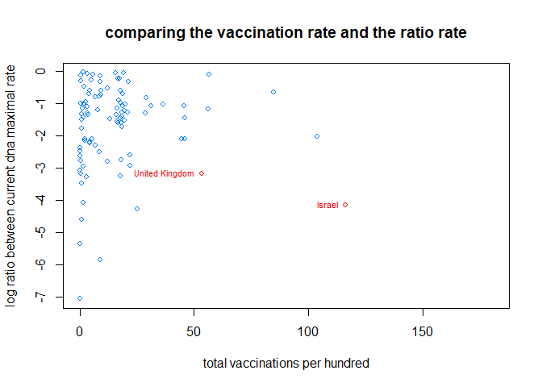<!-- -->

We expect there to be a high correlation between the ratio and the
amount of strains. The greater the amount of vaccines, the lower the
ratio. We see that the countries of Israel and the United Kingdom that
used the two-dose vaccine as can be seen in question 8, then the rate of
decrease in the ratio is significant. There are countries whose
vaccination rate is low and at the same time the rate is also low, this
can be explained by other reduction methods such as curfews (but which
have really moved and not like in Israel). There are countries where the
vaccination rate is large but the decrease is relatively low. This can
be attributed to the use of one dose or of vaccines by other companies,
in which the percentage of vaccination is lower than in companies used
in Israel and England.
