lab 1
================
Menachem Sokolik
14 4 2021

``` r
setwd(dirname(rstudioapi::getActiveDocumentContext()$path))

knitr::opts_chunk$set(warning=FALSE)
```

## LAB 1

#### 1.import the data set and attach the dataset to R.

``` r
data <-read.csv("CAhousing.csv")
attach(data)
```

#### 2 a. getting to know the data and the size of the data set

``` r
rowsandcols = dim(data)
print(rowsandcols)
```

    ## [1] 20640     9

the number of rows is 20640 and the number of columns is 9

#### b. Print summary statistic

``` r
summary(data)
```

    ##    longitude         latitude     housingMedianAge   totalRooms   
    ##  Min.   :-124.3   Min.   :32.54   Min.   : 1.00    Min.   :    2  
    ##  1st Qu.:-121.8   1st Qu.:33.93   1st Qu.:18.00    1st Qu.: 1448  
    ##  Median :-118.5   Median :34.26   Median :29.00    Median : 2127  
    ##  Mean   :-119.6   Mean   :35.63   Mean   :28.64    Mean   : 2636  
    ##  3rd Qu.:-118.0   3rd Qu.:37.71   3rd Qu.:37.00    3rd Qu.: 3148  
    ##  Max.   :-114.3   Max.   :41.95   Max.   :52.00    Max.   :39320  
    ##  totalBedrooms      population      households      medianIncome    
    ##  Min.   :   1.0   Min.   :    3   Min.   :   1.0   Min.   : 0.4999  
    ##  1st Qu.: 295.0   1st Qu.:  787   1st Qu.: 280.0   1st Qu.: 2.5634  
    ##  Median : 435.0   Median : 1166   Median : 409.0   Median : 3.5348  
    ##  Mean   : 537.9   Mean   : 1425   Mean   : 499.5   Mean   : 3.8707  
    ##  3rd Qu.: 647.0   3rd Qu.: 1725   3rd Qu.: 605.0   3rd Qu.: 4.7432  
    ##  Max.   :6445.0   Max.   :35682   Max.   :6082.0   Max.   :15.0001  
    ##  medianHouseValue
    ##  Min.   : 14999  
    ##  1st Qu.:119600  
    ##  Median :179700  
    ##  Mean   :206856  
    ##  3rd Qu.:264725  
    ##  Max.   :500001

#### c-d. Learn about the variables from and Print correlation matrix. Which variables are correlated?

``` r
cor(data)
```

    ##                    longitude    latitude housingMedianAge  totalRooms
    ## longitude         1.00000000 -0.92466443      -0.10819681  0.04456798
    ## latitude         -0.92466443  1.00000000       0.01117267 -0.03609960
    ## housingMedianAge -0.10819681  0.01117267       1.00000000 -0.36126220
    ## totalRooms        0.04456798 -0.03609960      -0.36126220  1.00000000
    ## totalBedrooms     0.06837753 -0.06631840      -0.32048471  0.92989335
    ## population        0.09977322 -0.10878475      -0.29624424  0.85712597
    ## households        0.05531009 -0.07103543      -0.30291601  0.91848449
    ## medianIncome     -0.01517587 -0.07980913      -0.11903399  0.19804965
    ## medianHouseValue -0.04596662 -0.14416028       0.10562341  0.13415311
    ##                  totalBedrooms   population  households medianIncome
    ## longitude          0.068377531  0.099773223  0.05531009 -0.015175865
    ## latitude          -0.066318400 -0.108784747 -0.07103543 -0.079809127
    ## housingMedianAge  -0.320484707 -0.296244240 -0.30291601 -0.119033990
    ## totalRooms         0.929893348  0.857125973  0.91848449  0.198049645
    ## totalBedrooms      1.000000000  0.878025580  0.97982896 -0.008093258
    ## population         0.878025580  1.000000000  0.90722227  0.004834346
    ## households         0.979828961  0.907222266  1.00000000  0.013033052
    ## medianIncome      -0.008093258  0.004834346  0.01303305  1.000000000
    ## medianHouseValue   0.050593789 -0.024649679  0.06584265  0.688075208
    ##                  medianHouseValue
    ## longitude             -0.04596662
    ## latitude              -0.14416028
    ## housingMedianAge       0.10562341
    ## totalRooms             0.13415311
    ## totalBedrooms          0.05059379
    ## population            -0.02464968
    ## households             0.06584265
    ## medianIncome           0.68807521
    ## medianHouseValue       1.00000000

``` r
corrplot(cor(data), method="number")
```

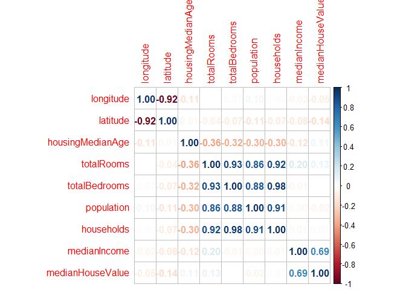<!-- --> We can now
identify by the correlation matrix where there is correlation between
the variables and at what intensity. When the clarity of the numbers
indicates the intensity of the correlation in the diagram. most of the
paired variables are correlated, except for:
latitude-housingMedianAge,medianIncome-longitude,
totalBedrooms-medianIncome,population-medianIncome,households-medianincome
those pairs of variables have a very small coefficient (in absolute
value) which means the correlation between them is not clear. We can see
that the households,population and totalbedrooms are strongly related
with each other.Also the medianHouseValue and medianIncome are strongly
related, while lattitude and longitude are strongly negatively related.
(if the corr coeficient is high and negative - then the variables are
strongly negative correlated, and if the corr coefficient is high and
positive - the variables are strongly positive correlated)

#### 3.We want to predict median house prices in a block by the median of income in the block:

#### a. What can we learn about the relationship between the variables?

``` r
library(ggplot2)
ggplot(,aes(y=medianHouseValue, x=medianIncome))+
  geom_point()
```

<!-- -->

we can see that there’s a linear relation between the variables. the
median house value rises with the median income, they are positively
strongly correlated. However, we can notice that for all the values of
median incomes, there are many observation at the top of the graph -
which means that the median house values of them is very high. Maybe it
happened because of some limit on the median house value. Those
observations probably lowers the correlation between the variables and
creats some bias. \#\#\#\# b. simple linear regression.

``` r
fit <- lm(medianHouseValue~medianIncome)
```

#### c. summary of regression

``` r
summary(fit) 
```

    ## 
    ## Call:
    ## lm(formula = medianHouseValue ~ medianIncome)
    ## 
    ## Residuals:
    ##     Min      1Q  Median      3Q     Max 
    ## -540697  -55950  -16979   36978  434023 
    ## 
    ## Coefficients:
    ##              Estimate Std. Error t value Pr(>|t|)    
    ## (Intercept)   45085.6     1322.9   34.08   <2e-16 ***
    ## medianIncome  41793.8      306.8  136.22   <2e-16 ***
    ## ---
    ## Signif. codes:  0 '***' 0.001 '**' 0.01 '*' 0.05 '.' 0.1 ' ' 1
    ## 
    ## Residual standard error: 83740 on 20638 degrees of freedom
    ## Multiple R-squared:  0.4734, Adjusted R-squared:  0.4734 
    ## F-statistic: 1.856e+04 on 1 and 20638 DF,  p-value: < 2.2e-16

the coef of median income is 41793.8, which means that for every rise of
10000 dollars in the income, we expect a rise of 41793.8 rise in the
value of the house.

#### d.Print diagnostic plots of regression results

``` r
plot(fit)
```

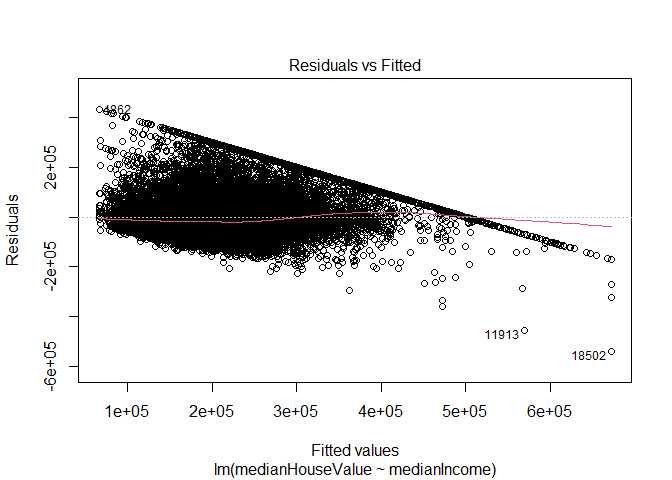<!-- -->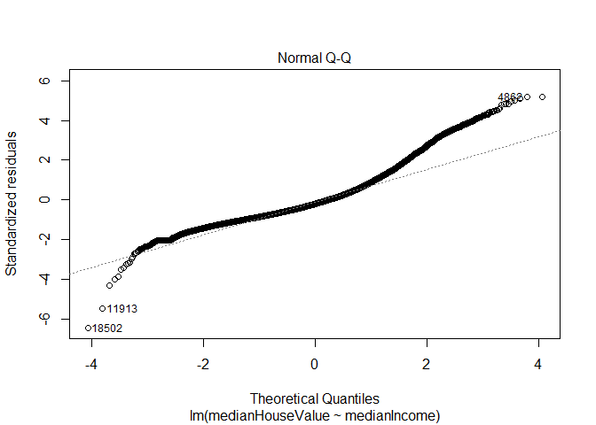<!-- -->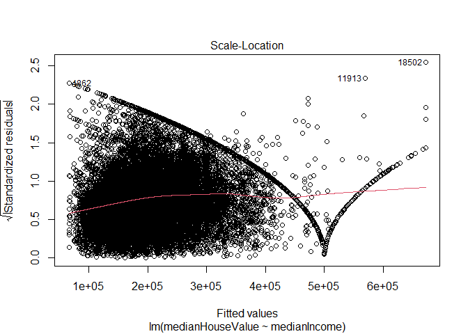<!-- -->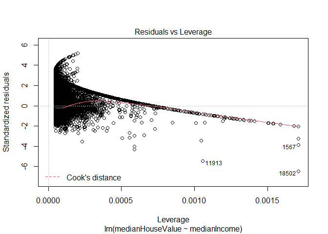<!-- -->
\#\#\#\# e. Extract predicted values. (Hint: use $ syntax similar to
extracting a variable from a database).

``` r
pred <- fit$fitted.values
```

#### f. Plot scatter plot of median income and median house value, then plot regression line.

``` r
ggplot(, aes(x = medianIncome, y = medianHouseValue)) + 
  geom_point() +
  geom_smooth(method = "lm", se = FALSE)
```

    ## `geom_smooth()` using formula 'y ~ x'

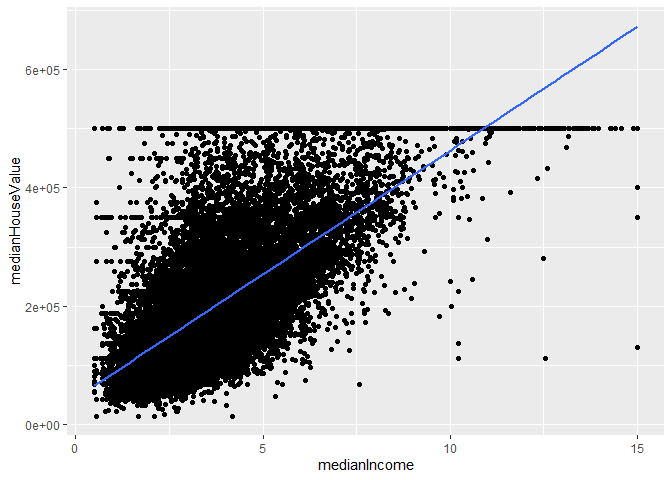<!-- --> \#\#\#
Revisit regression \#\#\#\# 4.a returning to the graph in 3.a.

``` r
ggplot(,aes(y=medianHouseValue, x=medianIncome))+
  geom_point()
```

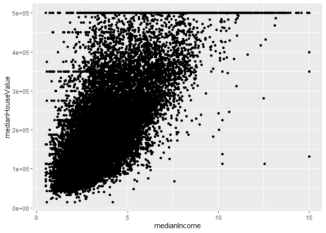<!-- --> the histogram

``` r
hist(medianHouseValue,breaks=100)
```

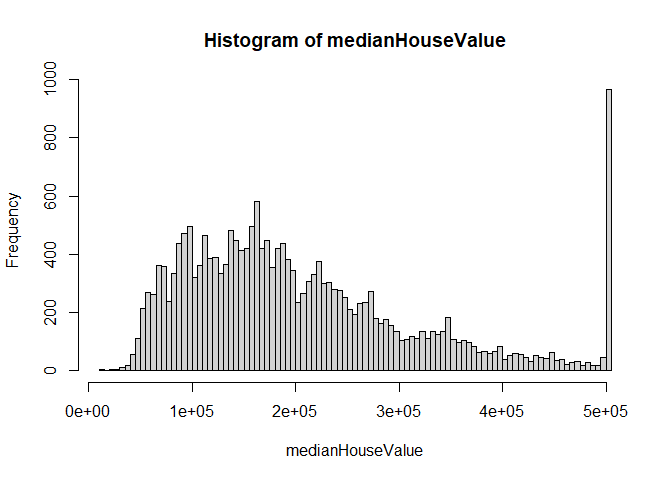<!-- --> You can tell
that there are anomalies in the data. From both charts you can notice
that there are many houses with high median house value. It may be a
data mistake, or some limit of the maximum possible value. We can
understand that this column of extremely high values of medianHouseValue
is the upper line we saw in the plot between the median income and the
median house value above. (The line is all the observations in the top
of the graph, it looks like a line)

#### 4.b Fit a full regression model

``` r
fit_all <- lm(medianHouseValue~. , data=data)
summary(fit_all)
```

    ## 
    ## Call:
    ## lm(formula = medianHouseValue ~ ., data = data)
    ## 
    ## Residuals:
    ##     Min      1Q  Median      3Q     Max 
    ## -563013  -43592  -11327   30307  803996 
    ## 
    ## Coefficients:
    ##                    Estimate Std. Error t value Pr(>|t|)    
    ## (Intercept)      -3.594e+06  6.254e+04 -57.468  < 2e-16 ***
    ## longitude        -4.282e+04  7.130e+02 -60.061  < 2e-16 ***
    ## latitude         -4.258e+04  6.733e+02 -63.240  < 2e-16 ***
    ## housingMedianAge  1.156e+03  4.317e+01  26.787  < 2e-16 ***
    ## totalRooms       -8.182e+00  7.881e-01 -10.381  < 2e-16 ***
    ## totalBedrooms     1.134e+02  6.902e+00  16.432  < 2e-16 ***
    ## population       -3.854e+01  1.079e+00 -35.716  < 2e-16 ***
    ## households        4.831e+01  7.515e+00   6.429 1.32e-10 ***
    ## medianIncome      4.025e+04  3.351e+02 120.123  < 2e-16 ***
    ## ---
    ## Signif. codes:  0 '***' 0.001 '**' 0.01 '*' 0.05 '.' 0.1 ' ' 1
    ## 
    ## Residual standard error: 69530 on 20631 degrees of freedom
    ## Multiple R-squared:  0.6371, Adjusted R-squared:  0.637 
    ## F-statistic:  4528 on 8 and 20631 DF,  p-value: < 2.2e-16

#### 4.c is the fit too good to be true? Look back at the correlation matrix. Should we omit some variables? Which ones?

We can see that all of the variables have a very strong relation to the
median house value, which seems unlikely to be true.. But we also learn
from the correlation matrix, that there was a very high correlation
between the rest of the variables and the median income. That means that
all those variables are related and correlated, so there is no good
reason to add them to the complex regression. The only variables we must
use in the complex regression are: median income, lattitude and total
rooms, as all the other variables will be highly correlated with the
three mentioned (so if we added all of the variables to the regression,
there would probably be a multiculiniarity).

## LAB 2 - KNN Analysis

#### 2.1. import the libraries

``` r
library(ISLR)
library(class)
```

#### 2.2. the data

``` r
dat = Default
```

#### 2.3.a. size of dataset

``` r
dsize = dim(dat)
dsize
```

    ## [1] 10000     4

There are 10000 rows and 4 columns.

#### 2.3.b. Print summary statistics. Are there any anomalies? Are the variables centered around 0?

``` r
summary(dat)
```

    ##  default    student       balance           income     
    ##  No :9667   No :7056   Min.   :   0.0   Min.   :  772  
    ##  Yes: 333   Yes:2944   1st Qu.: 481.7   1st Qu.:21340  
    ##                        Median : 823.6   Median :34553  
    ##                        Mean   : 835.4   Mean   :33517  
    ##                        3rd Qu.:1166.3   3rd Qu.:43808  
    ##                        Max.   :2654.3   Max.   :73554

#### finding the anomalies

#### a simple histogram of balance frequency and a scatter plot of balance-income:

``` r
plot(dat[c("income","balance")])
```

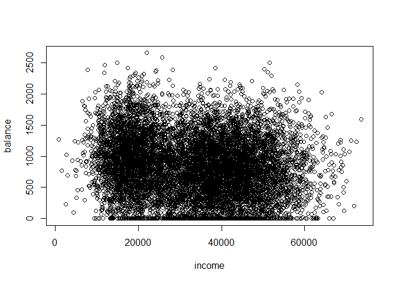<!-- -->

``` r
hist(dat$balance,xlab="balance")
```

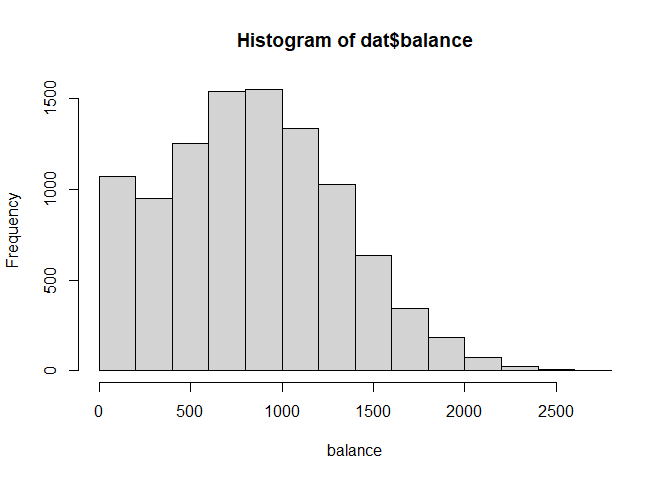<!-- --> It seems from
the hystogram that the frequency of balance around 0 is higher than we
expected, perhaps that happened because this variable can’t be negative,
so all the negative observations were made into 0. After taking this
into account, the hystogram reminds of a normal distribution with an
anomaly. We can see this anomaly in the scatter plot too, because there
is a big number of observations near the x-axis. However, we can’t say
that the values are centered around 0, but all of the values are
positive and centered from the right side of 0.

#### 2.3.c. learning about the variables.

``` r
(help(Default))
```

    ## starting httpd help server ... done

#### 2.3.d. SD of balance and of income.

``` r
sd(dat$balance)
```

    ## [1] 483.715

``` r
sd(dat$income)
```

    ## [1] 13336.64

The default data isn’t standardized, we can learn it from the standard
deviation of the variables above, both of them are way bigger than 1. If
we would like to standardize them, perhaps we should make a linear
transformation on the variables.

#### 2.4.a.

``` r
Subset_data <- dat[c("balance","income","default")]
```

#### 2.4.b. Normalize the numeric predictor variables using scale().

``` r
Subset_data$balance <- as.vector(scale(Subset_data$balance))
Subset_data$income <- as.vector(scale(Subset_data$incom))
```

#### 2.4.c. Split data into train and test set (remember, we need a train and test set with predictors only, and another train and test set with only the variable we want to predict)

``` r
set.seed(123)
index <- sample(x=1:nrow(dat), size=.3*nrow(dat))
test <- Subset_data[index,]
train <- Subset_data[-index,]
test_pred <- test[c("balance","income")] #predictors only
train_pred <- train[c("balance","income")] #predictors only
test_default <- test$default #true test classification
train_default <- train$default #true train classification
```

#### 2.4.d. Run K-nearest neighbors with 1, 5, 20, and 70 k’s (define each one as a different object).

#### Data Cleaning

``` r
Subset_data <- dat[c("balance","income","default")]
```

#### Data Normalization

``` r
Subset_data$balance <- scale(Subset_data$balance)
Subset_data$income <- scale(Subset_data$income)
```

#### Data Slicing

``` r
set.seed(123)
dat.d <- sample(1:nrow(Subset_data),size=nrow(Subset_data)*0.7,replace = FALSE) #random selection of 70% data.
train <- Subset_data[dat.d,] # 70% training data
test <- Subset_data[-dat.d,] # remaining 30% test data
test_pred <- test[c("balance","income")] #predictors only
train_pred <- train[c("balance","income")] #predictors only
test_default <- test$default #true test classification
train_default <- train$default #true train classification
```

#### Building a Machine Learning model

``` r
i=1
k.optm=1
for (i in c(1,5,20,70)){
  knn.mod <- knn(train = train_pred, test=test_pred, cl = train_default,  k = i)
  k.optm[i] <- 100 * sum(test_default == knn.mod)/NROW(test_default)
  k=i
  cat(k,'=',k.optm[i],'')
  print(table(knn.mod, test_default))
  print(prop.table(table(knn.mod, test_default),2)) #percentages
  print(paste("with",paste(i,paste('neighbors the accuracy is: ',paste0(k.optm[i],"%")))))
}
```

    ## 1 = 95.36667        test_default
    ## knn.mod   No  Yes
    ##     No  2830   69
    ##     Yes   70   31
    ##        test_default
    ## knn.mod         No        Yes
    ##     No  0.97586207 0.69000000
    ##     Yes 0.02413793 0.31000000
    ## [1] "with 1 neighbors the accuracy is:  95.3666666666667%"
    ## 5 = 97        test_default
    ## knn.mod   No  Yes
    ##     No  2878   68
    ##     Yes   22   32
    ##        test_default
    ## knn.mod          No         Yes
    ##     No  0.992413793 0.680000000
    ##     Yes 0.007586207 0.320000000
    ## [1] "with 5 neighbors the accuracy is:  97%"
    ## 20 = 97.13333        test_default
    ## knn.mod   No  Yes
    ##     No  2888   74
    ##     Yes   12   26
    ##        test_default
    ## knn.mod          No         Yes
    ##     No  0.995862069 0.740000000
    ##     Yes 0.004137931 0.260000000
    ## [1] "with 20 neighbors the accuracy is:  97.1333333333333%"
    ## 70 = 97        test_default
    ## knn.mod   No  Yes
    ##     No  2893   83
    ##     Yes    7   17
    ##        test_default
    ## knn.mod          No         Yes
    ##     No  0.997586207 0.830000000
    ##     Yes 0.002413793 0.170000000
    ## [1] "with 70 neighbors the accuracy is:  97%"

#### Accuracy plot

``` r
plot(k.optm, type="b", xlab="K- Value",ylab="Accuracy level")
```

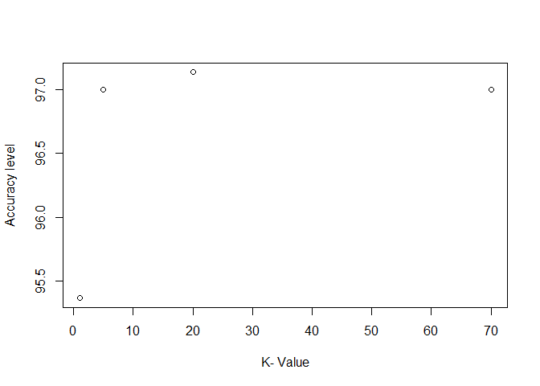<!-- --> We can see
from the results above, that for a different value of K we get a
different percentage of accuracy. It is important to mention, that as K
rises- the bias rises as well but the variance decreases, so we try to
find the “golden line” between both of those values, which the optimal K
will give us. But the optimal K depends also on the seed value we chose
at the beginning of the program, and on the division of the data to
training and test groups. If we change one of those parameters, the
value of our optimal K may change.

#### 2.5

``` r
summary(train_default)
```

    ##   No  Yes 
    ## 6767  233

``` r
prop.table(table(train_default))
```

    ## train_default
    ##         No        Yes 
    ## 0.96671429 0.03328571

``` r
for (i in 1:1){
  prob_train <- prop.table(table(train_default))
  prob_variable <- prop.table(table(Subset_data$default))
  print('*********************************')
  print('frequency table of training set')
  print(table(train_default))
  print('*********************************')
  print('proportion table of training set')
  print(prob_train)
  print('*********************************')
  print('frequency table  of main data')
  print(table(Subset_data$default))
  print('*********************************')
  print('proportion table main data')
  print(prob_variable)
  print('*********************************')
}
```

    ## [1] "*********************************"
    ## [1] "frequency table of training set"
    ## train_default
    ##   No  Yes 
    ## 6767  233 
    ## [1] "*********************************"
    ## [1] "proportion table of training set"
    ## train_default
    ##         No        Yes 
    ## 0.96671429 0.03328571 
    ## [1] "*********************************"
    ## [1] "frequency table  of main data"
    ## 
    ##   No  Yes 
    ## 9667  333 
    ## [1] "*********************************"
    ## [1] "proportion table main data"
    ## 
    ##     No    Yes 
    ## 0.9667 0.0333 
    ## [1] "*********************************"

It can be noticed that the percentage of negative observations in the
main data is 96.67%, so if we’ll guess that all the observations are
negative, then for sure we’ll be right in more than 95% of the cases.
The problem which our solution creates is that it depends on the data,
so there’ll be over-fitting, because we rely on the specifics of the
data. The solution is to find out more general features of the
observations to train our machine on them, in order to minimize the
over-fitting.

## LAB 3

#### Data Normalization

#### splitting the main data to train and test sets:

``` r
data <-read.csv("CAhousing.csv")
data<-data.frame(scale(data[c("medianHouseValue","medianIncome")]))
train <- sample_frac(data, 0.8)
sid <- as.numeric(rownames(train)) # because rownames() returns character
test <- data[-sid,]
```

#### Use the “ksmooth” function from the stats library in order to predict the median house value from CAhousing.csv, using only the best predictor variable.

``` r
kernel <- c("Gaussian","box")
train_Income <- train$medianIncome
train_HouseValue <- train$medianHouseValue
test_HouseValue <- test$medianHouseValue
pred_data <- data.frame(kernel = NA, h = NA, y_pred=NA,x_pred=NA)
testing_data <- data.frame(kernel = NA, h = NA, train_MSE = NA, test_MSE = NA)
for (k in kernel){
  for (h in c(1,3,5,20)){
    if (k=="Gaussian"){ pred<-ksmooth(train_Income,train_HouseValue,kernel = "normal",bandwidth = h )}
    if (k=="box"){pred <- ksmooth(train_Income,train_HouseValue,kernel="box",bandwidth = h)}
    train_MSE <-mean((train_HouseValue-pred$y)^2)
    test_MSE <- mean((test_HouseValue-pred$y)^2)
    pred_data<-rbind(data.frame(x_pred=pred$x,y_pred=pred$y,kernel=k,h=h),pred_data)
    data <- data.frame(kernel=k, h=h, train_MSE=train_MSE, test_MSE=test_MSE)
    testing_data <- rbind(testing_data,data)
  }
}
```

#### train MSE and test MSE Normaliz

``` r
testing_data <- na.omit(testing_data)
testing_data$train_MSE <- testing_data$train_MSE
testing_data$test_MSE <-testing_data$test_MSE
print(testing_data <- testing_data[order(testing_data$train_MSE),])
```

    ##     kernel  h train_MSE test_MSE
    ## 9      box 20  1.004430 1.122308
    ## 5 Gaussian 20  1.005837 1.123793
    ## 4 Gaussian  5  1.447581 1.545207
    ## 8      box  5  2.555304 2.564216
    ## 3 Gaussian  3  2.710214 2.709029
    ## 7      box  3  3.305732 3.245237
    ## 2 Gaussian  1  3.848867 3.768543
    ## 6      box  1  3.926685 3.849067

``` r
pred_data <- pred_data%>%filter(h %in% testing_data$h )
pred_data$x<-train_Income
pred_data$y<-train_HouseValue
ggplot(pred_data,aes(x=x ,y=y,col="data"))+
  geom_point(aes(alpha= 0.2, ), colour = 'Black')+
  geom_line(aes(x=x_pred,y=y_pred,col=as.factor(h)),size= 1)+
  facet_grid(~kernel)+
  xlab("Median Income")+ylab("Median House Val")+
  guides(fill=guide_legend(title="h-val"))
```

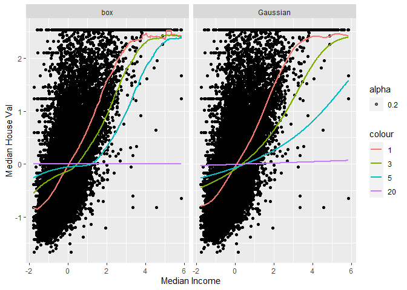<!-- -->

What can we learn from the graphs above? We can see that in both graphs,
with the rise of the value of h, the regression line gets closer to the
average value line of Median House Val - the average of the y - axis. In
the presentation it was written, that as the k value grows, the variance
rises as well, but the bias decreases (so this is probably the reason
the regression line gets closer to the avg meaning (after
normalization)). In addition, from the MSE chart above we learn that the
MSE of box method is bigger than the MSE of Gaussian method for every
value of h we chose. We would probably prefer the Gaussian method
because it lowers the value of MSE.. (The box method is based on uniform
distribution whereas the Gaussian is based on normal distribution - for
a given set of data and k value, the variance of uniform distribution is
larger than the variance of normal distribution.). On the other hand, we
can see that the regression line of Gaussian method “tries” to fit the
extreme values in the right upper corner more than the box plot method.
This is exactly the variance - bias trade off which we learned about in
the lecture. We can also notice some unwanted over - fitting in the box
plot when the value of h is 1 (in the upper right corner). In
conclusion, it is not very clear which method we should choose, because
every value of h and each method has its own benefits and disadvantages,
so it depends on our specific case. In our opinion the regression lines
in the box method fit better the majority of observation, so we would
choose it.
