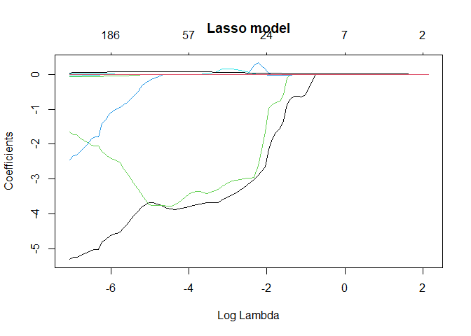
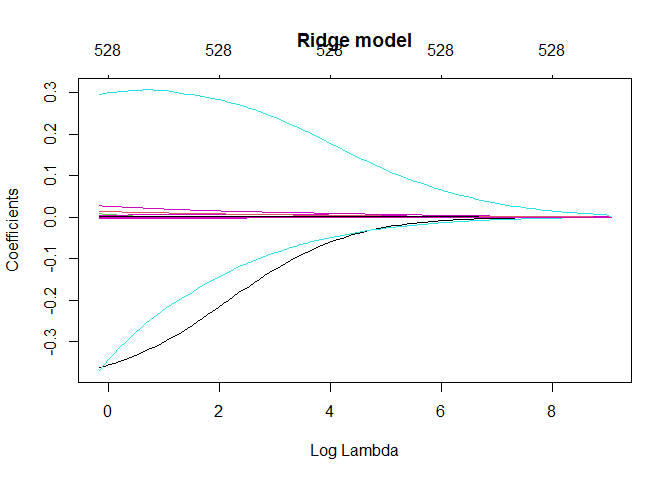
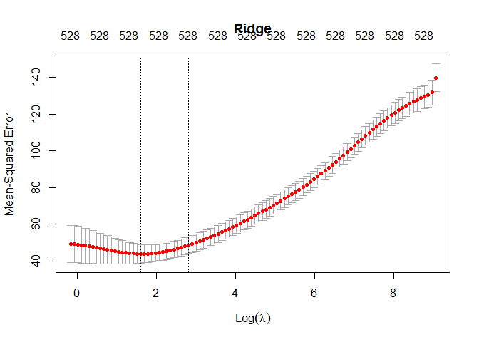
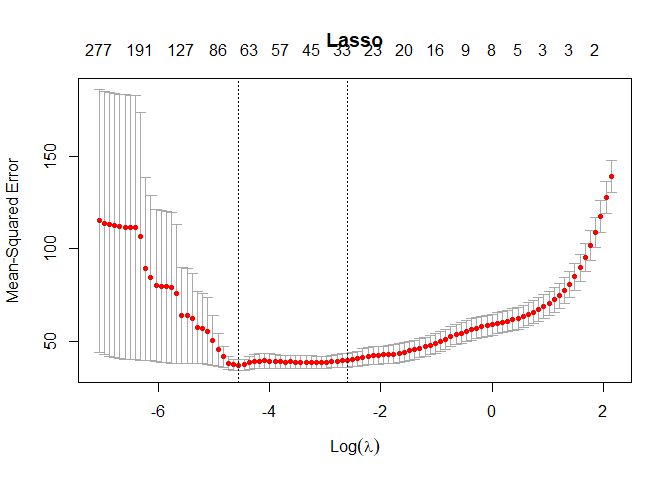
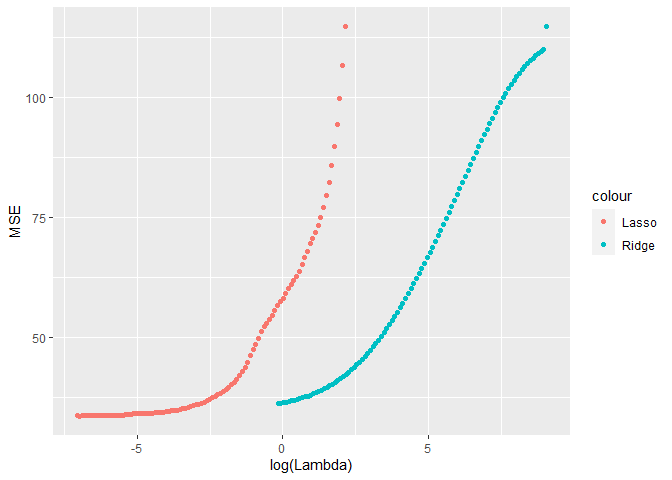
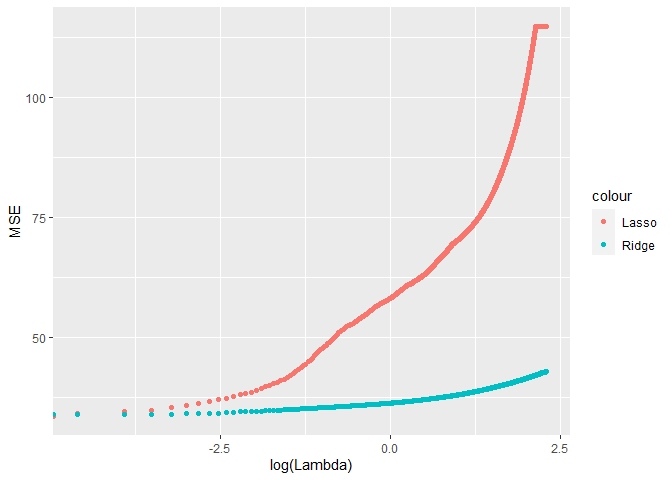
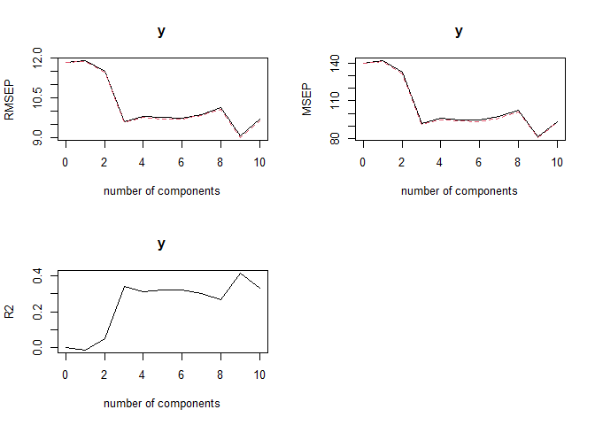
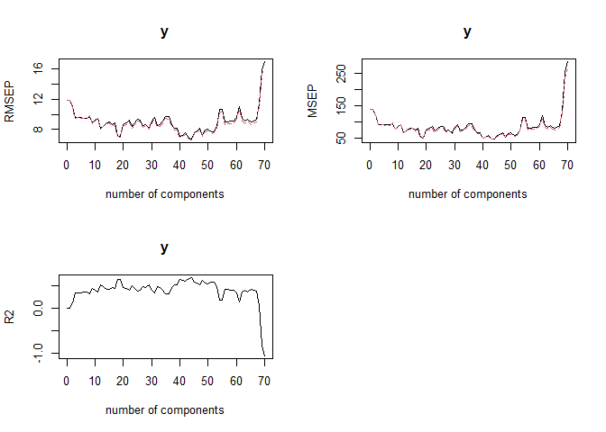

lab 2 ml
================
Menachem Sokolik and Valeria Lerman
25 5 2021

``` r
setwd(dirname(rstudioapi::getActiveDocumentContext()$path))

knitr::opts_chunk$set(warning=FALSE)
```

### mission 1,2

``` r
load("CA_samp.Rdata")
df <- data.frame(CA_samp)
# Center y, X will be standardized in the modelling function
```

After clarifying with the practitioner, I did not normalize data
following the question which is in the third part. \#\#\# mission 5

``` r
dim <- dim(df)
cat(paste0("In our data frame there are ", dim[1], paste0(" rows"), paste0(" and ", dim[2], paste0(" columns."))))
```

    ## In our data frame there are 1000 rows and 529 columns.

The least squares estimates often have low bias but large variance.
Prediction accuracy can sometimes be improved by shrinking or setting
some coefficients to zero. By doing so we sacrifice a little bit of bias
to reduce the variance of the predicted values, and hence may improve
the overall prediction accuracy.

### mission 6-Subset your data into train and test

``` r
set.seed(101) # Set Seed so that same sample can be reproduced in future also
# Now Selecting 80% of data as sample from total 'n' rows of the data  
sample <- sample.int(n = nrow(df), size = floor(.8*nrow(df)), replace = F)
train <- df[sample, ]
test  <- df[-sample, ]
```

### mission 7- Divide the response from the variables in the training and test sets

creating the train and test sets

``` r
p <- dim[2]
train_x <- train[, -p]
train_y <- train[, p]

test_x <- test[, -p]
test_y <- test[, p]
```

### mission 8a- Run Ridge and Lasso models

``` r
fit.ridge <- glmnet(train_x, train_y, family="gaussian", alpha=0, standardize = TRUE)
fit.lasso <- glmnet(train_x, train_y, family="gaussian", alpha=1, standardize = TRUE)
```

### mission 8b- Find which lambdas were used in the evaluation of each model

``` r
lambdas.ridge <- fit.ridge$lambda
lambdas.lasso <- fit.lasso$lambda

df.ridge <- fit.ridge$df
df.lasso <- fit.lasso$df
```

### mission 8c- how many non-zero coefficients were computed for each lambda

``` r
summary(df.ridge)
```

    ##    Min. 1st Qu.  Median    Mean 3rd Qu.    Max. 
    ##     528     528     528     528     528     528

``` r
summary(df.lasso)
```

    ##    Min. 1st Qu.  Median    Mean 3rd Qu.    Max. 
    ##    0.00    8.00   32.50   60.19   76.75  277.00

The zero coefficient of Ridge model is 528, but the lasso model has no
zero coefficient.

### mission 8d- Use plot(model, xvar=“lambda”) to view a plot of the coefficients as a function of lambda

``` r
plot(fit.lasso, xvar="lambda", main="Lasso model")
```

<!-- -->

``` r
plot(fit.ridge, xvar="lambda", main="Ridge model")
```

<!-- -->

### mision 9a-b - Run cv.glmnet() for cross-validation and choose the number of folds for the CV

for model ridge

``` r
# ridge regression assumes the predictors are standardized and the response is centered!
cv.fit.ridge <- cv.glmnet(as.matrix(train_x), as.matrix(train_y), alpha=0, standardize=TRUE, nfolds=5)
print(paste0("lambda that minimizes the cv error is (for ridge):", cv.fit.ridge$lambda.min))
```

    ## [1] "lambda that minimizes the cv error is (for ridge):4.99128850862523"

for model lasso

``` r
cv.fit.lasso <- cv.glmnet(as.matrix(train_x), as.matrix(train_y), alpha=1, standardize=TRUE, nfolds=5)
print(paste0("lambda that minimizes the cv error is (for lasso):", cv.fit.lasso$lambda.min))
```

    ## [1] "lambda that minimizes the cv error is (for lasso):0.0105061838609781"

### mision 9c

``` r
plot(cv.fit.ridge, main="Ridge")
```

<!-- -->

``` r
plot(cv.fit.lasso, main="Lasso")
```

<!-- -->

In the plot we can see for every lambda what rate of mean squared error.
In these line we get the lambda that minimizes the mean squared error
between in the range of one standard deviation.

### mision 9d

``` r
pred.lasso <- predict(cv.fit.lasso, newx= as.matrix(test_x), s=cv.fit.lasso$lambda.min)
pred.ridge <- predict(cv.fit.ridge, newx= as.matrix(test_x), s=cv.fit.ridge$lambda.min)
```

### mision 9e

``` r
# calculate MSE
MSE.lasso <- mean((pred.lasso - test_y)^2)
MSE.ridge <- mean((pred.ridge - test_y)^2)
MSE.ridge > MSE.lasso
```

    ## [1] TRUE

``` r
print(paste0("The MSE of model lasso is: ", MSE.lasso ,paste0(" and MSE of model Ridge is: ", MSE.ridge)))
```

    ## [1] "The MSE of model lasso is: 34.091545845995 and MSE of model Ridge is: 39.8242728958658"

Lasso regression does pretty much the same thing; it is another way to
limit the number of independent variables in the regression. The only
difference is, it uses the absolute value. Now the thing is that because
of the math, what it does is not just reduce the coefficients, Lasso
actually removes the coefficients. the coefficients can actually go to
zero, whereas in the Ridge regression, they do not go to zero, they
become small, but they never vanish. I will prefer the Lasso model on
the Ridge model because that I get a smaller MSE and also Ridge
regression has one obvious disadvantage, The penalty
$־»\\sum\_{j=1}^{n} \\beta\_{j}^2$ will shrink all of the coefficients
toward zero, but it will not set any of them exactly to zero. This may
not be a problem for prediction accuracy, but can create a challenge in
model interpretation.

### mision 10

``` r
pred_lasso <- predict(fit.lasso, newx= as.matrix(test_x))
MSE_lasso <- data.frame(MSE=apply(pred_lasso, 2, function(x){mean((test_y - x)^2)}),Lambda=fit.lasso$lambda)
pred_ridge <- predict(fit.ridge, newx= as.matrix(test_x))
MSE_ridge <- data.frame(MSE=apply(pred_ridge, 2, function(x){mean((test_y - x)^2)}),Lambda=fit.ridge$lambda)
```

``` r
rownames(MSE_ridge)<-NULL
head(MSE_ridge,20) 
```

    ##          MSE   Lambda
    ## 1  114.75860 8521.890
    ## 2  110.03068 7764.828
    ## 3  109.61999 7075.022
    ## 4  109.17708 6446.497
    ## 5  108.70110 5873.808
    ## 6  108.19042 5351.995
    ## 7  107.64349 4876.539
    ## 8  107.05887 4443.320
    ## 9  106.43522 4048.588
    ## 10 105.77135 3688.923
    ## 11 105.06628 3361.209
    ## 12 104.31925 3062.608
    ## 13 103.52976 2790.535
    ## 14 102.69760 2542.631
    ## 15 101.82288 2316.751
    ## 16 100.90607 2110.937
    ## 17  99.94069 1923.407
    ## 18  98.94182 1752.537
    ## 19  97.90448 1596.847
    ## 20  96.83074 1454.987

``` r
cat(paste("lambda that get minimum of Ridge MSE: ",paste(round(MSE_ridge[MSE_ridge$MSE==min(MSE_ridge$MSE),c(2)],6))))
```

    ## lambda that get minimum of Ridge MSE:  0.852189

``` r
rownames(MSE_lasso)<-NULL
head(MSE_lasso,20) 
```

    ##          MSE   Lambda
    ## 1  114.75860 8.521890
    ## 2  106.59408 7.764828
    ## 3   99.84972 7.075022
    ## 4   94.28743 6.446497
    ## 5   89.70325 5.873808
    ## 6   85.79245 5.351995
    ## 7   82.35088 4.876539
    ## 8   79.45780 4.443320
    ## 9   77.02479 4.048588
    ## 10  74.97647 3.688923
    ## 11  73.25004 3.361209
    ## 12  71.79311 3.062608
    ## 13  70.56218 2.790535
    ## 14  69.52059 2.542631
    ## 15  67.96206 2.316751
    ## 16  66.53374 2.110937
    ## 17  65.08032 1.923407
    ## 18  63.71594 1.752537
    ## 19  62.63064 1.596847
    ## 20  61.71451 1.454987

``` r
cat(paste(" lambda that get minimum of Lasso MSE: ",paste(round(MSE_ridge[MSE_lasso$MSE==min(MSE_lasso$MSE),c(2)],6))))
```

    ##  lambda that get minimum of Lasso MSE:  0.935276

``` r
ggplot()+geom_point(data=MSE_lasso,aes(x=log(Lambda),y=MSE,col="Lasso")) +geom_point(data=MSE_ridge,aes(x=log(Lambda),y=MSE,col="Ridge"))
```

<!-- -->

As it can be seen from the results, a smaller value of lamda gives us a
smaller MSE, before doing the cross validation. The explanation for this
is, that the more variables we add to our model, we will increase the
complexity and decrease the MSE, and then there is a risk to over -
fitting because of that (As lamda increases, more variables will be
omitted, and the complexity of the model decreases). Hence, the purpose
of doing the cross validation is to “overcome” the problem of
over-fitting, by omitting variables every time. Therefore, after doing
cross validation, we won’t expect to get smaller MSE for smaller lamda,
we will get a higher MSE for smaller lamda and the opposite.

### mision 11

``` r
fit_Ridge <- glmnet(train_x, train_y, family="gaussian", alpha=0, standardize = TRUE,lambda = seq(0,10,length=1000))
pred_Ridge <- predict(fit_Ridge, newx= as.matrix(test_x))
MSE_Ridge <- data.frame(MSE=apply(pred_Ridge, 2, function(x){mean((test_y - x)^2)}),Lambda=fit_Ridge$lambda)
rownames(MSE_Ridge)<-NULL
head(MSE_Ridge,20) 
```

    ##         MSE   Lambda
    ## 1  42.88028 10.00000
    ## 2  42.87736  9.98999
    ## 3  42.87571  9.97998
    ## 4  42.87525  9.96997
    ## 5  42.87549  9.95996
    ## 6  42.87596  9.94995
    ## 7  42.87619  9.93994
    ## 8  42.87581  9.92993
    ## 9  42.87452  9.91992
    ## 10 42.87212  9.90991
    ## 11 42.86851  9.89990
    ## 12 42.86368  9.88989
    ## 13 42.85771  9.87988
    ## 14 42.85075  9.86987
    ## 15 42.84299  9.85986
    ## 16 42.83467  9.84985
    ## 17 42.82604  9.83984
    ## 18 42.81738  9.82983
    ## 19 42.80893  9.81982
    ## 20 42.80094  9.80981

``` r
cat(paste("lambda that get minimum of Ridge MSE: ",paste(round(MSE_Ridge[MSE_Ridge$MSE==min(MSE_Ridge$MSE),c(2)],6))))
```

    ## lambda that get minimum of Ridge MSE:  0.02002

``` r
fit_Lasso <- glmnet(train_x, train_y, family="gaussian", alpha=1, standardize = TRUE,lambda = seq(0,10,length=1000))
pred_Lasso <- predict(fit_Lasso, newx= as.matrix(test_x))
MSE_Lasso <- data.frame(MSE=apply(pred_Lasso, 2, function(x){mean((test_y - x)^2)}),Lambda=fit_Lasso$lambda)
rownames(MSE_Lasso)<-NULL
head(MSE_Lasso,20) 
```

    ##         MSE   Lambda
    ## 1  114.7586 10.00000
    ## 2  114.7586  9.98999
    ## 3  114.7586  9.97998
    ## 4  114.7586  9.96997
    ## 5  114.7586  9.95996
    ## 6  114.7586  9.94995
    ## 7  114.7586  9.93994
    ## 8  114.7586  9.92993
    ## 9  114.7586  9.91992
    ## 10 114.7586  9.90991
    ## 11 114.7586  9.89990
    ## 12 114.7586  9.88989
    ## 13 114.7586  9.87988
    ## 14 114.7586  9.86987
    ## 15 114.7586  9.85986
    ## 16 114.7586  9.84985
    ## 17 114.7586  9.83984
    ## 18 114.7586  9.82983
    ## 19 114.7586  9.81982
    ## 20 114.7586  9.80981

``` r
cat(paste(" lambda that get minimum of Lasso MSE: ",paste(round(MSE_Ridge[MSE_Lasso$MSE==min(MSE_Lasso$MSE),c(2)],6))))
```

    ##  lambda that get minimum of Lasso MSE:  0

``` r
ggplot()+geom_point(data=MSE_Lasso,aes(x=log(Lambda),y=MSE,col="Lasso")) +geom_point(data=MSE_Ridge,aes(x=log(Lambda),y=MSE,col="Ridge"))
```

<!-- -->

We can see that the results of mission 11 are exactly the same as the
results we got in mission 10, even though we repeated the running of
Ridge and Lasso model 1000 times. Note that we showed only 20 first
observations because of lack of space.

## PCR Analysis

``` r
library(pls)
```

    ## 
    ## Attaching package: 'pls'

    ## The following object is masked from 'package:stats':
    ## 
    ##     loadings

### mision 2

``` r
#prepare dataset.
train_dat <- data.frame(train_x)
train_dat$y <- train_y
test_dat <- data.frame(test_x)
test_dat$y <- test_y
```

### mision 3a-c

``` r
# run regression
pcr.mod <- pcr(y~., data=train_dat, scale=TRUE, ncomp=10, validation="CV")
summary(pcr.mod)
```

    ## Data:    X dimension: 800 528 
    ##  Y dimension: 800 1
    ## Fit method: svdpc
    ## Number of components considered: 10
    ## 
    ## VALIDATION: RMSEP
    ## Cross-validated using 10 random segments.
    ##        (Intercept)  1 comps  2 comps  3 comps  4 comps  5 comps  6 comps
    ## CV           11.84    11.91    11.52    9.589    9.806    9.755    9.728
    ## adjCV        11.84    11.90    11.48    9.553    9.756    9.708    9.687
    ##        7 comps  8 comps  9 comps  10 comps
    ## CV       9.874    10.12    9.049     9.683
    ## adjCV    9.825    10.07    9.000     9.620
    ## 
    ## TRAINING: % variance explained
    ##    1 comps  2 comps  3 comps  4 comps  5 comps  6 comps  7 comps  8 comps
    ## X  51.4779    62.43    72.21    80.59    87.15    89.85    92.41    94.28
    ## y   0.3087    12.71    39.53    40.26    40.55    40.92    41.40    42.39
    ##    9 comps  10 comps
    ## X    95.49     96.33
    ## y    53.38     54.56

We chose n=10 in order so the complexity of our model won’t be too high,
but it will still give us enough information. This number is random, and
in the next mission it can be seen that if a larger number is chosen.
then the complexity of our model increases as the MSE value decreases.

``` r
# Plot solution paths:
par(mfrow=c(2,2))
# Plot the root mean squared error
validationplot(pcr.mod)
# Plot the cross validation MSE
validationplot(pcr.mod, val.type="MSEP")
# Plot the R2
validationplot(pcr.mod, val.type = "R2")
```

<!-- -->

We can see that the number of components with the lowest
cross-validation error is 9 components as can be seen in the adjacent
plots. We can also see that *R*<sup>2</sup> is the highest, which means
that a model explains the most by him. explain 96.56% of the variance
for 10 components. How much variance can be explained by that number of
components? 95.49% Notice that there is a tradeoff between the two. As
will be seen below it is possible to increase the number of principal
components well to reach a maximum reduction, but this thing which will
increase the degree of complexity of the model.

### mision 3d

``` r
# predict
pred <- predict(pcr.mod, newdata = data.frame(test_x), ncomp=9)
# calculate MSE
mean((pred-test_y)^2)
```

    ## [1] 59.65868

This is the MSE value we found.

### mision 4

``` r
# run regression
pcr.mod1 <- pcr(y~., data=train_dat, scale=TRUE, ncomp=70, validation="CV")
summary(pcr.mod1)
```

    ## Data:    X dimension: 800 528 
    ##  Y dimension: 800 1
    ## Fit method: svdpc
    ## Number of components considered: 70
    ## 
    ## VALIDATION: RMSEP
    ## Cross-validated using 10 random segments.
    ##        (Intercept)  1 comps  2 comps  3 comps  4 comps  5 comps  6 comps
    ## CV           11.84    11.82    11.02    9.569    9.568    9.565    9.496
    ## adjCV        11.84    11.82    11.03    9.535    9.536    9.534    9.473
    ##        7 comps  8 comps  9 comps  10 comps  11 comps  12 comps  13 comps
    ## CV       9.491    9.764    8.845     9.181     9.483     8.181     8.451
    ## adjCV    9.458    9.803    8.750     9.117     9.511     8.099     8.358
    ##        14 comps  15 comps  16 comps  17 comps  18 comps  19 comps  20 comps
    ## CV        8.910     9.017     8.625     8.870     7.125     7.071     8.613
    ## adjCV     8.777     8.887     8.438     8.666     7.061     7.002     8.459
    ##        21 comps  22 comps  23 comps  24 comps  25 comps  26 comps  27 comps
    ## CV        8.885     9.210     8.393     8.873     9.328     9.211     8.529
    ## adjCV     8.704     9.001     8.192     8.651     9.063     8.968     8.308
    ##        28 comps  29 comps  30 comps  31 comps  32 comps  33 comps  34 comps
    ## CV        8.631     8.178     9.075     9.623     8.560     8.700     9.067
    ## adjCV     8.413     7.994     8.819     9.339     8.333     8.464     8.804
    ##        35 comps  36 comps  37 comps  38 comps  39 comps  40 comps  41 comps
    ## CV        9.729     9.660     8.659     8.117     8.149     7.084     7.276
    ## adjCV     9.424     9.356     8.426     7.926     7.951     6.974     7.145
    ##        42 comps  43 comps  44 comps  45 comps  46 comps  47 comps  48 comps
    ## CV        7.544     6.889     6.731     7.573     7.826     8.150     7.271
    ## adjCV     7.394     6.800     6.654     7.427     7.664     7.961     7.161
    ##        49 comps  50 comps  51 comps  52 comps  53 comps  54 comps  55 comps
    ## CV        7.891     8.050     7.647     7.697     8.430     10.68     10.72
    ## adjCV     7.694     7.847     7.483     7.534     8.211     10.31     10.34
    ##        56 comps  57 comps  58 comps  59 comps  60 comps  61 comps  62 comps
    ## CV        8.973     9.009     9.075     9.157     9.622     10.98     9.440
    ## adjCV     8.700     8.737     8.802     8.883     9.308     10.58     9.128
    ##        63 comps  64 comps  65 comps  66 comps  67 comps  68 comps  69 comps
    ## CV        9.094     9.398     8.969     9.121     9.356     11.43     15.93
    ## adjCV     8.807     9.095     8.705     8.834     9.060     11.01     15.23
    ##        70 comps
    ## CV        16.92
    ## adjCV     16.15
    ## 
    ## TRAINING: % variance explained
    ##    1 comps  2 comps  3 comps  4 comps  5 comps  6 comps  7 comps  8 comps
    ## X  51.4779    62.43    72.21    80.59    87.15    89.85    92.41    94.28
    ## y   0.3087    12.71    39.53    40.26    40.55    40.92    41.40    42.39
    ##    9 comps  10 comps  11 comps  12 comps  13 comps  14 comps  15 comps
    ## X    95.49     96.33     97.04     97.66     98.07     98.42     98.66
    ## y    53.38     54.56     54.91     62.85     62.85     63.17     63.99
    ##    16 comps  17 comps  18 comps  19 comps  20 comps  21 comps  22 comps
    ## X     98.86     99.06     99.22     99.33     99.44     99.51     99.57
    ## y     68.30     69.42     70.55     70.84     70.85     71.11     71.78
    ##    23 comps  24 comps  25 comps  26 comps  27 comps  28 comps  29 comps
    ## X     99.62     99.67     99.71     99.74     99.77     99.80     99.82
    ## y     73.85     73.91     74.06     74.07     74.69     74.85     75.06
    ##    30 comps  31 comps  32 comps  33 comps  34 comps  35 comps  36 comps
    ## X     99.84     99.86     99.88     99.89     99.90     99.91     99.92
    ## y     75.31     75.31     75.85     75.88     75.91     75.91     76.11
    ##    37 comps  38 comps  39 comps  40 comps  41 comps  42 comps  43 comps
    ## X     99.93     99.94     99.95     99.95     99.96     99.96     99.97
    ## y     76.27     76.31     76.43     76.47     76.65     76.65     76.69
    ##    44 comps  45 comps  46 comps  47 comps  48 comps  49 comps  50 comps
    ## X     99.97     99.97     99.98     99.98     99.98     99.98     99.98
    ## y     76.89     76.89     76.90     77.10     77.14     77.75     77.79
    ##    51 comps  52 comps  53 comps  54 comps  55 comps  56 comps  57 comps
    ## X     99.98     99.99     99.99     99.99     99.99     99.99     99.99
    ## y     77.79     77.79     77.90     77.93     78.11     78.38     78.38
    ##    58 comps  59 comps  60 comps  61 comps  62 comps  63 comps  64 comps
    ## X     99.99     99.99     99.99     99.99     99.99     99.99    100.00
    ## y     78.40     78.41     78.57     78.57     78.90     78.93     78.95
    ##    65 comps  66 comps  67 comps  68 comps  69 comps  70 comps
    ## X    100.00    100.00    100.00    100.00    100.00    100.00
    ## y     78.96     79.15     79.15     79.22     79.24     79.68

``` r
# Plot solution paths:
par(mfrow=c(2,2))
# Plot the root mean squared error
validationplot(pcr.mod1)
# Plot the cross validation MSE
validationplot(pcr.mod1, val.type="MSEP")
# Plot the R2
validationplot(pcr.mod1, val.type = "R2")

# predict
pred1 <- predict(pcr.mod1, newdata = data.frame(test_x), ncomp=44)
# calculate MSE
mean((pred1-test_y)^2)
```

    ## [1] 35.22492

<!-- -->

## mission 3 - Elastic Net:

### 3.1 - splitting the data

We have already split the data into 80% train and 20% into test sets in
mission 6 of part one.

### 3.2 - Are the datasets similar?

``` r
train <- apply(train, 2, mean)
test <- apply(test, 2, mean)
newdata <- data.frame(train,test)
head(newdata,20) 
```

    ##                            train          test
    ## longitude.1        -1.195788e+02 -1.192559e+02
    ## longitude.2         1.430318e+04  1.422552e+04
    ## longitude.3        -1.711339e+06 -1.697328e+06
    ## longitude.4         2.048163e+08  2.025692e+08
    ## latitude.1          3.563586e+01  3.534210e+01
    ## latitude.2          1.274612e+03  1.253167e+03
    ## latitude.3          4.576235e+04  4.458559e+04
    ## latitude.4          1.649324e+06  1.591799e+06
    ## housingMedianAge.1  2.852250e+01  2.818500e+01
    ## housingMedianAge.2  9.756400e+02  9.315150e+02
    ## housingMedianAge.3  3.736543e+04  3.415238e+04
    ## housingMedianAge.4  1.544625e+06  1.343240e+06
    ## totalRooms.1        2.724566e+03  2.365915e+03
    ## totalRooms.2        1.302552e+07  7.990568e+06
    ## totalRooms.3        1.191055e+11  3.750649e+10
    ## totalRooms.4        1.806485e+15  2.305361e+14
    ## totalBedrooms.1     5.462988e+02  4.859150e+02
    ## totalBedrooms.2     4.844709e+05  3.371106e+05
    ## totalBedrooms.3     7.100859e+08  3.345114e+08
    ## totalBedrooms.4     1.585545e+12  4.540591e+11

``` r
summary(newdata)
```

    ##      train                 test           
    ##  Min.   :-2.952e+21   Min.   :-3.926e+20  
    ##  1st Qu.: 4.416e+05   1st Qu.: 3.699e+05  
    ##  Median : 7.327e+09   Median : 4.791e+09  
    ##  Mean   : 2.651e+28   Mean   : 7.250e+25  
    ##  3rd Qu.: 8.144e+14   3rd Qu.: 2.743e+14  
    ##  Max.   : 1.347e+31   Max.   : 3.420e+28

We can see that indeed the data are very similar between the training
and the test, hoy says that we are indeed accustomed at random and that
we are indeed close to predicting correctly. We also observed that the
number of variables that would result in a minimum MSE of the training
would also result in a minimum of the test, although approximately, we
actually see that it is really close.

### 3.3 - Train an Elastic Net model on our data

``` r
alpha <- c()
cv_mse <- c()
test_mse <- c()
df <- data.frame(alpha,cv_mse,test_mse)

for (i in seq(0,1,0.1)){ #for every alpha value
  res <- cv.glmnet(as.matrix(train_x),as.matrix(train_y), nfolds = 5,alpha=i) #using the cv.glmnet function to find the minimal mean cross validation error for every alpha
  predres= predict(res, newx = as.matrix(test_x),s=res$lambda.min) #Predict on the test set
  cv_mse <- min(res$cvm)
  test_mse <- mean((test_y - predres)^2)
  temp <- data.frame(alpha=i,cv_mse,test_mse) #creating a data frame for each alpha value
  df <- rbind(df,temp)
}
df
```

    ##    alpha   cv_mse test_mse
    ## 1    0.0 41.42056 36.12913
    ## 2    0.1 52.99998 48.58369
    ## 3    0.2 38.76865 36.07440
    ## 4    0.3 41.42344 36.02757
    ## 5    0.4 40.52349 38.60954
    ## 6    0.5 37.02678 33.92999
    ## 7    0.6 40.76279 36.77331
    ## 8    0.7 38.27821 34.02828
    ## 9    0.8 36.60330 34.03073
    ## 10   0.9 39.74183 36.77917
    ## 11   1.0 37.86059 35.84414

``` r
summary(df)
```

    ##      alpha          cv_mse         test_mse    
    ##  Min.   :0.00   Min.   :36.60   Min.   :33.93  
    ##  1st Qu.:0.25   1st Qu.:38.07   1st Qu.:34.94  
    ##  Median :0.50   Median :39.74   Median :36.07  
    ##  Mean   :0.50   Mean   :40.49   Mean   :36.98  
    ##  3rd Qu.:0.75   3rd Qu.:41.09   3rd Qu.:36.78  
    ##  Max.   :1.00   Max.   :53.00   Max.   :48.58
