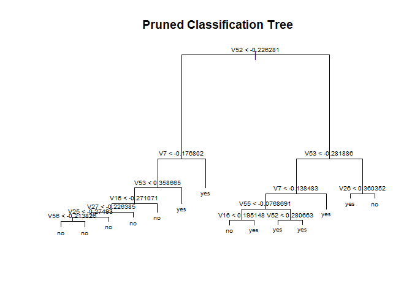
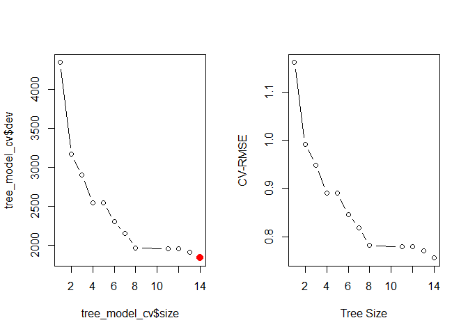
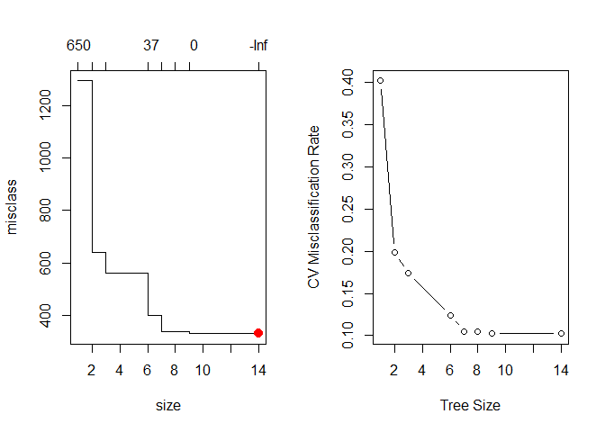
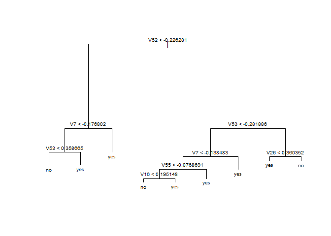
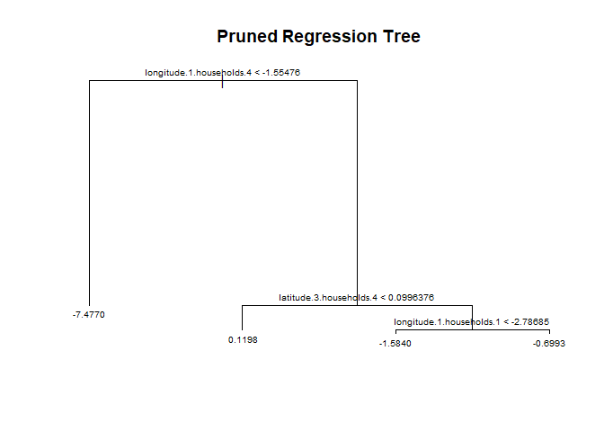
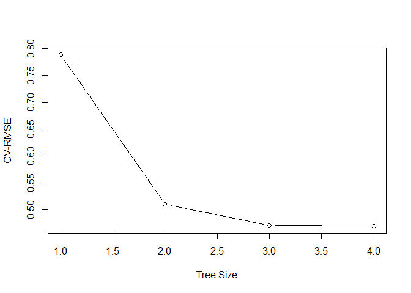
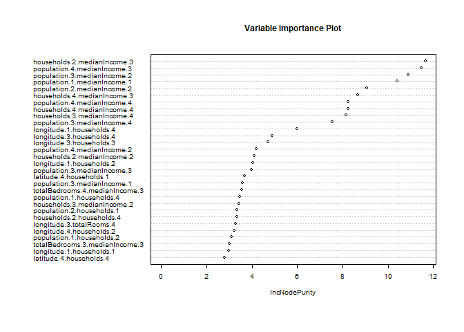
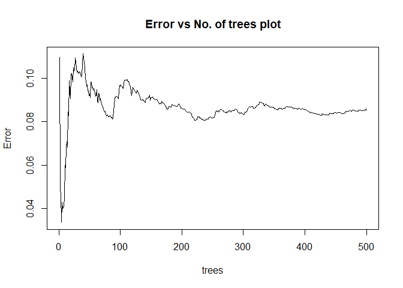

Lab 3 ML
================
Menachem Sokolik and Valeria Lerman
27 5 2021

``` r
setwd(dirname(rstudioapi::getActiveDocumentContext()$path))

knitr::opts_chunk$set(warning=FALSE)
```

### Classification Tree

#### task 1

``` r
dat <- read.table("spam.data")
```

#### task 2.b

``` r
dim <- dim(dat)
cat(paste0("In our data table there are ", dim[1], paste0(" rows"), paste0(" and ", dim[2], paste0(" columns."))))
```

    ## In our data table there are 4601 rows and 58 columns.

#### task 2.c

``` r
dat$V58 = as.factor(ifelse(dat$V58 == 1 , "yes", "no"))
str(dat)
```

    ## 'data.frame':    4601 obs. of  58 variables:
    ##  $ V1 : num  0 0.21 0.06 0 0 0 0 0 0.15 0.06 ...
    ##  $ V2 : num  0.64 0.28 0 0 0 0 0 0 0 0.12 ...
    ##  $ V3 : num  0.64 0.5 0.71 0 0 0 0 0 0.46 0.77 ...
    ##  $ V4 : num  0 0 0 0 0 0 0 0 0 0 ...
    ##  $ V5 : num  0.32 0.14 1.23 0.63 0.63 1.85 1.92 1.88 0.61 0.19 ...
    ##  $ V6 : num  0 0.28 0.19 0 0 0 0 0 0 0.32 ...
    ##  $ V7 : num  0 0.21 0.19 0.31 0.31 0 0 0 0.3 0.38 ...
    ##  $ V8 : num  0 0.07 0.12 0.63 0.63 1.85 0 1.88 0 0 ...
    ##  $ V9 : num  0 0 0.64 0.31 0.31 0 0 0 0.92 0.06 ...
    ##  $ V10: num  0 0.94 0.25 0.63 0.63 0 0.64 0 0.76 0 ...
    ##  $ V11: num  0 0.21 0.38 0.31 0.31 0 0.96 0 0.76 0 ...
    ##  $ V12: num  0.64 0.79 0.45 0.31 0.31 0 1.28 0 0.92 0.64 ...
    ##  $ V13: num  0 0.65 0.12 0.31 0.31 0 0 0 0 0.25 ...
    ##  $ V14: num  0 0.21 0 0 0 0 0 0 0 0 ...
    ##  $ V15: num  0 0.14 1.75 0 0 0 0 0 0 0.12 ...
    ##  $ V16: num  0.32 0.14 0.06 0.31 0.31 0 0.96 0 0 0 ...
    ##  $ V17: num  0 0.07 0.06 0 0 0 0 0 0 0 ...
    ##  $ V18: num  1.29 0.28 1.03 0 0 0 0.32 0 0.15 0.12 ...
    ##  $ V19: num  1.93 3.47 1.36 3.18 3.18 0 3.85 0 1.23 1.67 ...
    ##  $ V20: num  0 0 0.32 0 0 0 0 0 3.53 0.06 ...
    ##  $ V21: num  0.96 1.59 0.51 0.31 0.31 0 0.64 0 2 0.71 ...
    ##  $ V22: num  0 0 0 0 0 0 0 0 0 0 ...
    ##  $ V23: num  0 0.43 1.16 0 0 0 0 0 0 0.19 ...
    ##  $ V24: num  0 0.43 0.06 0 0 0 0 0 0.15 0 ...
    ##  $ V25: num  0 0 0 0 0 0 0 0 0 0 ...
    ##  $ V26: num  0 0 0 0 0 0 0 0 0 0 ...
    ##  $ V27: num  0 0 0 0 0 0 0 0 0 0 ...
    ##  $ V28: num  0 0 0 0 0 0 0 0 0 0 ...
    ##  $ V29: num  0 0 0 0 0 0 0 0 0 0 ...
    ##  $ V30: num  0 0 0 0 0 0 0 0 0 0 ...
    ##  $ V31: num  0 0 0 0 0 0 0 0 0 0 ...
    ##  $ V32: num  0 0 0 0 0 0 0 0 0 0 ...
    ##  $ V33: num  0 0 0 0 0 0 0 0 0.15 0 ...
    ##  $ V34: num  0 0 0 0 0 0 0 0 0 0 ...
    ##  $ V35: num  0 0 0 0 0 0 0 0 0 0 ...
    ##  $ V36: num  0 0 0 0 0 0 0 0 0 0 ...
    ##  $ V37: num  0 0.07 0 0 0 0 0 0 0 0 ...
    ##  $ V38: num  0 0 0 0 0 0 0 0 0 0 ...
    ##  $ V39: num  0 0 0 0 0 0 0 0 0 0 ...
    ##  $ V40: num  0 0 0.06 0 0 0 0 0 0 0 ...
    ##  $ V41: num  0 0 0 0 0 0 0 0 0 0 ...
    ##  $ V42: num  0 0 0 0 0 0 0 0 0 0 ...
    ##  $ V43: num  0 0 0.12 0 0 0 0 0 0.3 0 ...
    ##  $ V44: num  0 0 0 0 0 0 0 0 0 0.06 ...
    ##  $ V45: num  0 0 0.06 0 0 0 0 0 0 0 ...
    ##  $ V46: num  0 0 0.06 0 0 0 0 0 0 0 ...
    ##  $ V47: num  0 0 0 0 0 0 0 0 0 0 ...
    ##  $ V48: num  0 0 0 0 0 0 0 0 0 0 ...
    ##  $ V49: num  0 0 0.01 0 0 0 0 0 0 0.04 ...
    ##  $ V50: num  0 0.132 0.143 0.137 0.135 0.223 0.054 0.206 0.271 0.03 ...
    ##  $ V51: num  0 0 0 0 0 0 0 0 0 0 ...
    ##  $ V52: num  0.778 0.372 0.276 0.137 0.135 0 0.164 0 0.181 0.244 ...
    ##  $ V53: num  0 0.18 0.184 0 0 0 0.054 0 0.203 0.081 ...
    ##  $ V54: num  0 0.048 0.01 0 0 0 0 0 0.022 0 ...
    ##  $ V55: num  3.76 5.11 9.82 3.54 3.54 ...
    ##  $ V56: int  61 101 485 40 40 15 4 11 445 43 ...
    ##  $ V57: int  278 1028 2259 191 191 54 112 49 1257 749 ...
    ##  $ V58: Factor w/ 2 levels "no","yes": 2 2 2 2 2 2 2 2 2 2 ...

It can be seen, that the columns 1-57 represent variables which explain
our y. Column 58 represents the result variables y, and they are binary
- so we changed the 0 and 1 values into yes and no string variables,
which represents whether the current variable is spam or not. So for
each row that represents a different observation, we can tell whether
the result Y is spam or not according to the columns.

#### task 3-Subset your data into train and test

``` r
dat[c(1:57)] <- lapply(dat[c(1:57)], function(x) c(scale(x))) #scaling
set.seed(2) # Set Seed so that same sample can be reproduced in future also
# Now Selecting 70% of data as sample from total 'n' rows of the data  
sample <- sample.int(n = nrow(dat), size = floor(.7*nrow(dat)), replace = F)
train <- dat[sample, ]
test  <- dat[-sample, ]
```

#### task 4

``` r
p <- dim[2]
train_x <- train[, -p] #predictors only
train_y <- train[, p] #true test classification

test_x <- test[, -p] #predictors only
test_y <- test[, p] #true test classification
```

#### task 5.a-d.

Then fit an unpruned regression tree to the training data.

``` r
#run tree model
tree_model <- tree(V58~., data = train)
summary(tree_model)
```

    ## 
    ## Classification tree:
    ## tree(formula = V58 ~ ., data = train)
    ## Variables actually used in tree construction:
    ## [1] "V52" "V7"  "V53" "V16" "V27" "V25" "V56" "V55" "V26"
    ## Number of terminal nodes:  14 
    ## Residual mean deviance:  0.4862 = 1559 / 3206 
    ## Misclassification error rate: 0.0941 = 303 / 3220

We see this tree has 14 terminal nodes and a Misclassification error
rate 0.0941.

``` r
plot(tree_model) #visualize tree
text(tree_model, pretty=0, cex=0.6)
title(main = "Pruned Classification Tree")
```

<!-- -->

We created a pruned clasification tree. In every decision point the
function computes the splitting number according to the RSS minimization
criterion we learned in the lecture - for every decission point, if our
vector value is smaller than the splitting number - then we go left,
otherwise - we go right. The function does it recursively over and over
according to the best value we wiil find later for the B, in order to
get the best pruned tree possible. But we should be cauchious with the
number of decission points, because if we go too deep than there will be
over fitting on the variables, so we will find later what is the best B
value for which we’ll prune the tree.

#### task 5.e.

``` r
tree_preds <- predict(tree_model, test_x, type = "class") #predict on the test set
summary(tree_preds)
```

    ##  no yes 
    ## 870 511

#### task 5.f.

``` r
#check accuracy of predictions
table(predicted = tree_preds, actual = test_y) #confusion matrix
```

    ##          actual
    ## predicted  no yes
    ##       no  790  80
    ##       yes  73 438

``` r
mean(tree_preds == test_y) #accuracy
```

    ## [1] 0.8892107

It can be noticed that our prediction was correct in 1228 of the cases.
However, we had 2 types of errors: we predicted false negative for 80
cases and false positive for 73 cases. In total, we predicted wrong for
153 cases.

predict on the train set to see overfitting if we run it on train.

``` r
tree_train_preds <-  predict(tree_model, train_x, type = "class") #predict on the train set
table(predicted = tree_train_preds, actual = train_y) # train confusion
```

    ##          actual
    ## predicted   no  yes
    ##       no  1806  184
    ##       yes  119 1111

``` r
mean(tree_train_preds == train_y) #accuracy
```

    ## [1] 0.9059006

Here it is easy to see that the tree has been over-fit. The train set
performs much better than the test set.

#### task 5.h-j.

We will now use cross-validation to find a tree by considering trees of
different sizes which have been pruned from our original tree. As with
classification trees, we can use cross-validation to select a good
pruning of the tree.

``` r
set.seed(3)
tree_model_cv = cv.tree(tree_model) # As we were instructed
tree_model_cv
```

    ## $size
    ##  [1] 14 13 12 11  8  7  6  5  4  3  2  1
    ## 
    ## $dev
    ##  [1] 1838.152 1913.628 1953.784 1954.317 1966.353 2157.366 2302.665 2548.572
    ##  [9] 2548.572 2898.565 3166.048 4341.585
    ## 
    ## $k
    ##  [1]       -Inf   46.17571   52.34330   53.62668   56.41103   95.53647
    ##  [7]  126.63814  174.35507  175.46410  329.43548  391.67590 1166.51990
    ## 
    ## $method
    ## [1] "deviance"
    ## 
    ## attr(,"class")
    ## [1] "prune"         "tree.sequence"

``` r
par(mfrow = c(1, 2))
plot(tree_model_cv$size, tree_model_cv$dev, type="b") # plot deviance as function of sizs
tree.min <- which.min(tree_model_cv$dev) # index of tree with minimum error
tree_model_cv$size[tree.min] # number of terminal nodes in that tree
```

    ## [1] 14

``` r
points(tree_model_cv$size[tree.min] , tree_model_cv$dev[tree.min], col = "red", cex = 2, pch = 20)

plot(tree_model_cv$size, sqrt(tree_model_cv$dev / nrow(train)), type = "b",
     xlab = "Tree Size", ylab = "CV-RMSE") # plot deviance as function of CV-RMSE
```

<!-- -->

In this case, the tree size that minimizes the corss-validation error 14
is selected by cross-validation (the point in red).

#### task 5.h-j.

We will now use cross-validation to find a tree by considering trees of
different sizes which have been pruned from our original tree with
`prune.misclass` function.

``` r
set.seed(3)
tree_cv = cv.tree(tree_model, FUN = prune.misclass)
min_idx = which.min(tree_cv$dev) # index of tree with minimum error
tree_cv$size[min_idx] # number of terminal nodes in that tree
```

    ## [1] 14

``` r
tree_cv$dev / length(sample) # misclassification rate of each tree
```

    ## [1] 0.1021739 0.1021739 0.1049689 0.1049689 0.1242236 0.1736025 0.1987578
    ## [8] 0.4021739

``` r
par(mfrow = c(1, 2))
plot(tree_cv) # default plot
tree.min <- which.min(tree_cv$dev)
points(tree_cv$size[min_idx], tree_cv$dev[tree.min], col = "red", cex = 2, pch = 20)
plot(tree_cv$size, tree_cv$dev / nrow(train), type = "b",
     xlab = "Tree Size", ylab = "CV Misclassification Rate") # better plottree.min
```

<!-- -->

According to the graphs, the best value for K is 14, it can be seen by
the red dot. That means that if we prune our tree with k=14, we get the
best accurancy. However, note that according to the graph, we can get
the same percentage of accurancy even for 9-13 values of K, so we would
prefer to choose k=9 for our model. But if we choose a smaller value,
then of cauese we will get a lower percentage. It can be checked and
compared using the function of mission 5.1.

It appears that a tree of size 14 but the same in size 9 has the fewest
misclassifications of the considered trees, via cross-validation.

We use prune.misclass() to obtain that tree from our original tree, and
plot this smaller tree.

#### task 5.l.

``` r
pruned_tree <- prune.misclass(tree_model, best = 9) # prune tree to have 14 leaves
plot(pruned_tree) #visualize tree
text(pruned_tree, pretty=0, cex=0.6)
```

<!-- -->

``` r
#predict on the test set
tree_preds_l <- predict(pruned_tree, test_x, type = "class")
summary(tree_preds_l)
```

    ##  no yes 
    ## 870 511

``` r
#check accuracy of predictions
table(predicted = tree_preds_l, actual = test_y) #confusion matrix
```

    ##          actual
    ## predicted  no yes
    ##       no  790  80
    ##       yes  73 438

``` r
mean(tree_preds_l == test_y) #accuracy
```

    ## [1] 0.8892107

It can be seen in this tree that we used the optimal B value for pruning
the tree. In every leaf at the bottom of the tree you can see what was
the decission - whether this is a spam or not according to the given
information in the upper decission points.

### Random Forest

#### task 6.b-c

``` r
rf_model <- randomForest(V58~., data =train) #run random forest
rf_pred <- predict(rf_model, newdata = test_x) #predict on the test set

#check accuracy of predictions
table(predicted = rf_pred, actual = test_y) #confusion matrix
```

    ##          actual
    ## predicted  no yes
    ##       no  830  42
    ##       yes  33 476

``` r
mean(rf_pred == test_y) #accuracy
```

    ## [1] 0.9456915

we can see that if we use the method of Random Forest we can get higher
accuracy from regular tree method. in Random Forest the accuracy is
0.9456915, in regular tree method the accuracy is 0.8892107.

### Regression.

### Trees.

#### task 7.a-b

``` r
load("CA_samp.Rdata")
df <- data.frame(CA_samp)
df[c(1:528)] <- lapply(df[c(1:528)], function(x) c(scale(x))) #scaling

set.seed(123) # Set Seed so that same sample can be reproduced in future also
# Now Selecting 70% of data as sample from total 'n' rows of the data  
sample.7 <- sort(sample.int(n = nrow(df), size = floor(.7*nrow(df)), replace = F))
train.7 <- df[sample.7, ]
test.7  <- df[-sample.7, ]

q <- dim[2]
train_x.7 <- train.7[, -q] #predictors only
train_y.7 <- train.7[, q] #true test classification

test_x.7 <- test.7[, -q] #predictors only
test_y.7 <- test.7[, q] #true test classification

train_df <- train_x.7
train_df$y <- train_y.7
test_df <- test_x.7
test_df$y <- test_y.7
```

#### task 7.c

``` r
tree_mod <- tree(y~., data = train_df)
summary(tree_mod)
```

    ## 
    ## Regression tree:
    ## tree(formula = y ~ ., data = train_df)
    ## Variables actually used in tree construction:
    ## [1] "longitude.1.households.4" "latitude.3.households.4" 
    ## [3] "longitude.1.households.1"
    ## Number of terminal nodes:  4 
    ## Residual mean deviance:  0.1387 = 96.53 / 696 
    ## Distribution of residuals:
    ##     Min.  1st Qu.   Median     Mean  3rd Qu.     Max. 
    ## -6.36700 -0.01131  0.03584  0.00000  0.05241  4.52700

``` r
plot(tree_mod) #visualize tree
text(tree_mod, pretty=0,cex=0.6)
title(main = "Pruned Regression Tree")
```

<!-- -->

``` r
tree_p <- predict(tree_mod, newdata = test_df) #predict on the test set
summary(tree_p)
```

    ##     Min.  1st Qu.   Median     Mean  3rd Qu.     Max. 
    ## -7.47710  0.11983  0.11983 -0.04329  0.11983  0.11983

As with classification trees, we can use cross-validation to select a
good pruning of the tree. According to the tree graph, it can be noted
that the tree contains 4 levels. In the next graph it can be seen that
indeed we should prune our tree after 4 levels, in order not to create
over-fitting. In every decision point the function computes the
splitting number according to the RSS minimization criterion we learned
in the lecture - for every decission point, if our vector value is
smaller than the splitting number - then we go left, otherwise - we go
right. The function does it recursively over and over according to the
best value we computed - B=4, in order to get the best pruned tree
possible.

root mean squared error (RMSE)

``` r
sqrt(mean((tree_p-test_y.7)^2))
```

    ## [1] 0.9845114

The root mean squared error (RMSE) is 0.9845114. Note that we got this
value after scalling our data.

``` r
set.seed(18)
tree_mod_cv = cv.tree(tree_mod)
plot(tree_mod_cv$size, sqrt(tree_mod_cv$dev / nrow(train_df)), type = "b",
     xlab = "Tree Size", ylab = "CV-RMSE")
```

<!-- -->

While the tree of size 4 does have the lowest RMSE, we’ll prune to a
size of 3 as it seems to perform just as well. (Otherwise we would not
be pruning.) The pruned tree is, as expected, smaller and easier to
interpret.

``` r
tree_mod_prune = prune.tree(tree_mod, best = 3)
tree_p_prune <- predict(tree_mod_prune, newdata = test_df) #predict on the test set
summary(tree_p_prune)
```

    ##     Min.  1st Qu.   Median     Mean  3rd Qu.     Max. 
    ## -7.47710  0.11983  0.11983 -0.03108  0.11983  0.11983

Let’s compare this regression tree to an additive linear model and use
RMSE as our metric.

``` r
sqrt(mean((tree_p_prune-test_y.7)^2))
```

    ## [1] 0.9926563

The root mean squared error (RMSE) is 0.9926563. Note that we got this
value after scaling our data.

#### task 8. Random Forest

``` r
set.seed(42)
rf_model.8 <- randomForest(y~., data = train_df, mportance= T) #run random forest
rf_pred.8 <- predict(rf_model.8, newdata = test_x.7) #predict on the test set
```

root mean squared error (RMSE)

``` r
sqrt(mean((rf_pred.8-test_y.7)^2)) #find the rmse
```

    ## [1] 0.7685833

The root mean squared error (RMSE) is 0.7685833 is lower from not a
Random Forest regression. This happens because in every new tree which
is created by the function, we include exactly the same fcomplete number
of variables as the original data, but the data that appears in every
tree is chosen randomly. This means, that the number of appearances for
every variable in the data explains its contribution to the variance,
and this is the reason that we get a lower RMSE (and a higher accuracy)
by using random forest.

importance

``` r
set.seed(42)
rf_model.8 <- randomForest(y~., data = train_df, mportance = TRUE) #run random forest
variable.importance <- data.frame(rf_model.8$importance)
top.20 <-variable.importance %>%  top_n(20, IncNodePurity)
top.20 # The twenty largest variables.
```

    ##                                IncNodePurity
    ## longitude.1.households.2            4.035142
    ## longitude.1.households.4            5.996380
    ## longitude.3.households.3            4.715117
    ## longitude.3.households.4            4.897125
    ## latitude.4.households.1             3.666936
    ## totalBedrooms.4.medianIncome.3      3.555443
    ## population.1.medianIncome.1        10.410981
    ## population.2.medianIncome.2         9.062477
    ## population.3.medianIncome.1         3.574931
    ## population.3.medianIncome.2        10.894954
    ## population.3.medianIncome.3         3.984094
    ## population.3.medianIncome.4         7.529159
    ## population.4.medianIncome.2         4.207266
    ## population.4.medianIncome.3        11.465699
    ## population.4.medianIncome.4         8.232383
    ## households.2.medianIncome.2         4.114627
    ## households.2.medianIncome.3        11.649179
    ## households.3.medianIncome.4         8.146457
    ## households.4.medianIncome.3         8.683724
    ## households.4.medianIncome.4         8.231087

``` r
imp<-importance(rf_model.8)
vars<-dimnames(imp)[[1]]
imp<-data.frame(vars=vars,imp=as.numeric(imp[,1]))
imp<-imp[order(imp$imp,decreasing=T),]
varImpPlot(rf_model.8, cex=0.6,main='Variable Importance Plot')
```

<!-- -->

``` r
plot(rf_model.8, cex=0.6,main='Error vs No. of trees plot')
```

<!-- -->

In the upper graph we can see the contribution of each type of household
and medianincome variables to the results of our model. The information
in the graph is arranged in such a way that you can see easily which
variables contribute the most to our model and which contribute the
least.

The second graph shows the connection between the error percentage and
the number of trees created by the random forest method. According to
the graph, the error rate is the highest when around 60-70 trees are
created, and then the rate decreases when the number of trees grows to
100. If the number of trees is higher than 100, the error rate stays
around 0.08, which suits what we learned during the lectures.
