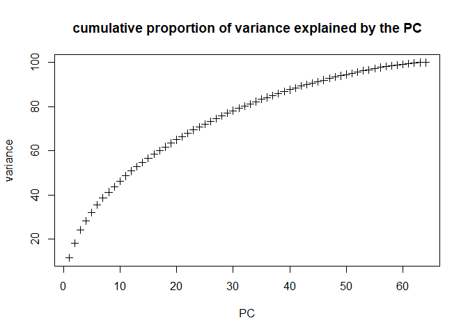
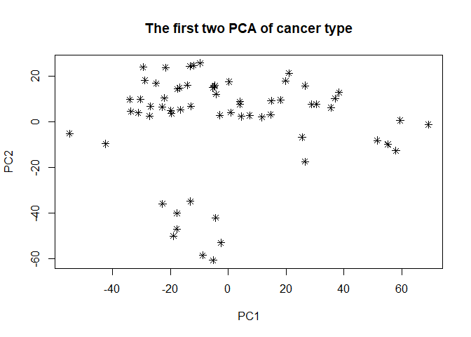
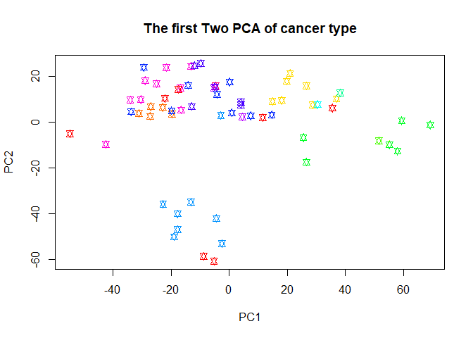
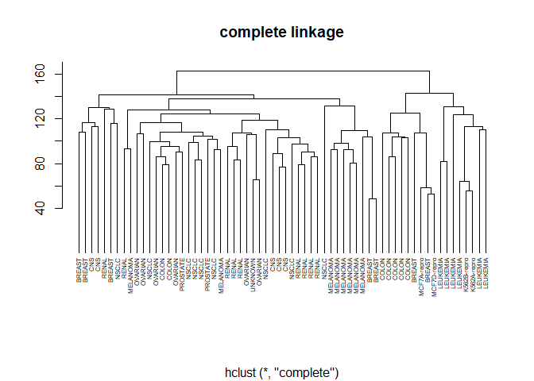
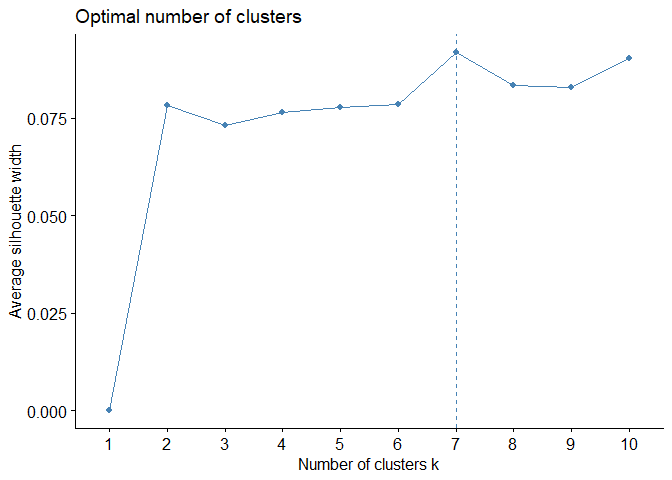
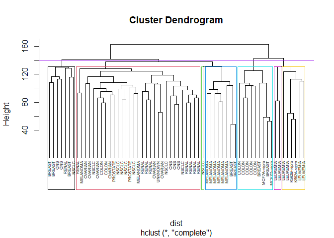
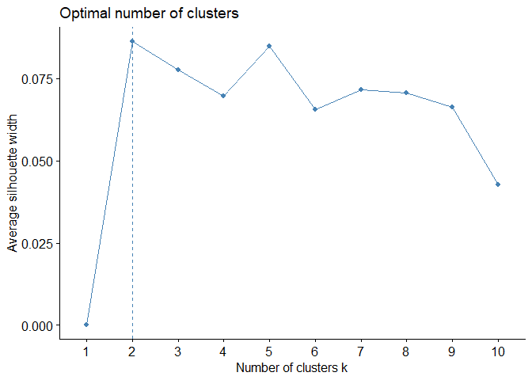
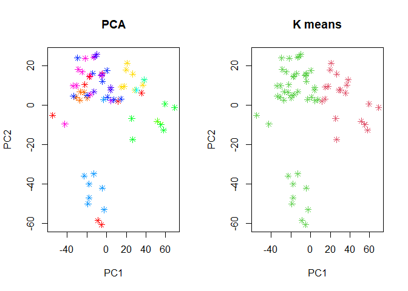

lab 4 machine learning
================
Menachem Sokolik & valeria lerman
20 6 2021

``` r
setwd(dirname(rstudioapi::getActiveDocumentContext()$path))

knitr::opts_chunk$set(warning=FALSE)
```

### 1-3

Loading and understanding our data.

``` r
library(ISLR)
full_dat <- NCI60
?NCI60
```

    ## starting httpd help server ... done

What is the format of the data? Notice that NCI60 is a list containing
two elements – data and labels

NCI microarray data. The data contains expression levels on 6830 genes
from 64 cancer cell lines. Cancer type is also recorded. The format is a
list containing two elements: data and labs.

data is a 64 by 6830 matrix of the expression values while labs is a
vector listing the cancer types for the 64 cell lines.

What is The size of the data?

``` r
dim <- dim(full_dat$data)
cat(paste0("In our data table there are ", dim[1], paste0(" rows"), paste0(" and ", dim[2], paste0(" columns."))))
```

    ## In our data table there are 64 rows and 6830 columns.

Useing the str function in order to take a glimpse at the data.

``` r
str(full_dat$data)
```

    ##  num [1:64, 1:6830] 0.3 0.68 0.94 0.28 0.485 ...
    ##  - attr(*, "dimnames")=List of 2
    ##   ..$ : chr [1:64] "V1" "V2" "V3" "V4" ...
    ##   ..$ : chr [1:6830] "1" "2" "3" "4" ...

We can see that we have 64 vectors which contain 6830 observations

How many different labels are there? Use table to learn about the
different labels you have (the labels are stored in full\_dat$labs)

``` r
knitr::kable(table(full_dat$labs))
```

| Var1        | Freq |
|:------------|-----:|
| BREAST      |    7 |
| CNS         |    5 |
| COLON       |    7 |
| K562A-repro |    1 |
| K562B-repro |    1 |
| LEUKEMIA    |    6 |
| MCF7A-repro |    1 |
| MCF7D-repro |    1 |
| MELANOMA    |    8 |
| NSCLC       |    9 |
| OVARIAN     |    6 |
| PROSTATE    |    2 |
| RENAL       |    9 |
| UNKNOWN     |    1 |

``` r
cat(paste0("In our data we have ", dim(table(full_dat$labs)), paste0(" different labels")))
```

    ## In our data we have 14 different labels

### PCA

#### a.

Run PCA using the “prcomp” function.

``` r
data <- full_dat$data
fit.pca <- prcomp(data,scale=T) # PCA and scaling
```

It is very important to scale the variables if they are measured in
different units and hence having different variances. Typically, when we
perform PCA on unscaled variables, the first principal component will
have a very large loading for the variable with the largest variance.

#### b.

Explore the PCA object – What does it contain? What is the meaning of
each value?

``` r
knitr::kable(names(fit.pca), , col.names = NULL, caption = "name")
```

|          |
|:---------|
| sdev     |
| rotation |
| center   |
| scale    |
| x        |

name

``` r
?prcomp
```

prcomp - returns a list with class “prcomp” containing the following
components:

sdev - the standard deviations of the principal components (i.e., the
square roots of the eigenvalues of the covariance/correlation matrix,
though the calculation is actually done with the singular values of the
data matrix).

rotation - the matrix of variable loadings (i.e., a matrix whose columns
contain the eigenvectors). The function princomp returns this in the
element loadings.

x - if retx is true the value of the rotated data (the centred (and
scaled if requested) data multiplied by the rotation matrix) is
returned. Hence, cov(x) is the diagonal matrix diag(sdev^2). For the
formula method, napredict() is applied to handle the treatment of values
omitted by the na.action.

center, scale - the centering and scaling used, or FALSE.

#### c.

Extract the standard deviation of each of the PCS. How much of the
variance is explained by each of the PCS?

``` r
sd <- fit.pca$sdev
var.explained <- sd^2 # variance explained
p.var.explained <- as.data.frame(round(var.explained/sum(var.explained),3)) #  normalizing by the sum of all the PCs' variance
```

#### d.

Calculate the cumulative proportion of variance explained by the PCS.
How many PCS are needed to explain 50%/75%/100% of the variance in the
data?

``` r
cpvar <- cumsum(data.frame(cp=c(1:64),`prop`=round(p.var.explained*100,3)))
cpvar$cp <- c(1:64)
cpvar
```

    ##    cp round.var.explained.sum.var.explained...3.
    ## 1   1                                       11.4
    ## 2   2                                       18.2
    ## 3   3                                       24.0
    ## 4   4                                       28.2
    ## 5   5                                       31.9
    ## 6   6                                       35.5
    ## 7   7                                       38.6
    ## 8   8                                       41.3
    ## 9   9                                       43.8
    ## 10 10                                       46.2
    ## 11 11                                       48.6
    ## 12 12                                       50.8
    ## 13 13                                       52.8
    ## 14 14                                       54.8
    ## 15 15                                       56.7
    ## 16 16                                       58.5
    ## 17 17                                       60.2
    ## 18 18                                       61.8
    ## 19 19                                       63.4
    ## 20 20                                       65.0
    ## 21 21                                       66.5
    ## 22 22                                       68.0
    ## 23 23                                       69.4
    ## 24 24                                       70.8
    ## 25 25                                       72.1
    ## 26 26                                       73.4
    ## 27 27                                       74.7
    ## 28 28                                       75.9
    ## 29 29                                       77.1
    ## 30 30                                       78.2
    ## 31 31                                       79.3
    ## 32 32                                       80.3
    ## 33 33                                       81.3
    ## 34 34                                       82.3
    ## 35 35                                       83.3
    ## 36 36                                       84.2
    ## 37 37                                       85.1
    ## 38 38                                       86.0
    ## 39 39                                       86.9
    ## 40 40                                       87.7
    ## 41 41                                       88.5
    ## 42 42                                       89.3
    ## 43 43                                       90.0
    ## 44 44                                       90.7
    ## 45 45                                       91.4
    ## 46 46                                       92.1
    ## 47 47                                       92.8
    ## 48 48                                       93.4
    ## 49 49                                       94.0
    ## 50 50                                       94.6
    ## 51 51                                       95.2
    ## 52 52                                       95.8
    ## 53 53                                       96.3
    ## 54 54                                       96.8
    ## 55 55                                       97.3
    ## 56 56                                       97.8
    ## 57 57                                       98.2
    ## 58 58                                       98.6
    ## 59 59                                       99.0
    ## 60 60                                       99.3
    ## 61 61                                       99.6
    ## 62 62                                       99.8
    ## 63 63                                      100.0
    ## 64 64                                      100.0

``` r
exd.data <- cpvar %>% filter(cp== 12|cp== 28|cp== 63)
names(exd.data) <- c("Principal Components","proportion")
exd.data
```

    ##   Principal Components proportion
    ## 1                   12       50.8
    ## 2                   28       75.9
    ## 3                   63      100.0

As we can see, 12 components give us the cumulative explained variance
of 50% 28 components give the cumulative explained variance of 75% and
63 components give the cumulative variance of 100%, we can also
understand it, because we know that the highest explained variance comes
from n-1 components (when n is the original number of components).

#### e.

Plot the cumulative proportion of variance explained by the PCs as a
function of the number of PCs (i.e. the cumulative sum on the y axis and
the number of PCs on the x axis)

``` r
plot(cpvar$cp, cpvar$round.var.explained.sum.var.explained...3.,xlab="PC", ylab= "variance",main="cumulative proportion of variance explained by the PC", pch=3)
```

<!-- -->

#### f.

Let’s see how the data looks in the PC space. Plot the PC scores each
observation got on the first two PCs.

``` r
plot(fit.pca$x[,1],fit.pca$x[,2], xlab = "PC1", ylab="PC2", main = "The first two PCA of cancer type", pch=8)
```

<!-- -->

We can see from the plot, that the largest explained variance is placed
on the horizontal line between (0, 20) PC2 values, and the orthogonal
vertical line with the second largest variance is located around
( − 20, 0) value.

#### g.

Run the following code in order to generate a different color for each
label type, and color the observations with the color of their label

``` r
cols <- rainbow(length(unique(full_dat$labs)))
obs_cols <- cols[as.numeric(as.factor(full_dat$labs))]

plot(fit.pca$x[,1],fit.pca$x[,2], xlab = "PC1", ylab="PC2", main = "The first Two PCA of cancer type", col= obs_cols, pch=11)
```

<!-- -->

Note that each color represents a different group in our plot.

### Hierarchical Clustering

**Hierarchical clustering is an approach which does not require a
particular choice of k.** *It has an advantage over k-means that it
results in a tree-based representation called a dendogram*

The method produces hierarchical representations in which the clusters
at each level of the hierarchy are created by merging clusters at the
next lower level. At the lowest level each cluster contains a single
observation. At the highest level there is only one cluster containing
all of the data.

#### a.

Scale the data in order for all the variables to have the same scale.

``` r
sc_data <- scale(data)
```

It is very important to scale the variables if they are measured in
different units and hence having different variances. Typically, when we
perform PCA on unscaled variables, the first principal component will
have a very large loading for the variable with the largest variance.

#### b.

Use the dist function in order to calculate the distances between every
two observations.

``` r
dist <- dist(sc_data)
```

In order to decide which clusters should be combined a measure of
dissimilarity, distance metric, between sets of observations is
required. The distance metric will greatly influence the formation of
the clusters.

#### c.

Run hierarchical clustering using complete linkage.

``` r
hc_fit <- hclust(dist,method = "complete")
```

we need to specify the linkage criteria which determines the distance
between sets of observations as a function of the pairwise distances
between observations. complete linkage =
*d*<sub>*C**L*</sub>(*G*, *H*) = *m**a**x*<sub>*i* ∈ *G*, *j* ∈ *H*</sub>*d*<sub>*i*, *j*</sub>

#### d.

Plot the dendrogram of the model

``` r
plot(hc_fit,labels = full_dat$labs, main ="complete linkage", xlab="", ylab="",cex=.5, legend=NULL,hang = -1)
```

<!-- -->

#### e + f.

how the model divides the observations into these clusters. We chose
randomly k = 7

``` r
library(factoextra)
```

    ## Welcome! Want to learn more? See two factoextra-related books at https://goo.gl/ve3WBa

``` r
fviz_nbclust(sc_data, FUN=hcut, method="silhouette")
```

<!-- -->

``` r
cutting <- cutree(hc_fit,2)
plot(hc_fit,labels = full_dat$labs,cex=0.5,hang = -1)
rect.hclust(hc_fit, k=7, border = 1:7)
abline(h=140,col='purple')
```

<!-- -->

We use function “rect.hclust” to Draw Rectangles Around Hierarchical
Clusters (Draws rectangles around the branches of a dendrogram
highlighting the corresponding clusters. First the dendrogram is cut at
a certain level, then a rectangle is drawn around selected branches.).

It computes all pairwise dissimilarities between the elements in cluster
1 and the elements in cluster 2, and considers the largest value (i.e.,
maximum value) of these dissimilarities as the distance between the two
clusters. It tends to produce more compact clusters.

We have divided into seven sections which each existing section has a
common denominator and is obtained by dividing “complete”. For example
four on the left can be said to be “melanoma” cancer, and section three
is “nsclc” and on that way.

### K-Means

When we cluster observations of a dataset, we seek to partition them
into distinct groups so that the observations within each group are quit
similar and observations in different groups are quit different. We need
to define what it means to be similar which is often domain-specific. In
K-mean clustering we partition the observations into a pre-specified
number of clusters. one can cluster features based on the observations
in order to discover subgroups among the features.

#### a.

Run kmeans on the scaled data from 5a. and set the k it should use.

``` r
fviz_nbclust(sc_data, FUN=kmeans, method="silhouette")
```

<!-- -->

``` r
k_mean <- kmeans(sc_data, 2)
```

This function dertemines and visualize the optimal number of clusters
using different methods: within cluster sums of squares, average
silhouette and gap statistics. We used this function in order to find
the optimal number of clusters. According to the graph above, that the
Average silhouette width is the highest for k=2, and almost as good for
k=5, so the function returns k=2.

#### b.

Explore the resulting k-means object – What did the function return?
What does each of its values?

``` r
df <- data.frame(values=names(k_mean))
df
```

    ##         values
    ## 1      cluster
    ## 2      centers
    ## 3        totss
    ## 4     withinss
    ## 5 tot.withinss
    ## 6    betweenss
    ## 7         size
    ## 8         iter
    ## 9       ifault

cluster: vector of integer numbers that show for every point which
cluster it’s allocated to

centers: matrix of cluster centers it is also equal to the mean value of
all the points that are allocated to the cluster

totss: total sum of squares by definition

withinss: within cluster sum of squares by definition

tot.withinss: sum of withinss by definition

betweenss: between cluster sum of squares, also equal to the difference
between totss and tot.withinss

size: number of points in a current cluster

iter: number of iterations

ifault: indicator of an algorithmichal problem which may appear

#### c.

How much are the clusters diverse? i. Extract the within-cluster sum of
squares.

``` r
k_mean$withinss
```

    ## [1] 127760 264650

The within-point scatter can be written as:
$\\sum \_{k=1}^k\\:\\:n\_k\\sum \\:\_{c\\left(i\\right)=k}^{ }\\:\\:\\left\|\| x\_i-\\overline{x\_k}\\right\|\|^2$

2.  Extract the between-cluster sum of squares

``` r
k_mean$betweenss
```

    ## [1] 37880.09

The similarity measure for any two observations is defined by the
squared Euclidean distance.

#### d.

Extract the clusters of each observation

``` r
data.frame(cluster=k_mean$cluster)
```

    ##     cluster
    ## V1        2
    ## V2        2
    ## V3        2
    ## V4        2
    ## V5        2
    ## V6        2
    ## V7        2
    ## V8        2
    ## V9        2
    ## V10       2
    ## V11       2
    ## V12       2
    ## V13       2
    ## V14       2
    ## V15       2
    ## V16       2
    ## V17       2
    ## V18       2
    ## V19       2
    ## V20       2
    ## V21       2
    ## V22       2
    ## V23       2
    ## V24       2
    ## V25       2
    ## V26       2
    ## V27       2
    ## V28       2
    ## V29       2
    ## V30       2
    ## V31       2
    ## V32       2
    ## V33       2
    ## V34       1
    ## V35       1
    ## V36       1
    ## V37       1
    ## V38       1
    ## V39       1
    ## V40       1
    ## V41       1
    ## V42       1
    ## V43       1
    ## V44       1
    ## V45       1
    ## V46       1
    ## V47       1
    ## V48       1
    ## V49       1
    ## V50       1
    ## V51       1
    ## V52       1
    ## V53       2
    ## V54       2
    ## V55       1
    ## V56       2
    ## V57       2
    ## V58       2
    ## V59       2
    ## V60       2
    ## V61       2
    ## V62       2
    ## V63       2
    ## V64       2

Return to the plot from 4f. Color the observations using the k-means
clusters. Hint: set col=km$cluster+1

``` r
par(mfrow=c(1,2))
plot(fit.pca$x[,1],fit.pca$x[,2], xlab = "PC1", ylab="PC2", main = "PCA", pch=8, col=obs_cols)

plot(fit.pca$x[,1],fit.pca$x[,2], xlab = "PC1", ylab="PC2", main = "K means", pch=8, col=k_mean$cluster+1)
```

<!-- -->

We can see that after using the k-means coloring, the right plot shows
the exact devision to clusters of all the observations (according to the
optimal number of clustering we found above). On the left side, the
observations are not clustered.
