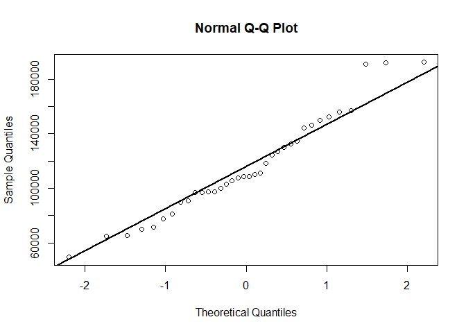
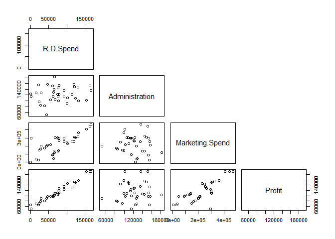
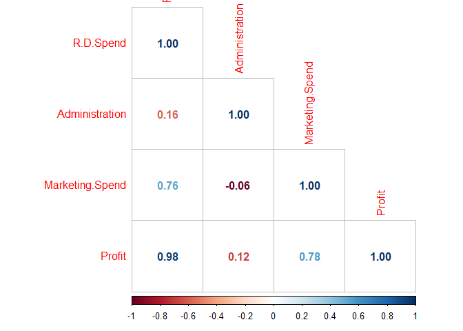

Quiz 1
================
Menachem Sokolik and Idan Keipour
12 5 2021

``` r
setwd(dirname(rstudioapi::getActiveDocumentContext()$path))

knitr::opts_chunk$set(warning=FALSE)
```

``` r
My_lm <- function(X,Y){
  #' @param X is matrix with n rows and p+1 columns
  #' @param Y is vector with length n 
  # TODO: Complete the code.
  #       Don't use any external libaries or functions for computing linear models.
  X <- as.matrix(X)
  X <- cbind(1,X) # n*(p+1)
  Y <- as.matrix(Y) 
  n <- nrow(X)
  p <- ncol(X) - 1
  dof <-  n-p-1
  # t(X) is the transponse, %*% is matrix multiplication,
  # solve takes the inverse
  A <- solve(t(X) %*% X)
  # this comes from looking at formula for beta hat and
  # multiplying the additional terms needed
  beta_hat <- A %*% t(X) %*% Y
  Y_hat <- X %*% beta_hat
  # just filling in formula
  residuals <- Y - (Y_hat)
  sigma2_hat <- t(residuals) %*% residuals/dof
  # I’ve put as.numeric() at the end to convert it to a single scalar number 
  # instead of a 1 by 1 matrix.
  sigma2_hat <- as.numeric(sigma2_hat)
  # covariance matrix of estimated regression coefficients
  # is just the estimated residual variance times solve(t(X) %*% X)
  # we calculuted earlier and stored as A
  beta_cov <- sigma2_hat * A
  # diag takes the diagonal of the matrix, sqrt makes it go
  # from variance to standard deviation
  beta_SE <- sqrt(diag(beta_cov))
  
  T_stat <- beta_hat/beta_SE
  P_Values <- 2*(1-pt(abs(T_stat),dof))
    
  # residual sum of squares divided by total sum of squares
  R_squared <- 1- sum((residuals)^2)/sum((Y - mean(Y))^2)
  return(list(beta_hat, beta_cov, T_stat, P_Values, sigma2_hat, R_squared, dof, residuals, X, Y, Y_hat))
}
```

``` r
df <- read.csv("startups.csv")
```

### i

``` r
str(df)
```

    ## 'data.frame':    36 obs. of  5 variables:
    ##  $ R.D.Spend      : num  165349 162598 153442 131877 130298 ...
    ##  $ Administration : num  136898 151378 101146 99815 145530 ...
    ##  $ Marketing.Spend: num  471784 443899 407935 362861 323877 ...
    ##  $ State          : chr  "New York" "California" "Florida" "New York" ...
    ##  $ Profit         : num  192262 191792 191050 156991 155753 ...

``` r
summary(df)
```

    ##    R.D.Spend      Administration   Marketing.Spend     State          
    ##  Min.   :  1000   Min.   : 51283   Min.   :  1904   Length:36         
    ##  1st Qu.: 45837   1st Qu.:105078   1st Qu.:139922   Class :character  
    ##  Median : 74662   Median :122700   Median :239453   Mode  :character  
    ##  Mean   : 76578   Mean   :123041   Mean   :224241                     
    ##  3rd Qu.:105066   3rd Qu.:144485   3rd Qu.:300633                     
    ##  Max.   :165349   Max.   :182646   Max.   :471784                     
    ##      Profit      
    ##  Min.   : 49491  
    ##  1st Qu.: 95212  
    ##  Median :108643  
    ##  Mean   :115300  
    ##  3rd Qu.:136795  
    ##  Max.   :192262

### ii

``` r
hist(df$Profit, xlab = "Profit")
```

<!-- --> looks like a
normal distribution but with long right tail. also can see that with the
QQPlot to identify normality.

``` r
qqnorm(df$Profit)
qqline(df$Profit, lwd = 2)
```

<!-- --> \#\#\# iii

``` r
# automatic for the correlation coefficients.
# The diagonal consists of the densities of the three variables and the upper panels consist of the correlation coefficients between the variables.
ggpairs(df[c(-4)])
```

<!-- -->

``` r
pairs(~ R.D.Spend + Administration + Marketing.Spend + Profit, data = df, upper.panel = NULL)
```

<!-- -->

``` r
# by hand
cor_df <- cor(df[c(-4)])
corrplot(cor_df, method="number",type = "lower" )
```

<!-- -->

``` r
cor_df
```

    ##                 R.D.Spend Administration Marketing.Spend    Profit
    ## R.D.Spend       1.0000000     0.16054446      0.75826916 0.9782919
    ## Administration  0.1605445     1.00000000     -0.05504912 0.1196753
    ## Marketing.Spend 0.7582692    -0.05504912      1.00000000 0.7770678
    ## Profit          0.9782919     0.11967533      0.77706784 1.0000000

### iv

``` r
# matrix of profit
# dummy <- for k variables making k-1 categorical.
df$New_York <- ifelse(df$State == "New York", 1,0)
df$Florida <- ifelse(df$State == "Florida", 1,0)
Y <- df["Profit"] 
X <- df %>% select(-c("Profit","State"))
My_reg <- My_lm(X,Y)
coeff <- My_reg[[1]]
rownames(coeff)[1] = "Intercept"
coeff
```

    ##                        Profit
    ## Intercept        5.633027e+04
    ## R.D.Spend        7.660746e-01
    ## Administration  -2.616449e-02
    ## Marketing.Spend  2.384049e-02
    ## New_York        -2.939637e+03
    ## Florida         -2.792330e+03

### v

``` r
t_stat <- My_reg[3]
t_stat
```

    ## [[1]]
    ##                     Profit
    ##                  8.1873071
    ## R.D.Spend       15.8224079
    ## Administration  -0.5077559
    ## Marketing.Spend  1.3142079
    ## New_York        -0.8746709
    ## Florida         -0.9405045

### vi

``` r
CI <- function(alpha, coeff, beta_cov, dof){
  CI_betas <- data.frame(beta=NA, lower_beta=NA, upper_beta=NA)
  for(i in 1:length(coeff)){
  beta <- rownames(coeff)[i]
  lower_beta <- coeff[i] - sqrt(beta_cov[i])*qt(1-alpha/2,dof)
  upper_beta <- coeff[i] + sqrt(beta_cov[i])*qt(1-alpha/2,dof)
  CI_betas <-rbind(CI_betas, c(beta, lower_beta, upper_beta))}
  return(CI_betas)}
```

### vii

``` r
alpha= 0.05
beta_cov <- diag(My_reg[[2]])
dof <- My_reg[[7]]
CI(alpha, coeff, beta_cov, dof)
```

    ##              beta          lower_beta         upper_beta
    ## 1            <NA>                <NA>               <NA>
    ## 2       Intercept     42279.037676838   70381.5040675557
    ## 3       R.D.Spend   0.667193797647681  0.864955498705348
    ## 4  Administration  -0.131402078859794 0.0790731063466653
    ## 5 Marketing.Spend -0.0132075109226804  0.060888492906907
    ## 6        New_York    -9803.4083213011   3924.13344461858
    ## 7         Florida   -8855.77633934312   3271.11644734578

We will be rejected H\_0 when T\_j in is absolute value is greater than
qt(dof). So when truth comes out we reject the null hypothesis otherwise
we do not reject. Also, can not see by p.value test when p.value greater
than alpha does not reject the null hypothesis, otherwise rejected.
rejecting null hypothesis of intercept and for R.D spend.

``` r
abs(t_stat[[1]])>qt(0.975, dof)
```

    ##                 Profit
    ##                   TRUE
    ## R.D.Spend         TRUE
    ## Administration   FALSE
    ## Marketing.Spend  FALSE
    ## New_York         FALSE
    ## Florida          FALSE

``` r
P.value <- My_reg[[4]]
P.value
```

    ##                       Profit
    ##                 3.866198e-09
    ## R.D.Spend       4.440892e-16
    ## Administration  6.153375e-01
    ## Marketing.Spend 1.987366e-01
    ## New_York        3.887019e-01
    ## Florida         3.544707e-01

## question 4.c

``` r
new_df <- read.csv("Startups_test.csv")
new_df <- cbind("Intercept"=1,new_df)
new_df$New_York <- ifelse(new_df$State == "New York", 1,0)
new_df$Florida <- ifelse(new_df$State == "Florida", 1,0)
real_profit <- new_df$Profit
new_df<- new_df %>% select(-c("Profit","State"))
new_df <- as.matrix(mutate(new_df,"exp_profit" = as.matrix(new_df)%*%coeff))
new_df
```

    ##       Intercept R.D.Spend Administration Marketing.Spend New_York Florida
    ##  [1,]         1  46014.02       85047.44        205517.6        1       0
    ##  [2,]         1 134615.46      147198.87        127716.8        0       0
    ##  [3,]         1  72107.60      127864.55        353183.8        1       0
    ##  [4,]         1  94657.16      145077.58        282574.3        1       0
    ##  [5,]         1  20229.59       65947.93        185265.1        1       0
    ##  [6,]         1 144372.41      118671.85        383199.6        1       0
    ##  [7,]         1  28754.33      118546.05        172795.7        0       0
    ##  [8,]         1  65605.48      153032.06        107138.4        1       0
    ##  [9,]         1 142107.34       91391.77        366168.4        0       1
    ## [10,]         1  93863.75      127320.38        249839.4        0       1
    ##       exp_profit
    ##  [1,]   91315.23
    ##  [2,]  158649.21
    ##  [3,]  113705.00
    ##  [4,]  128845.91
    ##  [5,]   71579.33
    ##  [6,]  170021.36
    ##  [7,]   79376.07
    ##  [8,]  102199.55
    ##  [9,]  168741.19
    ## [10,]  128069.60

``` r
n <- length(real_profit)
RMSE <- sqrt((1/n)*sum((new_df[,7] - real_profit)^2))
RMSE
```

    ## [1] 7561.162
