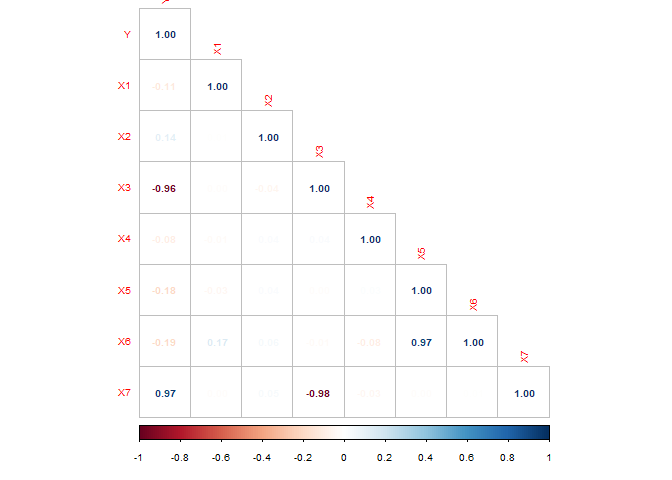
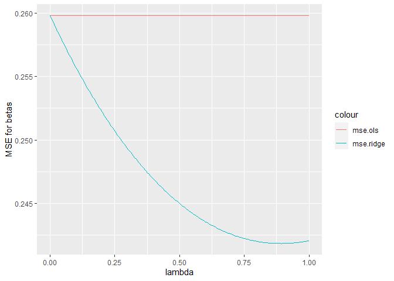
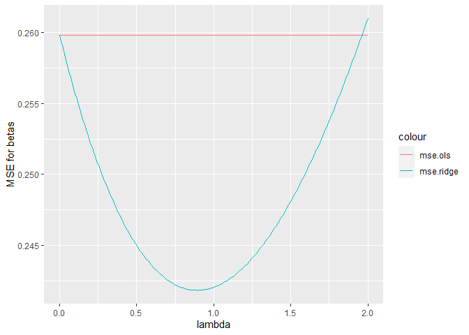
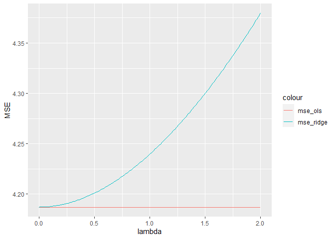
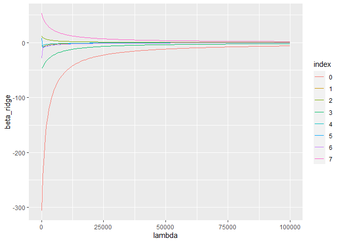
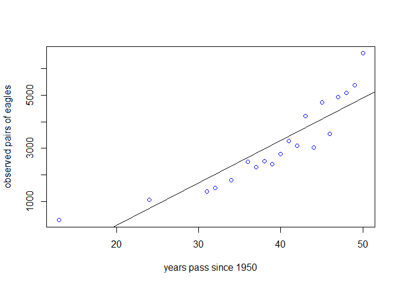
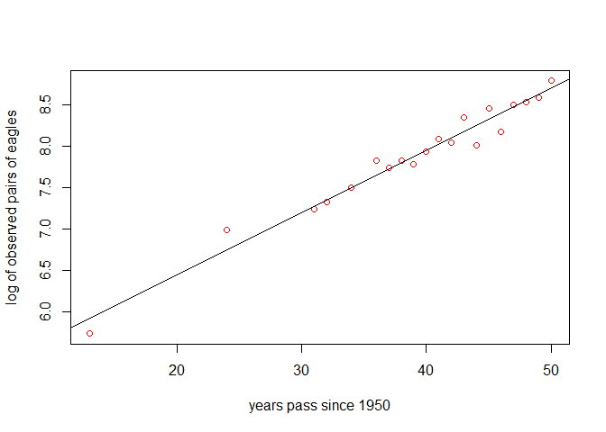
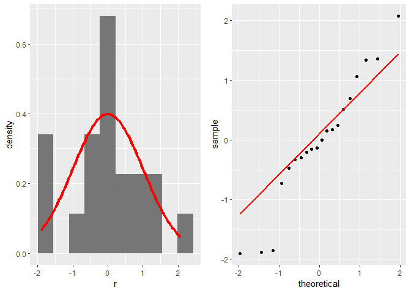
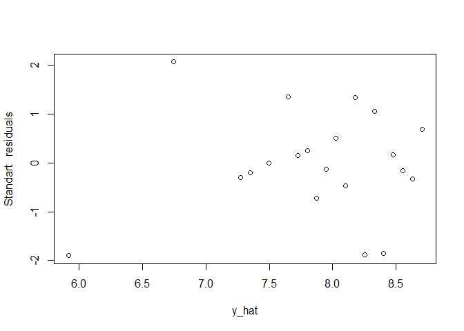
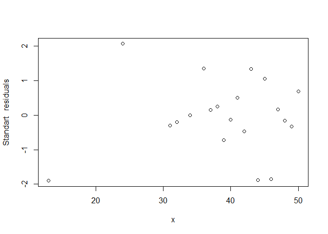

Quiz 2
================
Menachem Sokolik Idan Keipour
6 6 2021

``` r
setwd(dirname(rstudioapi::getActiveDocumentContext()$path))

knitr::opts_chunk$set(warning=FALSE)
```

### Q 1

``` r
df <-  read.csv("quiz2_df.csv") # read  the data
attach(df)
df[c(3:9)] <- lapply(df[c(3:9)], function(x) c(scale(x))) #scaling
str(df)
```

    ## 'data.frame':    2000 obs. of  9 variables:
    ##  $ Y : num  -531 -475 -213 -201 -352 ...
    ##  $ X0: int  1 1 1 1 1 1 1 1 1 1 ...
    ##  $ X1: num  1.674 -0.738 -0.305 -0.147 -0.151 ...
    ##  $ X2: num  -1.015 0.717 0.612 1.392 -1.471 ...
    ##  $ X3: num  1.717 1.722 -0.305 -0.748 0.525 ...
    ##  $ X4: num  -0.657 -0.474 -0.877 0.157 -0.469 ...
    ##  $ X5: num  1.647 -0.164 -1.271 -1.774 -0.969 ...
    ##  $ X6: num  2.023 -0.132 -1.342 -1.73 -1.011 ...
    ##  $ X7: num  -1.565 -1.975 0.612 0.424 -0.545 ...

#### 9

#### compute Pearson correlations among the variables in the data set.

``` r
corrplot(round(cor(df[,-2]),digits=3),method = "number", type = "lower",
         cl.cex = 0.6, pch.cex = 0.6, tl.cex = 0.6, number.cex = 0.6)
```

<!-- -->

the correlation between
(*y*, *x*<sub>3</sub>), (*y*, *x*<sub>7</sub>), (*x*<sub>7</sub>, *x*<sub>3</sub>), (*x*<sub>6</sub>, *x*<sub>5</sub>)
is seen to be very high.

As learned in a correlation lesson according to Pearson coefficient is
good only for pairs of variables. When dealing with multiple variables
we will prefer other methods.

#### compute *R*<sup>2</sup> method that $R^2\_j=\\frac{SSR\_{\\left(j\\right)}}{SST\_{\\left(j\\right)}}$

when are *S**S**R*<sub>(*j*)</sub> and *S**S**T*<sub>(*j*)</sub> are the
sums of the squares corresponding to a multiple linear regression of
*X*<sup>(*j*)</sup> on all other explanatory variables. *R*<sup>2</sup>
is the variance ratio of *X*<sup>(*j*)</sup> explained by the other
explanatory variables

run the regressions.

``` r
fit <- lm(Y~., data = df)
```

Multicolinearity using condition index and VIF, TOL.

``` r
coll.ans <- ols_coll_diag(fit)
dd <- coll.ans$vif_t
dd[with(dd, order(-VIF)), ]
```

    ##   Variables   Tolerance        VIF
    ## 7        X6 0.009906343 100.945426
    ## 6        X5 0.010271640  97.355438
    ## 8        X7 0.038089224  26.254145
    ## 4        X3 0.038112746  26.237941
    ## 2        X1 0.210070282   4.760312
    ## 5        X4 0.485947088   2.057837
    ## 1        X0 0.500008652   1.999965
    ## 3        X2 0.944254733   1.059036

$Tolerance:= 1-R^2\_j=\\frac{SSE\_{\\left(j\\right)}}{SST\_{\\left(j\\right)}}$
If the equality is high then there is less multiculturalism. Like the
variables
(*x*<sub>2</sub>, *x*<sub>0</sub>, *x*<sub>4</sub>, *x*<sub>1</sub>) As
a rule of thumb they have multicollinearity. $VIF:=\\frac{1}{1-R^2\_j}$
If the equality is low then there is no multiculturalism. Like the
variables
(*x*<sub>2</sub>, *x*<sub>0</sub>, *x*<sub>4</sub>, *x*<sub>1</sub>) As
a rule of thumb they have multicollinearity.

rule of thumb for values is *R*<sup>2</sup> = 0.85 As a result
*T**o**l* ≥ 0.15, *V**I**F* ≥ 6.6 is aIndication of strong
multicollinearity.

#### Condition indices and Condition number.

The condition number of x is set to be
$\\gamma \\left(x\\right):=\\left(\\frac{\\gamma \_{\\max }\\left(X^TX\\right)}{\\:\\gamma \_{\\min \\left(X^TX\\right)}}\\right)^{\\frac{1}{2}}$
When we are in the range of 30-100 then it is an indication of strong
multicollinearity.

The condition indices of vector *u*<sub>*k*</sub> of
(*X*<sup>*T*</sup>*X*) is set to be
$\\alpha \\left(x\\right):=\\left(\\frac{\\gamma \_{\\max }\\left(X^TX\\right)}{\\:\\gamma \_{k \\left(X^TX\\right)}}\\right)^{\\frac{1}{2}}$
High value can help us locate *X*<sup>(*j*)</sup> “problematic”
explanatory variables, according to the coordinates of
*u*<sub>*k*</sub>.

``` r
fit <- lm(Y~.-X0, data = df) # we have intercept replace X0. 
round(ols_eigen_cindex(fit),3)
```

    ##   Eigenvalue Condition Index intercept    X1    X2    X3    X4    X5    X6
    ## 1      2.002           1.000         0 0.001 0.004 0.005 0.001 0.001 0.001
    ## 2      1.973           1.007         0 0.001 0.000 0.005 0.000 0.001 0.001
    ## 3      1.049           1.382         0 0.017 0.322 0.000 0.256 0.000 0.000
    ## 4      1.011           1.407         0 0.167 0.153 0.000 0.001 0.000 0.000
    ## 5      1.000           1.415         1 0.000 0.000 0.000 0.000 0.000 0.000
    ## 6      0.942           1.458         0 0.019 0.471 0.000 0.226 0.000 0.000
    ## 7      0.019          10.199         0 0.000 0.002 0.990 0.000 0.000 0.000
    ## 8      0.005          20.144         0 0.796 0.048 0.001 0.517 0.997 0.997
    ##      X7
    ## 1 0.005
    ## 2 0.005
    ## 3 0.000
    ## 4 0.000
    ## 5 0.000
    ## 6 0.000
    ## 7 0.990
    ## 8 0.001

When the Condition Index is high then there is a high correlation
indication alternatively when the Eigenvalue is low. It can be seen that
there is in the variables (*x*<sub>5</sub>, *x*<sub>6</sub>), high
correlation that we saw also in Pearson correlations. Condition Index
Indicates 20.144. But variables (*x*<sub>3</sub>, *x*<sub>7</sub>) have
an effect of lower but still existing variables, the Condition Index
Indicates 10.199.There is a small impact on
(*x*<sub>1</sub>, *x*<sub>4</sub>).Each column sums to one so it is
proportionally. It is difficult to say that there is strong information
for multicollinearity as it is subtly smaller than the total finger
30 − 100.
$\\gamma \\left(x\\right):=\\left(\\frac{\\gamma \_{\\max }\\left(X^TX\\right)}{\\:\\gamma \_{\\min \\left(X^TX\\right)}}\\right)^{\\frac{1}{2}}= 20.144 \\rightarrow \\gamma \\left(x\\right) &lt; 30$.

#### 10

``` r
sigma_sq <- 2 # true sigma squared
beta <- c(3.155678, -2.967792, 5.6823762, -9.4346238, -3.7229186, 0.8544212, -1.4265823, 10.4009092) # true beta vector
lambda_seq <- seq(10^{-4},1,length.out = 200) # lambda sequence to try
lambda_seq_mod <- seq(10^{-4},10^5,length.out = 200)

ridge_aux_functions <- function(X, Y, lambda, sigma_sq, beta_true){
  #' @param X is the X data frame/matrix
  #' @param Y is the Y variable
  #' @param lambda is the ridge penalty parameter
  #' @param sigma_sq is the true model sigma squared
  #' @param beta_true is the true model beta vector
  X <- as.matrix(X)
  Y <- as.matrix(Y)
  beta_true <- as.matrix(beta)
  lambda_diag <- lambda*diag(dim(X)[2]) # lambda*I
  beta_ridge <- solve(t(X) %*% X+lambda_diag) %*% t(X) %*% Y
  A <- solve(t(X) %*% X+lambda_diag) %*% t(X) %*% X
  bais_ridge <- (A %*% beta_true - beta_true)
  var_ridge <- sigma_sq %*% sum(diag(A %*% solve(t(X)%*%X) %*% t(A)))
  mse_ridge <- var_ridge + t(bais_ridge)%*%bais_ridge # from q 6-9.
  
  beta_ols <- solve(t(X) %*% X) %*% t(X)%*%Y
  A <- solve(t(X) %*% X) %*% t(X) %*% X
  bais_ols <- (A %*% beta_true - beta_true)
  var_ols <- sigma_sq %*% sum(diag(A %*% solve(t(X)%*%X) %*% t(A)))
  mse_ols <- var_ols + t(bais_ols)%*%bais_ols # from q 6-9.
  return(list(lambda = lambda, mse_ridge = mse_ridge, mse_ols = mse_ols))
}
X <- df[,-1]
Y <- df["Y"]
```

The ratio between the different mse overall makes sense since Lambda is
close to zero so the punishment is low, as will be explained below

#### 11

``` r
dat <- data.frame(lambda=NA, mse.ridge=NA, mse.ols=NA)
for (lambda in lambda_seq){
  x <- unlist(ridge_aux_functions(X,Y,lambda,sigma_sq,beta))
  dat <- rbind(dat, x)
}
dat <- arrange(na.omit(dat), lambda)# Arrange rows by column values 

ggplot(dat, aes(x = lambda)) + geom_line(aes(y = mse.ols, colour = "mse.ols")) + geom_line(aes(y = mse.ridge, colour = "mse.ridge")) +ylab("MSE for betas")
```

<!-- -->

It can be seen that when *λ* = 0 then the two models merge as expected,
but when When *λ* ≠ 0 It can be said that the larger the *λ* then we
will reduce the *M**S**E*\[*β̂*\] to a certain point when one large *λ*
can be seen that the *M**S**E* is starting to grow. There are ways to
choose the optimal *λ* like when *λ* = 2 is not optimal for low
*M**S**E*\[*β̂*\]. This represents the well-known trade-off between bais
and var. When the var is reduced then the bais increases as well as in
exchange.

``` r
lambda_seq <- seq(10^{-4},2,length.out = 200) # lambda sequence to try
dat <- data.frame(lambda=NA, mse.ridge=NA, mse.ols=NA)
for (lambda in lambda_seq){
  x <- unlist(ridge_aux_functions(X,Y,lambda,sigma_sq,beta))
  dat <- rbind(dat, x)
}
dat <- arrange(na.omit(dat), lambda)# Arrange rows by column values 

ggplot(dat, aes(x = lambda)) + geom_line(aes(y = mse.ols, colour = "mse.ols")) + geom_line(aes(y = mse.ridge, colour = "mse.ridge")) +ylab("MSE for betas")
```

<!-- -->

In order to better understand the model i build this function.

``` r
ridge_aux_functions_1 <- function(X, Y, lambda, sigma_sq){
  #' @param X is the X data frame/matrix
  #' @param Y is the Y variable
  #' @param lambda is the ridge penalty parameter
  #' @param sigma_sq is the true model sigma squared
  X <- as.matrix(X)
  Y <- as.matrix(Y)
  
  lambda_diag <- lambda*diag(dim(X)[2]) # lambda*I
  beta_ridge <- solve(t(X) %*% X+lambda_diag) %*% t(X) %*% Y
  yhat_ridge <- X %*% beta_ridge
  mse_ridge <-  mean((Y-yhat_ridge)^2)
  
  beta_ols <- solve(t(X) %*% X) %*% t(X)%*%Y
  yhat_ols <- X %*% beta_ols
  mse_ols = mean((Y-yhat_ols)^2)
  return(list(lambda = lambda, mse_ridge = mse_ridge, mse_ols = mse_ols))
}
X <- df[,-1]
Y <- df["Y"]
```

``` r
dat <- data.frame(lambda=NA, mse_ridge=NA, mse_ols=NA)
for (lambda in lambda_seq){
  x <- unlist(ridge_aux_functions_1(X,Y,lambda,sigma_sq))
  dat <- rbind(dat, x)
}
dat <- arrange(na.omit(dat), lambda)# Arrange rows by column values 

ggplot(dat, aes(x = lambda)) + geom_line(aes(y = mse_ols, colour = "mse_ols")) + geom_line(aes(y = mse_ridge, colour = "mse_ridge")) +ylab("MSE")
```

<!-- -->

Ridge regression is very similar to least squares, except that the
coefficients are estimated by minimizing a slightly different quantity.
The standard least squares estimates (ridge regression with *λ* = 0 like
in the plot.) are scale equivariant. This means that multiplying
*X*<sub>*j*</sub> by a constant *c* simply leads to a scaling of the
least squares coefficient by $\\frac{1}{c}$ so that
*X*<sub>*j*</sub>*β̂*<sub>*j*</sub> will remain the same. In contrast,
the ridge regression coefficient estimates are not scale equivariant and
can change substantially when multiplying a given predictor by a
constant. *X*<sub>*j*</sub>*β̂*<sub>*j*</sub> will depend not only on
*λ* = 0 but also on the scaling of the *j*<sup>*t**h*</sup> th predictor
and the scaling of the other predictors. Therefore, it is best to apply
ridge regression after standardizing the predictors. In situations where
the relationship between the response and the predictors is close to
linear, the least squares estimates and predictions will have low bias
but may have high variance. In particular when the number of variables p
is almost as large as the number of observations. Ridge regression works
best when the least squares solution has high variance as it can trade a
small increase in bias for a large decrease in variance. Ridge
regression has one obvious disadvantage. The penalty
$\\lambda\\sum\_{j=1}^{p}\\beta\_j^2$ will shrink all of the
coefficients toward zero, but it will not set any of them exactly to
zero. This may not be a problem for prediction accuracy, but can create
a challenge in model interpretation.It can also be seen that by the
penalty could have been reduced in this model which is not without bias
it by increasing the variance. It can be seen that the larger the
lambda, the greater the justice.

#### 12

``` r
ridge_aux_functions_2 <- function(X, Y, lambda_seq_mod){
  dat_2 <- data.frame(index=NA, lambda=NA, beta_ridge=NA)
  X <- as.matrix(X[])
  Y <- as.matrix(Y)
  lambda_diag <- lambda*diag(dim(X)[2]) # lambda*I
  beta_ridge <- solve(t(X) %*% X+lambda_diag) %*% t(X) %*% Y
  return(data.frame(index=1:length(beta_ridge) ,lambda = rep(lambda, length(beta_ridge)), beta_ridge = beta_ridge))
}

X <- df[,-1]
Y <- df["Y"]
dat_2 <- data.frame(index=NA, lambda=NA, beta_ridge=NA)
for (lambda in lambda_seq_mod){
  y <- c(ridge_aux_functions_2(X,Y,lambda_seq_mod))
  names(y) <- c("index", "lambda", "beta_ridge") # Synchronize the names that will match between the data frame.
  dat_2 <- rbind(dat_2, y)
}
dat_2 <- arrange(na.omit(dat_2), lambda) # Arrange rows by column values 
dat_2$index <- as.factor(dat_2$index-1) # Because there is a cutter then double of one variable
rownames(dat_2)<-NULL
dat_2
```

    ##      index      lambda   beta_ridge
    ## 1        0      0.0001 -305.7142346
    ## 2        1      0.0001   -5.9969823
    ## 3        2      0.0001   11.2950964
    ## 4        3      0.0001  -47.4943508
    ## 5        4      0.0001   -7.5242002
    ## 6        5      0.0001    8.4155746
    ## 7        6      0.0001  -29.0250430
    ## 8        7      0.0001   52.9409814
    ## 9        0    502.5127 -244.3258366
    ## 10       1    502.5127   -7.7303501
    ## 11       2    502.5127    9.0195751
    ## 12       3    502.5127  -44.3802073
    ## 13       4    502.5127   -4.7025619
    ## 14       5    502.5127   -8.2905868
    ## 15       6    502.5127   -9.6681043
    ## 16       7    502.5127   44.8486641
    ## 17       0   1005.0252 -203.4686746
    ## 18       1   1005.0252   -6.5567286
    ## 19       2   1005.0252    7.7127493
    ## 20       3   1005.0252  -40.0001591
    ## 21       4   1005.0252   -4.0300933
    ## 22       5   1005.0252   -7.6007281
    ## 23       6   1005.0252   -8.5058322
    ## 24       7   1005.0252   40.2625638
    ## 25       0   1507.5378 -174.3184356
    ## 26       1   1507.5378   -5.6915663
    ## 27       2   1507.5378    6.7521412
    ## 28       3   1507.5378  -36.3709059
    ## 29       4   1507.5378   -3.5417433
    ## 30       5   1507.5378   -6.9497671
    ## 31       6   1507.5378   -7.6507087
    ## 32       7   1507.5378   36.5577560
    ## 33       0   2010.0503 -152.4740206
    ## 34       1   2010.0503   -5.0304933
    ## 35       2   2010.0503    6.0125157
    ## 36       3   2010.0503  -33.3366383
    ## 37       4   2010.0503   -3.1658735
    ## 38       5   2010.0503   -6.3866945
    ## 39       6   2010.0503   -6.9647434
    ## 40       7   2010.0503   33.4833348
    ## 41       0   2512.5629 -135.4947314
    ## 42       1   2512.5629   -4.5088497
    ## 43       2   2512.5629    5.4236957
    ## 44       3   2512.5629  -30.7662944
    ## 45       4   2512.5629   -2.8658643
    ## 46       5   2512.5629   -5.9026317
    ## 47       6   2512.5629   -6.3962562
    ## 48       7   2512.5629   30.8877386
    ## 49       0   3015.0755 -121.9181053
    ## 50       1   3015.0755   -4.0864837
    ## 51       2   3015.0755    4.9428537
    ## 52       3   3015.0755  -28.5623446
    ## 53       4   3015.0755   -2.6200019
    ## 54       5   3015.0755   -5.4842965
    ## 55       6   3015.0755   -5.9156166
    ## 56       7   3015.0755   28.6662961
    ## 57       0   3517.5880 -110.8144529
    ## 58       1   3517.5880   -3.7373228
    ## 59       2   3517.5880    4.5422193
    ## 60       3   3517.5880  -26.6521898
    ## 61       4   3517.5880   -2.4143758
    ## 62       5   3517.5880   -5.1200246
    ## 63       6   3517.5880   -5.5032107
    ## 64       7   3517.5880   26.7432392
    ## 65       0   4020.1006 -101.5644988
    ## 66       1   4020.1006   -3.4437193
    ## 67       2   4020.1006    4.2029256
    ## 68       3   4020.1006  -24.9810055
    ## 69       4   4020.1006   -2.2395839
    ## 70       5   4020.1006   -4.8003708
    ## 71       6   4020.1006   -5.1451486
    ## 72       7   4020.1006   25.0621103
    ## 73       0   4522.6132  -93.7398071
    ## 74       1   4522.6132   -3.1933001
    ## 75       2   4522.6132    3.9116696
    ## 76       3   4522.6132  -23.5067188
    ## 77       4   4522.6132   -2.0890069
    ## 78       5   4522.6132   -4.5178154
    ## 79       6   4522.6132   -4.8311898
    ## 80       7   4522.6132   23.5799043
    ## 81       0   5025.1257  -87.0345278
    ## 82       1   5025.1257   -2.9771287
    ## 83       2   5025.1257    3.6587818
    ## 84       3   5025.1257  -22.1965425
    ## 85       4   5025.1257   -1.9578318
    ## 86       5   5025.1257   -4.2663684
    ## 87       6   5025.1257   -4.5535691
    ## 88       7   5025.1257   22.2632609
    ## 89       0   5527.6383  -81.2244793
    ## 90       1   5527.6383   -2.7885865
    ## 91       2   5527.6383    3.4370535
    ## 92       3   5527.6383  -21.0245640
    ## 93       4   5527.6383   -1.8424647
    ## 94       5   5527.6383   -4.0412281
    ## 95       6   5527.6383   -4.3062708
    ## 96       7   5527.6383   21.0858946
    ## 97       0   6030.1508  -76.1415958
    ## 98       1   6030.1508   -2.6226647
    ## 99       2   6030.1508    3.2409939
    ## 100      3   6030.1508  -19.9700414
    ## 101      4   6030.1508   -1.7401623
    ## 102      5   6030.1508   -3.8385136
    ## 103      6   6030.1508   -4.0845526
    ## 104      7   6030.1508   20.0268093
    ## 105      0   6532.6634  -71.6574029
    ## 106      1   6532.6634   -2.4755013
    ## 107      2   6532.6634    3.0663430
    ## 108      3   6532.6634  -19.0161782
    ## 109      4   6532.6634   -1.6487906
    ## 110      5   6532.6634   -3.6550605
    ## 111      6   6532.6634   -3.8846202
    ## 112      7   6532.6634   19.0690296
    ## 113      0   7035.1760  -67.6720079
    ## 114      1   7035.1760   -2.3440698
    ## 115      2   7035.1760    2.9097423
    ## 116      3   7035.1760  -18.1492309
    ## 117      4   7035.1760   -1.5666629
    ## 118      5   7035.1760   -3.4882665
    ## 119      6   7035.1760   -3.7033998
    ## 120      7   7035.1760   18.1986817
    ## 121      0   7537.6885  -64.1065702
    ## 122      1   7537.6885   -2.2259639
    ## 123      2   7537.6885    2.7685065
    ## 124      3   7537.6885  -17.3578459
    ## 125      4   7537.6885   -1.4924265
    ## 126      5   7537.6885   -3.3359736
    ## 127      6   7537.6885   -3.5383725
    ## 128      7   7537.6885   17.4043150
    ## 129      0   8040.2011  -60.8980332
    ## 130      1   8040.2011   -2.1192462
    ## 131      2   8040.2011    2.6404619
    ## 132      3   8040.2011  -16.6325631
    ## 133      4   8040.2011   -1.4249834
    ## 134      5   8040.2011   -3.1963784
    ## 135      6   8040.2011   -3.3874546
    ## 136      7   8040.2011   16.6763954
    ## 137      0   8542.7137  -57.9953624
    ## 138      1   8542.7137   -2.0223388
    ## 139      2   8542.7137    2.5238292
    ## 140      3   8542.7137  -15.9654367
    ## 141      4   8542.7137   -1.3634325
    ## 142      5   8542.7137   -3.0679629
    ## 143      6   8542.7137   -3.2489062
    ## 144      7   8542.7137   16.0069199
    ## 145      0   9045.2262  -55.3568109
    ## 146      1   9045.2262   -1.9339432
    ## 147      2   9045.2262    2.4171373
    ## 148      3   9045.2262  -15.3497449
    ## 149      4   9045.2262   -1.3070267
    ## 150      5   9045.2262   -2.9494406
    ## 151      6   9045.2262   -3.1212631
    ## 152      7   9045.2262   15.3891214
    ## 153      0   9547.7388  -52.9478984
    ## 154      1   9547.7388   -1.8529814
    ## 155      2   9547.7388    2.3191592
    ## 156      3   9547.7388  -14.7797625
    ## 157      4   9547.7388   -1.2551412
    ## 158      5   9547.7388   -2.8397141
    ## 159      6   9547.7388   -3.0032841
    ## 160      7   9547.7388   14.8172387
    ## 161      0  10050.2513  -50.7398960
    ## 162      1  10050.2513   -1.7785502
    ## 163      2  10050.2513    2.2288630
    ## 164      3  10050.2513  -14.2505833
    ## 165      4  10050.2513   -1.2072493
    ## 166      5  10050.2513   -2.7378420
    ## 167      6  10050.2513   -2.8939099
    ## 168      7  10050.2513   14.2863363
    ## 169      0  10552.7639  -48.7086752
    ## 170      1  10552.7639   -1.7098878
    ## 171      2  10552.7639    2.1453744
    ## 172      3  10552.7639  -13.7579786
    ## 173      4  10552.7639   -1.1629036
    ## 174      5  10552.7639   -2.6430121
    ## 175      6  10552.7639   -2.7922309
    ## 176      7  10552.7639   13.7921618
    ## 177      0  11055.2765  -46.8338224
    ## 178      1  11055.2765   -1.6463466
    ## 179      2  11055.2765    2.0679474
    ## 180      3  11055.2765  -13.2982845
    ## 181      4  11055.2765   -1.1217217
    ## 182      5  11055.2765   -2.5545204
    ## 183      6  11055.2765   -2.6974615
    ## 184      7  11055.2765   13.3310312
    ## 185      0  11557.7890  -45.0979506
    ## 186      1  11557.7890   -1.5873726
    ## 187      2  11557.7890    1.9959419
    ## 188      3  11557.7890  -12.8683102
    ## 189      4  11557.7890   -1.0833744
    ## 190      5  11557.7890   -2.4717530
    ## 191      6  11557.7890   -2.6089196
    ## 192      7  11557.7890   12.8997375
    ## 193      0  12060.3016  -43.4861582
    ## 194      1  12060.3016   -1.5324893
    ## 195      2  12060.3016    1.9288051
    ## 196      3  12060.3016  -12.4652646
    ## 197      4  12060.3016   -1.0475771
    ## 198      5  12060.3016   -2.3941730
    ## 199      6  12060.3016   -2.5260104
    ## 200      7  12060.3016   12.4954757
    ## 201      0  12562.8142  -41.9856007
    ## 202      1  12562.8142   -1.4812842
    ## 203      2  12562.8142    1.8660573
    ## 204      3  12562.8142  -12.0866954
    ## 205      4  12562.8142   -1.0140824
    ## 206      5  12562.8142   -2.3213083
    ## 207      6  12562.8142   -2.4482123
    ## 208      7  12562.8142   12.1157816
    ## 209      0  13065.3267  -40.5851470
    ## 210      1  13065.3267   -1.4333988
    ## 211      2  13065.3267    1.8072801
    ## 212      3  13065.3267  -11.7304389
    ## 213      4  13065.3267   -0.9826737
    ## 214      5  13065.3267   -2.2527424
    ## 215      6  13065.3267   -2.3750665
    ## 216      7  13065.3267   11.7584817
    ## 217      0  13567.8393  -39.2751035
    ## 218      1  13567.8393   -1.3885196
    ## 219      2  13567.8393    1.7521066
    ## 220      3  13567.8393  -11.3945794
    ## 221      4  13567.8393   -0.9531612
    ## 222      5  13567.8393   -2.1881062
    ## 223      6  13567.8393   -2.3061675
    ## 224      7  13567.8393   11.4216517
    ## 225      0  14070.3518  -38.0469890
    ## 226      1  14070.3518   -1.3463716
    ## 227      2  14070.3518    1.7002142
    ## 228      3  14070.3518  -11.0774142
    ## 229      4  14070.3518   -0.9253774
    ## 230      5  14070.3518   -2.1270718
    ## 231      6  14070.3518   -2.2411555
    ## 232      7  14070.3518   11.1035814
    ## 233      0  14572.8644  -36.8933508
    ## 234      1  14572.8644   -1.3067123
    ## 235      2  14572.8644    1.6513176
    ## 236      3  14572.8644  -10.7774250
    ## 237      4  14572.8644   -0.8991741
    ## 238      5  14572.8644   -2.0693466
    ## 239      6  14572.8644   -2.1797105
    ## 240      7  14572.8644   10.8027460
    ## 241      0  15075.3770  -35.8076135
    ## 242      1  15075.3770   -1.2693272
    ## 243      2  15075.3770    1.6051638
    ## 244      3  15075.3770  -10.4932536
    ## 245      4  15075.3770   -0.8744197
    ## 246      5  15075.3770   -2.0146689
    ## 247      6  15075.3770   -2.1215465
    ## 248      7  15075.3770   10.5177817
    ## 249      0  15577.8895  -34.7839539
    ## 250      1  15577.8895   -1.2340258
    ## 251      2  15577.8895    1.5615277
    ## 252      3  15577.8895  -10.2236811
    ## 253      4  15577.8895   -0.8509966
    ## 254      5  15577.8895   -1.9628038
    ## 255      6  15577.8895   -2.0664074
    ## 256      7  15577.8895   10.2474649
    ## 257      0  16080.4021  -33.8171959
    ## 258      1  16080.4021   -1.2006384
    ## 259      2  16080.4021    1.5202082
    ## 260      3  16080.4021   -9.9676110
    ## 261      4  16080.4021   -0.8288001
    ## 262      5  16080.4021   -1.9135399
    ## 263      6  16080.4021   -2.0140631
    ## 264      7  16080.4021    9.9906945
    ## 265      0  16582.9147  -32.9027233
    ## 266      1  16582.9147   -1.1690130
    ## 267      2  16582.9147    1.4810249
    ## 268      3  16582.9147   -9.7240536
    ## 269      4  16582.9147   -0.8077358
    ## 270      5  16582.9147   -1.8666866
    ## 271      6  16582.9147   -1.9643062
    ## 272      7  16582.9147    9.7464771
    ## 273      0  17085.4272  -32.0364062
    ## 274      1  17085.4272   -1.1390137
    ## 275      2  17085.4272    1.4438161
    ## 276      3  17085.4272   -9.4921138
    ## 277      4  17085.4272   -0.7877190
    ## 278      5  17085.4272   -1.8220711
    ## 279      6  17085.4272   -1.9169495
    ## 280      7  17085.4272    9.5139142
    ## 281      0  17587.9398  -31.2145385
    ## 282      1  17587.9398   -1.1105179
    ## 283      2  17587.9398    1.4084358
    ## 284      3  17587.9398   -9.2709798
    ## 285      4  17587.9398   -0.7686732
    ## 286      5  17587.9398   -1.7795372
    ## 287      6  17587.9398   -1.8718233
    ## 288      7  17587.9398    9.2921910
    ## 289      0  18090.4523  -30.4337846
    ## 290      1  18090.4523   -1.0834153
    ## 291      2  18090.4523    1.3747521
    ## 292      3  18090.4523   -9.0599137
    ## 293      4  18090.4523   -0.7505293
    ## 294      5  18090.4523   -1.7389425
    ## 295      6  18090.4523   -1.8287735
    ## 296      7  18090.4523    9.0805668
    ## 297      0  18592.9649  -29.6911349
    ## 298      1  18592.9649   -1.0576059
    ## 299      2  18592.9649    1.3426455
    ## 300      3  18592.9649   -8.8582433
    ## 301      4  18592.9649   -0.7332244
    ## 302      5  18592.9649   -1.7001574
    ## 303      6  18592.9649   -1.7876600
    ## 304      7  18592.9649    8.8783671
    ## 305      0  19095.4775  -28.9838664
    ## 306      1  19095.4775   -1.0329992
    ## 307      2  19095.4775    1.3120076
    ## 308      3  19095.4775   -8.6653550
    ## 309      4  19095.4775   -0.7167016
    ## 310      5  19095.4775   -1.6630638
    ## 311      6  19095.4775   -1.7483551
    ## 312      7  19095.4775    8.6849761
    ## 313      0  19597.9900  -28.3095093
    ## 314      1  19597.9900   -1.0095130
    ## 315      2  19597.9900    1.2827396
    ## 316      3  19597.9900   -8.4806873
    ## 317      4  19597.9900   -0.7009088
    ## 318      5  19597.9900   -1.6275533
    ## 319      6  19597.9900   -1.7107418
    ## 320      7  19597.9900    8.4998303
    ## 321      0  20100.5026  -27.6658188
    ## 322      1  20100.5026   -0.9870724
    ## 323      2  20100.5026    1.2547516
    ## 324      3  20100.5026   -8.3037259
    ## 325      4  20100.5026   -0.6857987
    ## 326      5  20100.5026   -1.5935267
    ## 327      6  20100.5026   -1.6747133
    ## 328      7  20100.5026    8.3224135
    ## 329      0  20603.0152  -27.0507494
    ## 330      1  20603.0152   -0.9656089
    ## 331      2  20603.0152    1.2279611
    ## 332      3  20603.0152   -8.1339980
    ## 333      4  20603.0152   -0.6713277
    ## 334      5  20603.0152   -1.5608931
    ## 335      6  20603.0152   -1.6401714
    ## 336      7  20603.0152    8.1522516
    ## 337      0  21105.5277  -26.4624339
    ## 338      1  21105.5277   -0.9450601
    ## 339      2  21105.5277    1.2022928
    ## 340      3  21105.5277   -7.9710693
    ## 341      4  21105.5277   -0.6574562
    ## 342      5  21105.5277   -1.5295687
    ## 343      6  21105.5277   -1.6070260
    ## 344      7  21105.5277    7.9889085
    ## 345      0  21608.0403  -25.8991637
    ## 346      1  21608.0403   -0.9253686
    ## 347      2  21608.0403    1.1776775
    ## 348      3  21608.0403   -7.8145391
    ## 349      4  21608.0403   -0.6441474
    ## 350      5  21608.0403   -1.4994762
    ## 351      6  21608.0403   -1.5751940
    ## 352      7  21608.0403    7.8319825
    ## 353      0  22110.5528  -25.3593729
    ## 354      1  22110.5528   -0.9064818
    ## 355      2  22110.5528    1.1540516
    ## 356      3  22110.5528   -7.6640378
    ## 357      4  22110.5528   -0.6313678
    ## 358      5  22110.5528   -1.4705444
    ## 359      6  22110.5528   -1.5445988
    ## 360      7  22110.5528    7.6811027
    ## 361      0  22613.0654  -24.8416233
    ## 362      1  22613.0654   -0.8883513
    ## 363      2  22613.0654    1.1313565
    ## 364      3  22613.0654   -7.5192237
    ## 365      4  22613.0654   -0.6190864
    ## 366      5  22613.0654   -1.4427075
    ## 367      6  22613.0654   -1.5151698
    ## 368      7  22613.0654    7.5359261
    ## 369      0  23115.5780  -24.3445921
    ## 370      1  23115.5780   -0.8709326
    ## 371      2  23115.5780    1.1095382
    ## 372      3  23115.5780   -7.3797805
    ## 373      4  23115.5780   -0.6072745
    ## 374      5  23115.5780   -1.4159045
    ## 375      6  23115.5780   -1.4868414
    ## 376      7  23115.5780    7.3961356
    ## 377      0  23618.0905  -23.8670598
    ## 378      1  23618.0905   -0.8541845
    ## 379      2  23618.0905    1.0885468
    ## 380      3  23618.0905   -7.2454148
    ## 381      4  23618.0905   -0.5959057
    ## 382      5  23618.0905   -1.3900788
    ## 383      6  23618.0905   -1.4595531
    ## 384      7  23618.0905    7.2614367
    ## 385      0  24120.6031  -23.4079013
    ## 386      1  24120.6031   -0.8380689
    ## 387      2  24120.6031    1.0683361
    ## 388      3  24120.6031   -7.1158542
    ## 389      4  24120.6031   -0.5849555
    ## 390      5  24120.6031   -1.3651781
    ## 391      6  24120.6031   -1.4332486
    ## 392      7  24120.6031    7.1315563
    ## 393      0  24623.1157  -22.9660761
    ## 394      1  24623.1157   -0.8225507
    ## 395      2  24623.1157    1.0488632
    ## 396      3  24623.1157   -6.9908455
    ## 397      4  24623.1157   -0.5744010
    ## 398      5  24623.1157   -1.3411534
    ## 399      6  24623.1157   -1.4078756
    ## 400      7  24623.1157    7.0062404
    ## 401      0  25125.6282  -22.5406208
    ## 402      1  25125.6282   -0.8075973
    ## 403      2  25125.6282    1.0300884
    ## 404      3  25125.6282   -6.8701530
    ## 405      4  25125.6282   -0.5642213
    ## 406      5  25125.6282   -1.3179594
    ## 407      6  25125.6282   -1.3833854
    ## 408      7  25125.6282    6.8852525
    ## 409      0  25628.1408  -22.1306423
    ## 410      1  25628.1408   -0.7931783
    ## 411      2  25628.1408    1.0119748
    ## 412      3  25628.1408   -6.7535570
    ## 413      4  25628.1408   -0.5543967
    ## 414      5  25628.1408   -1.2955538
    ## 415      6  25628.1408   -1.3597329
    ## 416      7  25628.1408    6.7683723
    ## 417      0  26130.6533  -21.7353110
    ## 418      1  26130.6533   -0.7792655
    ## 419      2  26130.6533    0.9944881
    ## 420      3  26130.6533   -6.6408524
    ## 421      4  26130.6533   -0.5449088
    ## 422      5  26130.6533   -1.2738970
    ## 423      6  26130.6533   -1.3368757
    ## 424      7  26130.6533    6.6553939
    ## 425      0  26633.1659  -21.3538559
    ## 426      1  26633.1659   -0.7658328
    ## 427      2  26633.1659    0.9775961
    ## 428      3  26633.1659   -6.5318476
    ## 429      4  26633.1659   -0.5357407
    ## 430      5  26633.1659   -1.2529521
    ## 431      6  26633.1659   -1.3147744
    ## 432      7  26633.1659    6.5461253
    ## 433      0  27135.6785  -20.9855590
    ## 434      1  27135.6785   -0.7528557
    ## 435      2  27135.6785    0.9612691
    ## 436      3  27135.6785   -6.4263633
    ## 437      4  27135.6785   -0.5268764
    ## 438      5  27135.6785   -1.2326846
    ## 439      6  27135.6785   -1.2933921
    ## 440      7  27135.6785    6.4403867
    ## 441      0  27638.1910  -20.6297510
    ## 442      1  27638.1910   -0.7403114
    ## 443      2  27638.1910    0.9454791
    ## 444      3  27638.1910   -6.3242317
    ## 445      4  27638.1910   -0.5183011
    ## 446      5  27638.1910   -1.2130622
    ## 447      6  27638.1910   -1.2726942
    ## 448      7  27638.1910    6.3380097
    ## 449      0  28140.7036  -20.2858071
    ## 450      1  28140.7036   -0.7281785
    ## 451      2  28140.7036    0.9302000
    ## 452      3  28140.7036   -6.2252955
    ## 453      4  28140.7036   -0.5100007
    ## 454      5  28140.7036   -1.1940545
    ## 455      6  28140.7036   -1.2526484
    ## 456      7  28140.7036    6.2388365
    ## 457      0  28643.2162  -19.9531438
    ## 458      1  28643.2162   -0.7164372
    ## 459      2  28643.2162    0.9154074
    ## 460      3  28643.2162   -6.1294071
    ## 461      4  28643.2162   -0.5019624
    ## 462      5  28643.2162   -1.1756332
    ## 463      6  28643.2162   -1.2332244
    ## 464      7  28643.2162    6.1427191
    ## 465      0  29145.7287  -19.6312151
    ## 466      1  29145.7287   -0.7050688
    ## 467      2  29145.7287    0.9010784
    ## 468      3  29145.7287   -6.0364277
    ## 469      4  29145.7287   -0.4941738
    ## 470      5  29145.7287   -1.1577715
    ## 471      6  29145.7287   -1.2143937
    ## 472      7  29145.7287    6.0495184
    ## 473      0  29648.2413  -19.3195096
    ## 474      1  29648.2413   -0.6940557
    ## 475      2  29648.2413    0.8871915
    ## 476      3  29648.2413   -5.9462269
    ## 477      4  29648.2413   -0.4866235
    ## 478      5  29648.2413   -1.1404443
    ## 479      6  29648.2413   -1.1961294
    ## 480      7  29648.2413    5.9591035
    ## 481      0  30150.7538  -19.0175479
    ## 482      1  30150.7538   -0.6833816
    ## 483      2  30150.7538    0.8737266
    ## 484      3  30150.7538   -5.8586820
    ## 485      4  30150.7538   -0.4793006
    ## 486      5  30150.7538   -1.1236279
    ## 487      6  30150.7538   -1.1784065
    ## 488      7  30150.7538    5.8713515
    ## 489      0  30653.2664  -18.7248801
    ## 490      1  30653.2664   -0.6730311
    ## 491      2  30653.2664    0.8606647
    ## 492      3  30653.2664   -5.7736775
    ## 493      4  30653.2664   -0.4721952
    ## 494      5  30653.2664   -1.1073002
    ## 495      6  30653.2664   -1.1612011
    ## 496      7  30653.2664    5.7861464
    ## 497      0  31155.7790  -18.4410838
    ## 498      1  31155.7790   -0.6629896
    ## 499      2  31155.7790    0.8479879
    ## 500      3  31155.7790   -5.6911043
    ## 501      4  31155.7790   -0.4652975
    ## 502      5  31155.7790   -1.0914401
    ## 503      6  31155.7790   -1.1444910
    ## 504      7  31155.7790    5.7033789
    ## 505      0  31658.2915  -18.1657616
    ## 506      1  31658.2915   -0.6532435
    ## 507      2  31658.2915    0.8356795
    ## 508      3  31658.2915   -5.6108596
    ## 509      4  31658.2915   -0.4585987
    ## 510      5  31658.2915   -1.0760278
    ## 511      6  31658.2915   -1.1282550
    ## 512      7  31658.2915    5.6229459
    ## 513      0  32160.8041  -17.8985395
    ## 514      1  32160.8041   -0.6437800
    ## 515      2  32160.8041    0.8237235
    ## 516      3  32160.8041   -5.5328463
    ## 517      4  32160.8041   -0.4520902
    ## 518      5  32160.8041   -1.0610447
    ## 519      6  32160.8041   -1.1124733
    ## 520      7  32160.8041    5.5447500
    ## 521      0  32663.3167  -17.6390651
    ## 522      1  32663.3167   -0.6345869
    ## 523      2  32663.3167    0.8121051
    ## 524      3  32663.3167   -5.4569726
    ## 525      4  32663.3167   -0.4457641
    ## 526      5  32663.3167   -1.0464730
    ## 527      6  32663.3167   -1.0971271
    ## 528      7  32663.3167    5.4686991
    ## 529      0  33165.8292  -17.3870065
    ## 530      1  33165.8292   -0.6256528
    ## 531      2  33165.8292    0.8008102
    ## 532      3  33165.8292   -5.3831517
    ## 533      4  33165.8292   -0.4396127
    ## 534      5  33165.8292   -1.0322960
    ## 535      6  33165.8292   -1.0821985
    ## 536      7  33165.8292    5.3947061
    ## 537      0  33668.3418  -17.1420500
    ## 538      1  33668.3418   -0.6169668
    ## 539      2  33668.3418    0.7898254
    ## 540      3  33668.3418   -5.3113013
    ## 541      4  33668.3418   -0.4336289
    ## 542      5  33668.3418   -1.0184979
    ## 543      6  33668.3418   -1.0676708
    ## 544      7  33668.3418    5.3226887
    ## 545      0  34170.8543  -16.9038999
    ## 546      1  34170.8543   -0.6085189
    ## 547      2  34170.8543    0.7791381
    ## 548      3  34170.8543   -5.2413436
    ## 549      4  34170.8543   -0.4278060
    ## 550      5  34170.8543   -1.0050638
    ## 551      6  34170.8543   -1.0535280
    ## 552      7  34170.8543    5.2525688
    ## 553      0  34673.3669  -16.6722761
    ## 554      1  34673.3669   -0.6002993
    ## 555      2  34673.3669    0.7687364
    ## 556      3  34673.3669   -5.1732048
    ## 557      4  34673.3669   -0.4221375
    ## 558      5  34673.3669   -0.9919794
    ## 559      6  34673.3669   -1.0397550
    ## 560      7  34673.3669    5.1842723
    ## 561      0  35175.8795  -16.4469142
    ## 562      1  35175.8795   -0.5922989
    ## 563      2  35175.8795    0.7586090
    ## 564      3  35175.8795   -5.1068149
    ## 565      4  35175.8795   -0.4166174
    ## 566      5  35175.8795   -0.9792313
    ## 567      6  35175.8795   -1.0263375
    ## 568      7  35175.8795    5.1177291
    ## 569      0  35678.3920  -16.2275635
    ## 570      1  35678.3920   -0.5845091
    ## 571      2  35678.3920    0.7487451
    ## 572      3  35678.3920   -5.0421074
    ## 573      4  35678.3920   -0.4112399
    ## 574      5  35678.3920   -0.9668066
    ## 575      6  35678.3920   -1.0132619
    ## 576      7  35678.3920    5.0528725
    ## 577      0  36180.9046  -16.0139867
    ## 578      1  36180.9046   -0.5769215
    ## 579      2  36180.9046    0.7391347
    ## 580      3  36180.9046   -4.9790191
    ## 581      4  36180.9046   -0.4059996
    ## 582      5  36180.9046   -0.9546931
    ## 583      6  36180.9046   -1.0005153
    ## 584      7  36180.9046    4.9896391
    ## 585      0  36683.4171  -15.8059589
    ## 586      1  36683.4171   -0.5695286
    ## 587      2  36683.4171    0.7297679
    ## 588      3  36683.4171   -4.9174900
    ## 589      4  36683.4171   -0.4008913
    ## 590      5  36683.4171   -0.9428795
    ## 591      6  36683.4171   -0.9880855
    ## 592      7  36683.4171    4.9279688
    ## 593      0  37185.9297  -15.6032664
    ## 594      1  37185.9297   -0.5623228
    ## 595      2  37185.9297    0.7206358
    ## 596      3  37185.9297   -4.8574630
    ## 597      4  37185.9297   -0.3959100
    ## 598      5  37185.9297   -0.9313545
    ## 599      6  37185.9297   -0.9759607
    ## 600      7  37185.9297    4.8678044
    ## 601      0  37688.4423  -15.4057067
    ## 602      1  37688.4423   -0.5552971
    ## 603      2  37688.4423    0.7117296
    ## 604      3  37688.4423   -4.7988839
    ## 605      4  37688.4423   -0.3910510
    ## 606      5  37688.4423   -0.9201079
    ## 607      6  37688.4423   -0.9641300
    ## 608      7  37688.4423    4.8090912
    ## 609      0  38190.9548  -15.2130872
    ## 610      1  38190.9548   -0.5484449
    ## 611      2  38190.9548    0.7030409
    ## 612      3  38190.9548   -4.7417007
    ## 613      4  38190.9548   -0.3863100
    ## 614      5  38190.9548   -0.9091296
    ## 615      6  38190.9548   -0.9525826
    ## 616      7  38190.9548    4.7517776
    ## 617      0  38693.4674  -15.0252249
    ## 618      1  38693.4674   -0.5417598
    ## 619      2  38693.4674    0.6945619
    ## 620      3  38693.4674   -4.6858643
    ## 621      4  38693.4674   -0.3816826
    ## 622      5  38693.4674   -0.8984102
    ## 623      6  38693.4674   -0.9413086
    ## 624      7  38693.4674    4.6958139
    ## 625      0  39195.9800  -14.8419458
    ## 626      1  39195.9800   -0.5352358
    ## 627      2  39195.9800    0.6862852
    ## 628      3  39195.9800   -4.6313275
    ## 629      4  39195.9800   -0.3771648
    ## 630      5  39195.9800   -0.8879406
    ## 631      6  39195.9800   -0.9302983
    ## 632      7  39195.9800    4.6411531
    ## 633      0  39698.4925  -14.6630840
    ## 634      1  39698.4925   -0.5288671
    ## 635      2  39698.4925    0.6782035
    ## 636      3  39698.4925   -4.5780456
    ## 637      4  39698.4925   -0.3727529
    ## 638      5  39698.4925   -0.8777121
    ## 639      6  39698.4925   -0.9195427
    ## 640      7  39698.4925    4.5877502
    ## 641      0  40201.0051  -14.4884819
    ## 642      1  40201.0051   -0.5226482
    ## 643      2  40201.0051    0.6703100
    ## 644      3  40201.0051   -4.5259757
    ## 645      4  40201.0051   -0.3684430
    ## 646      5  40201.0051   -0.8677166
    ## 647      6  40201.0051   -0.9090329
    ## 648      7  40201.0051    4.5355623
    ## 649      0  40703.5176  -14.3179891
    ## 650      1  40703.5176   -0.5165739
    ## 651      2  40703.5176    0.6625983
    ## 652      3  40703.5176   -4.4750769
    ## 653      4  40703.5176   -0.3642317
    ## 654      5  40703.5176   -0.8579461
    ## 655      6  40703.5176   -0.8987607
    ## 656      7  40703.5176    4.4845483
    ## 657      0  41206.0302  -14.1514621
    ## 658      1  41206.0302   -0.5106393
    ## 659      2  41206.0302    0.6550621
    ## 660      3  41206.0302   -4.4253102
    ## 661      4  41206.0302   -0.3601156
    ## 662      5  41206.0302   -0.8483932
    ## 663      6  41206.0302   -0.8887180
    ## 664      7  41206.0302    4.4346692
    ## 665      0  41708.5428  -13.9887642
    ## 666      1  41708.5428   -0.5048395
    ## 667      2  41708.5428    0.6476954
    ## 668      3  41708.5428   -4.3766382
    ## 669      4  41708.5428   -0.3560916
    ## 670      5  41708.5428   -0.8390507
    ## 671      6  41708.5428   -0.8788973
    ## 672      7  41708.5428    4.3858873
    ## 673      0  42211.0553  -13.8297649
    ## 674      1  42211.0553   -0.4991700
    ## 675      2  42211.0553    0.6404927
    ## 676      3  42211.0553   -4.3290252
    ## 677      4  42211.0553   -0.3521565
    ## 678      5  42211.0553   -0.8299116
    ## 679      6  42211.0553   -0.8692913
    ## 680      7  42211.0553    4.3381671
    ## 681      0  42713.5679  -13.6743393
    ## 682      1  42713.5679   -0.4936265
    ## 683      2  42713.5679    0.6334486
    ## 684      3  42713.5679   -4.2824369
    ## 685      4  42713.5679   -0.3483076
    ## 686      5  42713.5679   -0.8209695
    ## 687      6  42713.5679   -0.8598930
    ## 688      7  42713.5679    4.2914740
    ## 689      0  43216.0805  -13.5223684
    ## 690      1  43216.0805   -0.4882048
    ## 691      2  43216.0805    0.6265577
    ## 692      3  43216.0805   -4.2368407
    ## 693      4  43216.0805   -0.3445419
    ## 694      5  43216.0805   -0.8122180
    ## 695      6  43216.0805   -0.8506958
    ## 696      7  43216.0805    4.2457754
    ## 697      0  43718.5930  -13.3737383
    ## 698      1  43718.5930   -0.4829010
    ## 699      2  43718.5930    0.6198153
    ## 700      3  43718.5930   -4.1922053
    ## 701      4  43718.5930   -0.3408568
    ## 702      5  43718.5930   -0.8036511
    ## 703      6  43718.5930   -0.8416932
    ## 704      7  43718.5930    4.2010398
    ## 705      0  44221.1056  -13.2283400
    ## 706      1  44221.1056   -0.4777112
    ## 707      2  44221.1056    0.6132164
    ## 708      3  44221.1056   -4.1485005
    ## 709      4  44221.1056   -0.3372498
    ## 710      5  44221.1056   -0.7952630
    ## 711      6  44221.1056   -0.8328792
    ## 712      7  44221.1056    4.1572371
    ## 713      0  44723.6181  -13.0860692
    ## 714      1  44723.6181   -0.4726317
    ## 715      2  44723.6181    0.6067567
    ## 716      3  44723.6181   -4.1056975
    ## 717      4  44723.6181   -0.3337183
    ## 718      5  44723.6181   -0.7870482
    ## 719      6  44723.6181   -0.8242479
    ## 720      7  44723.6181    4.1143384
    ## 721      0  45226.1307  -12.9468261
    ## 722      1  45226.1307   -0.4676592
    ## 723      2  45226.1307    0.6004317
    ## 724      3  45226.1307   -4.0637687
    ## 725      4  45226.1307   -0.3302600
    ## 726      5  45226.1307   -0.7790013
    ## 727      6  45226.1307   -0.8157937
    ## 728      7  45226.1307    4.0723160
    ## 729      0  45728.6433  -12.8105150
    ## 730      1  45728.6433   -0.4627903
    ## 731      2  45728.6433    0.5942373
    ## 732      3  45728.6433   -4.0226877
    ## 733      4  45728.6433   -0.3268728
    ## 734      5  45728.6433   -0.7711173
    ## 735      6  45728.6433   -0.8075111
    ## 736      7  45728.6433    4.0311433
    ## 737      0  46231.1558  -12.6770443
    ## 738      1  46231.1558   -0.4580218
    ## 739      2  46231.1558    0.5881694
    ## 740      3  46231.1558   -3.9824290
    ## 741      4  46231.1558   -0.3235543
    ## 742      5  46231.1558   -0.7633913
    ## 743      6  46231.1558   -0.7993950
    ## 744      7  46231.1558    3.9907948
    ## 745      0  46733.6684  -12.5463262
    ## 746      1  46733.6684   -0.4533505
    ## 747      2  46733.6684    0.5822243
    ## 748      3  46733.6684   -3.9429680
    ## 749      4  46733.6684   -0.3203026
    ## 750      5  46733.6684   -0.7558185
    ## 751      6  46733.6684   -0.7914405
    ## 752      7  46733.6684    3.9512460
    ## 753      0  47236.1810  -12.4182763
    ## 754      1  47236.1810   -0.4487736
    ## 755      2  47236.1810    0.5763982
    ## 756      3  47236.1810   -3.9042814
    ## 757      4  47236.1810   -0.3171156
    ## 758      5  47236.1810   -0.7483945
    ## 759      6  47236.1810   -0.7836427
    ## 760      7  47236.1810    3.9124734
    ## 761      0  47738.6935  -12.2928138
    ## 762      1  47738.6935   -0.4442882
    ## 763      2  47738.6935    0.5706876
    ## 764      3  47738.6935   -3.8663465
    ## 765      4  47738.6935   -0.3139915
    ## 766      5  47738.6935   -0.7411149
    ## 767      6  47738.6935   -0.7759971
    ## 768      7  47738.6935    3.8744543
    ## 769      0  48241.2061  -12.1698611
    ## 770      1  48241.2061   -0.4398916
    ## 771      2  48241.2061    0.5650890
    ## 772      3  48241.2061   -3.8291418
    ## 773      4  48241.2061   -0.3109283
    ## 774      5  48241.2061   -0.7339756
    ## 775      6  48241.2061   -0.7684993
    ## 776      7  48241.2061    3.8371670
    ## 777      0  48743.7186  -12.0493436
    ## 778      1  48743.7186   -0.4355812
    ## 779      2  48743.7186    0.5595993
    ## 780      3  48743.7186   -3.7926462
    ## 781      4  48743.7186   -0.3079243
    ## 782      5  48743.7186   -0.7269724
    ## 783      6  48743.7186   -0.7611449
    ## 784      7  48743.7186    3.8005906
    ## 785      0  49246.2312  -11.9311896
    ## 786      1  49246.2312   -0.4313544
    ## 787      2  49246.2312    0.5542153
    ## 788      3  49246.2312   -3.7568397
    ## 789      4  49246.2312   -0.3049779
    ## 790      5  49246.2312   -0.7201017
    ## 791      6  49246.2312   -0.7539300
    ## 792      7  49246.2312    3.7647048
    ## 793      0  49748.7438  -11.8153303
    ## 794      1  49748.7438   -0.4272089
    ## 795      2  49748.7438    0.5489339
    ## 796      3  49748.7438   -3.7217030
    ## 797      4  49748.7438   -0.3020873
    ## 798      5  49748.7438   -0.7133596
    ## 799      6  49748.7438   -0.7468506
    ## 800      7  49748.7438    3.7294904
    ## 801      0  50251.2563  -11.7016995
    ## 802      1  50251.2563   -0.4231424
    ## 803      2  50251.2563    0.5437523
    ## 804      3  50251.2563   -3.6872174
    ## 805      4  50251.2563   -0.2992511
    ## 806      5  50251.2563   -0.7067425
    ## 807      6  50251.2563   -0.7399029
    ## 808      7  50251.2563    3.6949287
    ## 809      0  50753.7689  -11.5902335
    ## 810      1  50753.7689   -0.4191526
    ## 811      2  50753.7689    0.5386676
    ## 812      3  50753.7689   -3.6533651
    ## 813      4  50753.7689   -0.2964676
    ## 814      5  50753.7689   -0.7002471
    ## 815      6  50753.7689   -0.7330833
    ## 816      7  50753.7689    3.6610017
    ## 817      0  51256.2815  -11.4808710
    ## 818      1  51256.2815   -0.4152373
    ## 819      2  51256.2815    0.5336772
    ## 820      3  51256.2815   -3.6201286
    ## 821      4  51256.2815   -0.2937354
    ## 822      5  51256.2815   -0.6938699
    ## 823      6  51256.2815   -0.7263882
    ## 824      7  51256.2815    3.6276920
    ## 825      0  51758.7940  -11.3735531
    ## 826      1  51758.7940   -0.4113945
    ## 827      2  51758.7940    0.5287784
    ## 828      3  51758.7940   -3.5874915
    ## 829      4  51758.7940   -0.2910532
    ## 830      5  51758.7940   -0.6876079
    ## 831      6  51758.7940   -0.7198143
    ## 832      7  51758.7940    3.5949830
    ## 833      0  52261.3066  -11.2682229
    ## 834      1  52261.3066   -0.4076222
    ## 835      2  52261.3066    0.5239688
    ## 836      3  52261.3066   -3.5554376
    ## 837      4  52261.3066   -0.2884195
    ## 838      5  52261.3066   -0.6814579
    ## 839      6  52261.3066   -0.7133584
    ## 840      7  52261.3066    3.5628586
    ## 841      0  52763.8191  -11.1648258
    ## 842      1  52763.8191   -0.4039185
    ## 843      2  52763.8191    0.5192459
    ## 844      3  52763.8191   -3.5239514
    ## 845      4  52763.8191   -0.2858331
    ## 846      5  52763.8191   -0.6754169
    ## 847      6  52763.8191   -0.7070173
    ## 848      7  52763.8191    3.5313032
    ## 849      0  53266.3317  -11.0633089
    ## 850      1  53266.3317   -0.4002814
    ## 851      2  53266.3317    0.5146074
    ## 852      3  53266.3317   -3.4930179
    ## 853      4  53266.3317   -0.2832927
    ## 854      5  53266.3317   -0.6694820
    ## 855      6  53266.3317   -0.7007878
    ## 856      7  53266.3317    3.5003019
    ## 857      0  53768.8443  -10.9636215
    ## 858      1  53768.8443   -0.3967093
    ## 859      2  53768.8443    0.5100510
    ## 860      3  53768.8443   -3.4626229
    ## 861      4  53768.8443   -0.2807970
    ## 862      5  53768.8443   -0.6636505
    ## 863      6  53768.8443   -0.6946672
    ## 864      7  53768.8443    3.4698401
    ## 865      0  54271.3568  -10.8657145
    ## 866      1  54271.3568   -0.3932005
    ## 867      2  54271.3568    0.5055747
    ## 868      3  54271.3568   -3.4327522
    ## 869      4  54271.3568   -0.2783450
    ## 870      5  54271.3568   -0.6579198
    ## 871      6  54271.3568   -0.6886526
    ## 872      7  54271.3568    3.4399040
    ## 873      0  54773.8694  -10.7695407
    ## 874      1  54773.8694   -0.3897531
    ## 875      2  54773.8694    0.5011763
    ## 876      3  54773.8694   -3.4033924
    ## 877      4  54773.8694   -0.2759354
    ## 878      5  54773.8694   -0.6522871
    ## 879      6  54773.8694   -0.6827413
    ## 880      7  54773.8694    3.4104800
    ## 881      0  55276.3820  -10.6750545
    ## 882      1  55276.3820   -0.3863657
    ## 883      2  55276.3820    0.4968538
    ## 884      3  55276.3820   -3.3745307
    ## 885      4  55276.3820   -0.2735672
    ## 886      5  55276.3820   -0.6467501
    ## 887      6  55276.3820   -0.6769306
    ## 888      7  55276.3820    3.3815551
    ## 889      0  55778.8945  -10.5822118
    ## 890      1  55778.8945   -0.3830367
    ## 891      2  55778.8945    0.4926052
    ## 892      3  55778.8945   -3.3461543
    ## 893      4  55778.8945   -0.2712393
    ## 894      5  55778.8945   -0.6413063
    ## 895      6  55778.8945   -0.6712179
    ## 896      7  55778.8945    3.3531167
    ## 897      0  56281.4071  -10.4909701
    ## 898      1  56281.4071   -0.3797645
    ## 899      2  56281.4071    0.4884287
    ## 900      3  56281.4071   -3.3182511
    ## 901      4  56281.4071   -0.2689507
    ## 902      5  56281.4071   -0.6359534
    ## 903      6  56281.4071   -0.6656009
    ## 904      7  56281.4071    3.3251526
    ## 905      0  56783.9196  -10.4012884
    ## 906      1  56783.9196   -0.3765478
    ## 907      2  56783.9196    0.4843225
    ## 908      3  56783.9196   -3.2908095
    ## 909      4  56783.9196   -0.2667005
    ## 910      5  56783.9196   -0.6306890
    ## 911      6  56783.9196   -0.6600771
    ## 912      7  56783.9196    3.2976511
    ## 913      0  57286.4322  -10.3131269
    ## 914      1  57286.4322   -0.3733852
    ## 915      2  57286.4322    0.4802847
    ## 916      3  57286.4322   -3.2638180
    ## 917      4  57286.4322   -0.2644875
    ## 918      5  57286.4322   -0.6255111
    ## 919      6  57286.4322   -0.6546443
    ## 920      7  57286.4322    3.2706008
    ## 921      0  57788.9448  -10.2264474
    ## 922      1  57788.9448   -0.3702752
    ## 923      2  57788.9448    0.4763137
    ## 924      3  57788.9448   -3.2372657
    ## 925      4  57788.9448   -0.2623110
    ## 926      5  57788.9448   -0.6204176
    ## 927      6  57788.9448   -0.6493001
    ## 928      7  57788.9448    3.2439907
    ## 929      0  58291.4573  -10.1412128
    ## 930      1  58291.4573   -0.3672167
    ## 931      2  58291.4573    0.4724079
    ## 932      3  58291.4573   -3.2111420
    ## 933      4  58291.4573   -0.2601701
    ## 934      5  58291.4573   -0.6154063
    ## 935      6  58291.4573   -0.6440425
    ## 936      7  58291.4573    3.2178101
    ## 937      0  58793.9699  -10.0573873
    ## 938      1  58793.9699   -0.3642082
    ## 939      2  58793.9699    0.4685656
    ## 940      3  58793.9699   -3.1854364
    ## 941      4  58793.9699   -0.2580638
    ## 942      5  58793.9699   -0.6104753
    ## 943      6  58793.9699   -0.6388694
    ## 944      7  58793.9699    3.1920486
    ## 945      0  59296.4825   -9.9749362
    ## 946      1  59296.4825   -0.3612487
    ## 947      2  59296.4825    0.4647853
    ## 948      3  59296.4825   -3.1601392
    ## 949      4  59296.4825   -0.2559914
    ## 950      5  59296.4825   -0.6056227
    ## 951      6  59296.4825   -0.6337787
    ## 952      7  59296.4825    3.1666964
    ## 953      0  59798.9950   -9.8938259
    ## 954      1  59798.9950   -0.3583369
    ## 955      2  59798.9950    0.4610656
    ## 956      3  59798.9950   -3.1352406
    ## 957      4  59798.9950   -0.2539520
    ## 958      5  59798.9950   -0.6008466
    ## 959      6  59798.9950   -0.6287685
    ## 960      7  59798.9950    3.1417437
    ## 961      0  60301.5076   -9.8140241
    ## 962      1  60301.5076   -0.3554716
    ## 963      2  60301.5076    0.4574049
    ## 964      3  60301.5076   -3.1107312
    ## 965      4  60301.5076   -0.2519448
    ## 966      5  60301.5076   -0.5961453
    ## 967      6  60301.5076   -0.6238369
    ## 968      7  60301.5076    3.1171812
    ## 969      0  60804.0201   -9.7354994
    ## 970      1  60804.0201   -0.3526518
    ## 971      2  60804.0201    0.4538019
    ## 972      3  60804.0201   -3.0866021
    ## 973      4  60804.0201   -0.2499692
    ## 974      5  60804.0201   -0.5915169
    ## 975      6  60804.0201   -0.6189820
    ## 976      7  60804.0201    3.0929998
    ## 977      0  61306.5327   -9.6582213
    ## 978      1  61306.5327   -0.3498764
    ## 979      2  61306.5327    0.4502553
    ## 980      3  61306.5327   -3.0628444
    ## 981      4  61306.5327   -0.2480242
    ## 982      5  61306.5327   -0.5869599
    ## 983      6  61306.5327   -0.6142021
    ## 984      7  61306.5327    3.0691906
    ## 985      0  61809.0453   -9.5821603
    ## 986      1  61809.0453   -0.3471444
    ## 987      2  61809.0453    0.4467637
    ## 988      3  61809.0453   -3.0394497
    ## 989      4  61809.0453   -0.2461094
    ## 990      5  61809.0453   -0.5824725
    ## 991      6  61809.0453   -0.6094955
    ## 992      7  61809.0453    3.0457452
    ## 993      0  62311.5578   -9.5072880
    ## 994      1  62311.5578   -0.3444547
    ## 995      2  62311.5578    0.4433258
    ## 996      3  62311.5578   -3.0164096
    ## 997      4  62311.5578   -0.2442238
    ## 998      5  62311.5578   -0.5780533
    ## 999      6  62311.5578   -0.6048605
    ## 1000     7  62311.5578    3.0226553
    ## 1001     0  62814.0704   -9.4335766
    ## 1002     1  62814.0704   -0.3418064
    ## 1003     2  62814.0704    0.4399404
    ## 1004     3  62814.0704   -2.9937162
    ## 1005     4  62814.0704   -0.2423670
    ## 1006     5  62814.0704   -0.5737005
    ## 1007     6  62814.0704   -0.6002954
    ## 1008     7  62814.0704    2.9999128
    ## 1009     0  63316.5830   -9.3609995
    ## 1010     1  63316.5830   -0.3391985
    ## 1011     2  63316.5830    0.4366064
    ## 1012     3  63316.5830   -2.9713617
    ## 1013     4  63316.5830   -0.2405382
    ## 1014     5  63316.5830   -0.5694129
    ## 1015     6  63316.5830   -0.5957988
    ## 1016     7  63316.5830    2.9775100
    ## 1017     0  63819.0955   -9.2895306
    ## 1018     1  63819.0955   -0.3366301
    ## 1019     2  63819.0955    0.4333225
    ## 1020     3  63819.0955   -2.9493386
    ## 1021     4  63819.0955   -0.2387368
    ## 1022     5  63819.0955   -0.5651888
    ## 1023     6  63819.0955   -0.5913690
    ## 1024     7  63819.0955    2.9554394
    ## 1025     0  64321.6081   -9.2191447
    ## 1026     1  64321.6081   -0.3341003
    ## 1027     2  64321.6081    0.4300877
    ## 1028     3  64321.6081   -2.9276396
    ## 1029     4  64321.6081   -0.2369621
    ## 1030     5  64321.6081   -0.5610270
    ## 1031     6  64321.6081   -0.5870046
    ## 1032     7  64321.6081    2.9336935
    ## 1033     0  64824.1206   -9.1498174
    ## 1034     1  64824.1206   -0.3316082
    ## 1035     2  64824.1206    0.4269008
    ## 1036     3  64824.1206   -2.9062575
    ## 1037     4  64824.1206   -0.2352137
    ## 1038     5  64824.1206   -0.5569260
    ## 1039     6  64824.1206   -0.5827041
    ## 1040     7  64824.1206    2.9122653
    ## 1041     0  65326.6332   -9.0815250
    ## 1042     1  65326.6332   -0.3291531
    ## 1043     2  65326.6332    0.4237608
    ## 1044     3  65326.6332   -2.8851854
    ## 1045     4  65326.6332   -0.2334909
    ## 1046     5  65326.6332   -0.5528845
    ## 1047     6  65326.6332   -0.5784662
    ## 1048     7  65326.6332    2.8911478
    ## 1049     0  65829.1458   -9.0142444
    ## 1050     1  65829.1458   -0.3267340
    ## 1051     2  65829.1458    0.4206667
    ## 1052     3  65829.1458   -2.8644167
    ## 1053     4  65829.1458   -0.2317931
    ## 1054     5  65829.1458   -0.5489012
    ## 1055     6  65829.1458   -0.5742895
    ## 1056     7  65829.1458    2.8703344
    ## 1057     0  66331.6583   -8.9479535
    ## 1058     1  66331.6583   -0.3243502
    ## 1059     2  66331.6583    0.4176175
    ## 1060     3  66331.6583   -2.8439449
    ## 1061     4  66331.6583   -0.2301199
    ## 1062     5  66331.6583   -0.5449750
    ## 1063     6  66331.6583   -0.5701727
    ## 1064     7  66331.6583    2.8498186
    ## 1065     0  66834.1709   -8.8826304
    ## 1066     1  66834.1709   -0.3220010
    ## 1067     2  66834.1709    0.4146121
    ## 1068     3  66834.1709   -2.8237637
    ## 1069     4  66834.1709   -0.2284707
    ## 1070     5  66834.1709   -0.5411045
    ## 1071     6  66834.1709   -0.5661144
    ## 1072     7  66834.1709    2.8295939
    ## 1073     0  67336.6834   -8.8182542
    ## 1074     1  67336.6834   -0.3196856
    ## 1075     2  67336.6834    0.4116497
    ## 1076     3  67336.6834   -2.8038668
    ## 1077     4  67336.6834   -0.2268449
    ## 1078     5  67336.6834   -0.5372885
    ## 1079     6  67336.6834   -0.5621136
    ## 1080     7  67336.6834    2.8096542
    ## 1081     0  67839.1960   -8.7548044
    ## 1082     1  67839.1960   -0.3174032
    ## 1083     2  67839.1960    0.4087294
    ## 1084     3  67839.1960   -2.7842484
    ## 1085     4  67839.1960   -0.2252421
    ## 1086     5  67839.1960   -0.5335261
    ## 1087     6  67839.1960   -0.5581689
    ## 1088     7  67839.1960    2.7899937
    ## 1089     0  68341.7086   -8.6922611
    ## 1090     1  68341.7086   -0.3151532
    ## 1091     2  68341.7086    0.4058502
    ## 1092     3  68341.7086   -2.7649026
    ## 1093     4  68341.7086   -0.2236618
    ## 1094     5  68341.7086   -0.5298159
    ## 1095     6  68341.7086   -0.5542792
    ## 1096     7  68341.7086    2.7706063
    ## 1097     0  68844.2211   -8.6306051
    ## 1098     1  68844.2211   -0.3129349
    ## 1099     2  68844.2211    0.4030112
    ## 1100     3  68844.2211   -2.7458238
    ## 1101     4  68844.2211   -0.2221035
    ## 1102     5  68844.2211   -0.5261570
    ## 1103     6  68844.2211   -0.5504433
    ## 1104     7  68844.2211    2.7514866
    ## 1105     0  69346.7337   -8.5698177
    ## 1106     1  69346.7337   -0.3107476
    ## 1107     2  69346.7337    0.4002118
    ## 1108     3  69346.7337   -2.7270064
    ## 1109     4  69346.7337   -0.2205668
    ## 1110     5  69346.7337   -0.5225483
    ## 1111     6  69346.7337   -0.5466601
    ## 1112     7  69346.7337    2.7326289
    ## 1113     0  69849.2463   -8.5098805
    ## 1114     1  69849.2463   -0.3085907
    ## 1115     2  69849.2463    0.3974509
    ## 1116     3  69849.2463   -2.7084453
    ## 1117     4  69849.2463   -0.2190513
    ## 1118     5  69849.2463   -0.5189887
    ## 1119     6  69849.2463   -0.5429286
    ## 1120     7  69849.2463    2.7140279
    ## 1121     0  70351.7588   -8.4507759
    ## 1122     1  70351.7588   -0.3064635
    ## 1123     2  70351.7588    0.3947279
    ## 1124     3  70351.7588   -2.6901351
    ## 1125     4  70351.7588   -0.2175564
    ## 1126     5  70351.7588   -0.5154773
    ## 1127     6  70351.7588   -0.5392477
    ## 1128     7  70351.7588    2.6956785
    ## 1129     0  70854.2714   -8.3924866
    ## 1130     1  70854.2714   -0.3043654
    ## 1131     2  70854.2714    0.3920420
    ## 1132     3  70854.2714   -2.6720708
    ## 1133     4  70854.2714   -0.2160817
    ## 1134     5  70854.2714   -0.5120131
    ## 1135     6  70854.2714   -0.5356164
    ## 1136     7  70854.2714    2.6775755
    ## 1137     0  71356.7839   -8.3349960
    ## 1138     1  71356.7839   -0.3022959
    ## 1139     2  71356.7839    0.3893924
    ## 1140     3  71356.7839   -2.6542474
    ## 1141     4  71356.7839   -0.2146270
    ## 1142     5  71356.7839   -0.5085952
    ## 1143     6  71356.7839   -0.5320336
    ## 1144     7  71356.7839    2.6597140
    ## 1145     0  71859.2965   -8.2782876
    ## 1146     1  71859.2965   -0.3002543
    ## 1147     2  71859.2965    0.3867783
    ## 1148     3  71859.2965   -2.6366603
    ## 1149     4  71859.2965   -0.2131917
    ## 1150     5  71859.2965   -0.5052226
    ## 1151     6  71859.2965   -0.5284985
    ## 1152     7  71859.2965    2.6420893
    ## 1153     0  72361.8091   -8.2223457
    ## 1154     1  72361.8091   -0.2982401
    ## 1155     2  72361.8091    0.3841992
    ## 1156     3  72361.8091   -2.6193047
    ## 1157     4  72361.8091   -0.2117755
    ## 1158     5  72361.8091   -0.5018944
    ## 1159     6  72361.8091   -0.5250100
    ## 1160     7  72361.8091    2.6246966
    ## 1161     0  72864.3216   -8.1671547
    ## 1162     1  72864.3216   -0.2962528
    ## 1163     2  72864.3216    0.3816542
    ## 1164     3  72864.3216   -2.6021761
    ## 1165     4  72864.3216   -0.2103779
    ## 1166     5  72864.3216   -0.4986097
    ## 1167     6  72864.3216   -0.5215673
    ## 1168     7  72864.3216    2.6075314
    ## 1169     0  73366.8342   -8.1126998
    ## 1170     1  73366.8342   -0.2942918
    ## 1171     2  73366.8342    0.3791427
    ## 1172     3  73366.8342   -2.5852701
    ## 1173     4  73366.8342   -0.2089987
    ## 1174     5  73366.8342   -0.4953678
    ## 1175     6  73366.8342   -0.5181694
    ## 1176     7  73366.8342    2.5905892
    ## 1177     0  73869.3468   -8.0589662
    ## 1178     1  73869.3468   -0.2923566
    ## 1179     2  73869.3468    0.3766640
    ## 1180     3  73869.3468   -2.5685823
    ## 1181     4  73869.3468   -0.2076375
    ## 1182     5  73869.3468   -0.4921678
    ## 1183     6  73869.3468   -0.5148156
    ## 1184     7  73869.3468    2.5738658
    ## 1185     0  74371.8593   -8.0059397
    ## 1186     1  74371.8593   -0.2904466
    ## 1187     2  74371.8593    0.3742176
    ## 1188     3  74371.8593   -2.5521086
    ## 1189     4  74371.8593   -0.2062939
    ## 1190     5  74371.8593   -0.4890088
    ## 1191     6  74371.8593   -0.5115048
    ## 1192     7  74371.8593    2.5573569
    ## 1193     0  74874.3719   -7.9536064
    ## 1194     1  74874.3719   -0.2885615
    ## 1195     2  74874.3719    0.3718027
    ## 1196     3  74874.3719   -2.5358448
    ## 1197     4  74874.3719   -0.2049676
    ## 1198     5  74874.3719   -0.4858902
    ## 1199     6  74874.3719   -0.5082364
    ## 1200     7  74874.3719    2.5410585
    ## 1201     0  75376.8844   -7.9019529
    ## 1202     1  75376.8844   -0.2867007
    ## 1203     2  75376.8844    0.3694188
    ## 1204     3  75376.8844   -2.5197870
    ## 1205     4  75376.8844   -0.2036582
    ## 1206     5  75376.8844   -0.4828110
    ## 1207     6  75376.8844   -0.5050095
    ## 1208     7  75376.8844    2.5249665
    ## 1209     0  75879.3970   -7.8509660
    ## 1210     1  75879.3970   -0.2848637
    ## 1211     2  75879.3970    0.3670653
    ## 1212     3  75879.3970   -2.5039313
    ## 1213     4  75879.3970   -0.2023654
    ## 1214     5  75879.3970   -0.4797707
    ## 1215     6  75879.3970   -0.5018233
    ## 1216     7  75879.3970    2.5090770
    ## 1217     0  76381.9096   -7.8006329
    ## 1218     1  76381.9096   -0.2830501
    ## 1219     2  76381.9096    0.3647416
    ## 1220     3  76381.9096   -2.4882739
    ## 1221     4  76381.9096   -0.2010890
    ## 1222     5  76381.9096   -0.4767683
    ## 1223     6  76381.9096   -0.4986770
    ## 1224     7  76381.9096    2.4933862
    ## 1225     0  76884.4221   -7.7509410
    ## 1226     1  76884.4221   -0.2812595
    ## 1227     2  76884.4221    0.3624471
    ## 1228     3  76884.4221   -2.4728111
    ## 1229     4  76884.4221   -0.1998286
    ## 1230     5  76884.4221   -0.4738034
    ## 1231     6  76884.4221   -0.4955700
    ## 1232     7  76884.4221    2.4778905
    ## 1233     0  77386.9347   -7.7018782
    ## 1234     1  77386.9347   -0.2794913
    ## 1235     2  77386.9347    0.3601813
    ## 1236     3  77386.9347   -2.4575392
    ## 1237     4  77386.9347   -0.1985838
    ## 1238     5  77386.9347   -0.4708750
    ## 1239     6  77386.9347   -0.4925014
    ## 1240     7  77386.9347    2.4625862
    ## 1241     0  77889.4473   -7.6534326
    ## 1242     1  77889.4473   -0.2777453
    ## 1243     2  77889.4473    0.3579437
    ## 1244     3  77889.4473   -2.4424549
    ## 1245     4  77889.4473   -0.1973545
    ## 1246     5  77889.4473   -0.4679827
    ## 1247     6  77889.4473   -0.4894706
    ## 1248     7  77889.4473    2.4474697
    ## 1249     0  78391.9598   -7.6055927
    ## 1250     1  78391.9598   -0.2760210
    ## 1251     2  78391.9598    0.3557337
    ## 1252     3  78391.9598   -2.4275546
    ## 1253     4  78391.9598   -0.1961403
    ## 1254     5  78391.9598   -0.4651257
    ## 1255     6  78391.9598   -0.4864769
    ## 1256     7  78391.9598    2.4325378
    ## 1257     0  78894.4724   -7.5583471
    ## 1258     1  78894.4724   -0.2743179
    ## 1259     2  78894.4724    0.3535509
    ## 1260     3  78894.4724   -2.4128350
    ## 1261     4  78894.4724   -0.1949410
    ## 1262     5  78894.4724   -0.4623033
    ## 1263     6  78894.4724   -0.4835196
    ## 1264     7  78894.4724    2.4177869
    ## 1265     0  79396.9849   -7.5116849
    ## 1266     1  79396.9849   -0.2726357
    ## 1267     2  79396.9849    0.3513946
    ## 1268     3  79396.9849   -2.3982928
    ## 1269     4  79396.9849   -0.1937562
    ## 1270     5  79396.9849   -0.4595150
    ## 1271     6  79396.9849   -0.4805980
    ## 1272     7  79396.9849    2.4032138
    ## 1273     0  79899.4975   -7.4655953
    ## 1274     1  79899.4975   -0.2709741
    ## 1275     2  79899.4975    0.3492646
    ## 1276     3  79899.4975   -2.3839249
    ## 1277     4  79899.4975   -0.1925858
    ## 1278     5  79899.4975   -0.4567601
    ## 1279     6  79899.4975   -0.4777115
    ## 1280     7  79899.4975    2.3888154
    ## 1281     0  80402.0101   -7.4200678
    ## 1282     1  80402.0101   -0.2693325
    ## 1283     2  80402.0101    0.3471602
    ## 1284     3  80402.0101   -2.3697281
    ## 1285     4  80402.0101   -0.1914294
    ## 1286     5  80402.0101   -0.4540380
    ## 1287     6  80402.0101   -0.4748595
    ## 1288     7  80402.0101    2.3745884
    ## 1289     0  80904.5226   -7.3750922
    ## 1290     1  80904.5226   -0.2677108
    ## 1291     2  80904.5226    0.3450810
    ## 1292     3  80904.5226   -2.3556994
    ## 1293     4  80904.5226   -0.1902868
    ## 1294     5  80904.5226   -0.4513482
    ## 1295     6  80904.5226   -0.4720413
    ## 1296     7  80904.5226    2.3605299
    ## 1297     0  81407.0352   -7.3306586
    ## 1298     1  81407.0352   -0.2661084
    ## 1299     2  81407.0352    0.3430265
    ## 1300     3  81407.0352   -2.3418358
    ## 1301     4  81407.0352   -0.1891578
    ## 1302     5  81407.0352   -0.4486901
    ## 1303     6  81407.0352   -0.4692564
    ## 1304     7  81407.0352    2.3466370
    ## 1305     0  81909.5478   -7.2867572
    ## 1306     1  81909.5478   -0.2645252
    ## 1307     2  81909.5478    0.3409964
    ## 1308     3  81909.5478   -2.3281344
    ## 1309     4  81909.5478   -0.1880421
    ## 1310     5  81909.5478   -0.4460631
    ## 1311     6  81909.5478   -0.4665042
    ## 1312     7  81909.5478    2.3329065
    ## 1313     0  82412.0603   -7.2433785
    ## 1314     1  82412.0603   -0.2629606
    ## 1315     2  82412.0603    0.3389902
    ## 1316     3  82412.0603   -2.3145924
    ## 1317     4  82412.0603   -0.1869395
    ## 1318     5  82412.0603   -0.4434667
    ## 1319     6  82412.0603   -0.4637840
    ## 1320     7  82412.0603    2.3193359
    ## 1321     0  82914.5729   -7.2005132
    ## 1322     1  82914.5729   -0.2614145
    ## 1323     2  82914.5729    0.3370074
    ## 1324     3  82914.5729   -2.3012070
    ## 1325     4  82914.5729   -0.1858497
    ## 1326     5  82914.5729   -0.4409003
    ## 1327     6  82914.5729   -0.4610954
    ## 1328     7  82914.5729    2.3059222
    ## 1329     0  83417.0854   -7.1581522
    ## 1330     1  83417.0854   -0.2598864
    ## 1331     2  83417.0854    0.3350477
    ## 1332     3  83417.0854   -2.2879756
    ## 1333     4  83417.0854   -0.1847726
    ## 1334     5  83417.0854   -0.4383635
    ## 1335     6  83417.0854   -0.4584378
    ## 1336     7  83417.0854    2.2926627
    ## 1337     0  83919.5980   -7.1162868
    ## 1338     1  83919.5980   -0.2583761
    ## 1339     2  83919.5980    0.3331107
    ## 1340     3  83919.5980   -2.2748955
    ## 1341     4  83919.5980   -0.1837079
    ## 1342     5  83919.5980   -0.4358557
    ## 1343     6  83919.5980   -0.4558106
    ## 1344     7  83919.5980    2.2795549
    ## 1345     0  84422.1106   -7.0749082
    ## 1346     1  84422.1106   -0.2568833
    ## 1347     2  84422.1106    0.3311959
    ## 1348     3  84422.1106   -2.2619640
    ## 1349     4  84422.1106   -0.1826554
    ## 1350     5  84422.1106   -0.4333764
    ## 1351     6  84422.1106   -0.4532134
    ## 1352     7  84422.1106    2.2665961
    ## 1353     0  84924.6231   -7.0340081
    ## 1354     1  84924.6231   -0.2554076
    ## 1355     2  84924.6231    0.3293031
    ## 1356     3  84924.6231   -2.2491788
    ## 1357     4  84924.6231   -0.1816149
    ## 1358     5  84924.6231   -0.4309252
    ## 1359     6  84924.6231   -0.4506456
    ## 1360     7  84924.6231    2.2537838
    ## 1361     0  85427.1357   -6.9935781
    ## 1362     1  85427.1357   -0.2539487
    ## 1363     2  85427.1357    0.3274317
    ## 1364     3  85427.1357   -2.2365372
    ## 1365     4  85427.1357   -0.1805862
    ## 1366     5  85427.1357   -0.4285015
    ## 1367     6  85427.1357   -0.4481068
    ## 1368     7  85427.1357    2.2411155
    ## 1369     0  85929.6483   -6.9536102
    ## 1370     1  85929.6483   -0.2525065
    ## 1371     2  85929.6483    0.3255815
    ## 1372     3  85929.6483   -2.2240370
    ## 1373     4  85929.6483   -0.1795691
    ## 1374     5  85929.6483   -0.4261050
    ## 1375     6  85929.6483   -0.4455964
    ## 1376     7  85929.6483    2.2285889
    ## 1377     0  86432.1608   -6.9140966
    ## 1378     1  86432.1608   -0.2510805
    ## 1379     2  86432.1608    0.3237521
    ## 1380     3  86432.1608   -2.2116757
    ## 1381     4  86432.1608   -0.1785633
    ## 1382     5  86432.1608   -0.4237351
    ## 1383     6  86432.1608   -0.4431139
    ## 1384     7  86432.1608    2.2162015
    ## 1385     0  86934.6734   -6.8750295
    ## 1386     1  86934.6734   -0.2496705
    ## 1387     2  86934.6734    0.3219431
    ## 1388     3  86934.6734   -2.1994511
    ## 1389     4  86934.6734   -0.1775688
    ## 1390     5  86934.6734   -0.4213914
    ## 1391     6  86934.6734   -0.4406590
    ## 1392     7  86934.6734    2.2039511
    ## 1393     0  87437.1859   -6.8364014
    ## 1394     1  87437.1859   -0.2482763
    ## 1395     2  87437.1859    0.3201543
    ## 1396     3  87437.1859   -2.1873609
    ## 1397     4  87437.1859   -0.1765853
    ## 1398     5  87437.1859   -0.4190735
    ## 1399     6  87437.1859   -0.4382311
    ## 1400     7  87437.1859    2.1918353
    ## 1401     0  87939.6985   -6.7982049
    ## 1402     1  87939.6985   -0.2468976
    ## 1403     2  87939.6985    0.3183852
    ## 1404     3  87939.6985   -2.1754028
    ## 1405     4  87939.6985   -0.1756126
    ## 1406     5  87939.6985   -0.4167809
    ## 1407     6  87939.6985   -0.4358299
    ## 1408     7  87939.6985    2.1798520
    ## 1409     0  88442.2111   -6.7604329
    ## 1410     1  88442.2111   -0.2455341
    ## 1411     2  88442.2111    0.3166356
    ## 1412     3  88442.2111   -2.1635748
    ## 1413     4  88442.2111   -0.1746506
    ## 1414     5  88442.2111   -0.4145134
    ## 1415     6  88442.2111   -0.4334548
    ## 1416     7  88442.2111    2.1679991
    ## 1417     0  88944.7236   -6.7230783
    ## 1418     1  88944.7236   -0.2441856
    ## 1419     2  88944.7236    0.3149051
    ## 1420     3  88944.7236   -2.1518747
    ## 1421     4  88944.7236   -0.1736991
    ## 1422     5  88944.7236   -0.4122703
    ## 1423     6  88944.7236   -0.4311054
    ## 1424     7  88944.7236    2.1562743
    ## 1425     0  89447.2362   -6.6861343
    ## 1426     1  89447.2362   -0.2428518
    ## 1427     2  89447.2362    0.3131934
    ## 1428     3  89447.2362   -2.1403005
    ## 1429     4  89447.2362   -0.1727578
    ## 1430     5  89447.2362   -0.4100514
    ## 1431     6  89447.2362   -0.4287814
    ## 1432     7  89447.2362    2.1446757
    ## 1433     0  89949.7488   -6.6495940
    ## 1434     1  89949.7488   -0.2415325
    ## 1435     2  89949.7488    0.3115002
    ## 1436     3  89949.7488   -2.1288501
    ## 1437     4  89949.7488   -0.1718268
    ## 1438     5  89949.7488   -0.4078562
    ## 1439     6  89949.7488   -0.4264823
    ## 1440     7  89949.7488    2.1332012
    ## 1441     0  90452.2613   -6.6134510
    ## 1442     1  90452.2613   -0.2402275
    ## 1443     2  90452.2613    0.3098252
    ## 1444     3  90452.2613   -2.1175216
    ## 1445     4  90452.2613   -0.1709057
    ## 1446     5  90452.2613   -0.4056845
    ## 1447     6  90452.2613   -0.4242077
    ## 1448     7  90452.2613    2.1218488
    ## 1449     0  90954.7739   -6.5776987
    ## 1450     1  90954.7739   -0.2389365
    ## 1451     2  90954.7739    0.3081682
    ## 1452     3  90954.7739   -2.1063130
    ## 1453     4  90954.7739   -0.1699944
    ## 1454     5  90954.7739   -0.4035357
    ## 1455     6  90954.7739   -0.4219573
    ## 1456     7  90954.7739    2.1106166
    ## 1457     0  91457.2864   -6.5423310
    ## 1458     1  91457.2864   -0.2376593
    ## 1459     2  91457.2864    0.3065287
    ## 1460     3  91457.2864   -2.0952225
    ## 1461     4  91457.2864   -0.1690928
    ## 1462     5  91457.2864   -0.4014096
    ## 1463     6  91457.2864   -0.4197306
    ## 1464     7  91457.2864    2.0995027
    ## 1465     0  91959.7990   -6.5073415
    ## 1466     1  91959.7990   -0.2363956
    ## 1467     2  91959.7990    0.3049067
    ## 1468     3  91959.7990   -2.0842481
    ## 1469     4  91959.7990   -0.1682007
    ## 1470     5  91959.7990   -0.3993057
    ## 1471     6  91959.7990   -0.4175273
    ## 1472     7  91959.7990    2.0885053
    ## 1473     0  92462.3116   -6.4727243
    ## 1474     1  92462.3116   -0.2351454
    ## 1475     2  92462.3116    0.3033017
    ## 1476     3  92462.3116   -2.0733881
    ## 1477     4  92462.3116   -0.1673180
    ## 1478     5  92462.3116   -0.3972238
    ## 1479     6  92462.3116   -0.4153470
    ## 1480     7  92462.3116    2.0776224
    ## 1481     0  92964.8241   -6.4384735
    ## 1482     1  92964.8241   -0.2339083
    ## 1483     2  92964.8241    0.3017135
    ## 1484     3  92964.8241   -2.0626407
    ## 1485     4  92964.8241   -0.1664445
    ## 1486     5  92964.8241   -0.3951635
    ## 1487     6  92964.8241   -0.4131893
    ## 1488     7  92964.8241    2.0668524
    ## 1489     0  93467.3367   -6.4045832
    ## 1490     1  93467.3367   -0.2326841
    ## 1491     2  93467.3367    0.3001419
    ## 1492     3  93467.3367   -2.0520041
    ## 1493     4  93467.3367   -0.1655801
    ## 1494     5  93467.3367   -0.3931245
    ## 1495     6  93467.3367   -0.4110540
    ## 1496     7  93467.3367    2.0561935
    ## 1497     0  93969.8493   -6.3710478
    ## 1498     1  93969.8493   -0.2314727
    ## 1499     2  93969.8493    0.2985865
    ## 1500     3  93969.8493   -2.0414767
    ## 1501     4  93969.8493   -0.1647246
    ## 1502     5  93969.8493   -0.3911064
    ## 1503     6  93969.8493   -0.4089406
    ## 1504     7  93969.8493    2.0456439
    ## 1505     0  94472.3618   -6.3378618
    ## 1506     1  94472.3618   -0.2302739
    ## 1507     2  94472.3618    0.2970472
    ## 1508     3  94472.3618   -2.0310567
    ## 1509     4  94472.3618   -0.1638779
    ## 1510     5  94472.3618   -0.3891089
    ## 1511     6  94472.3618   -0.4068488
    ## 1512     7  94472.3618    2.0352020
    ## 1513     0  94974.8744   -6.3050198
    ## 1514     1  94974.8744   -0.2290874
    ## 1515     2  94974.8744    0.2955237
    ## 1516     3  94974.8744   -2.0207426
    ## 1517     4  94974.8744   -0.1630399
    ## 1518     5  94974.8744   -0.3871317
    ## 1519     6  94974.8744   -0.4047783
    ## 1520     7  94974.8744    2.0248662
    ## 1521     0  95477.3869   -6.2725163
    ## 1522     1  95477.3869   -0.2279131
    ## 1523     2  95477.3869    0.2940158
    ## 1524     3  95477.3869   -2.0105326
    ## 1525     4  95477.3869   -0.1622104
    ## 1526     5  95477.3869   -0.3851745
    ## 1527     6  95477.3869   -0.4027288
    ## 1528     7  95477.3869    2.0146349
    ## 1529     0  95979.8995   -6.2403463
    ## 1530     1  95979.8995   -0.2267507
    ## 1531     2  95979.8995    0.2925231
    ## 1532     3  95979.8995   -2.0004254
    ## 1533     4  95979.8995   -0.1613893
    ## 1534     5  95979.8995   -0.3832369
    ## 1535     6  95979.8995   -0.4007000
    ## 1536     7  95979.8995    2.0045064
    ## 1537     0  96482.4121   -6.2085045
    ## 1538     1  96482.4121   -0.2256002
    ## 1539     2  96482.4121    0.2910455
    ## 1540     3  96482.4121   -1.9904192
    ## 1541     4  96482.4121   -0.1605764
    ## 1542     5  96482.4121   -0.3813188
    ## 1543     6  96482.4121   -0.3986915
    ## 1544     7  96482.4121    1.9944792
    ## 1545     0  96984.9246   -6.1769861
    ## 1546     1  96984.9246   -0.2244612
    ## 1547     2  96984.9246    0.2895828
    ## 1548     3  96984.9246   -1.9805127
    ## 1549     4  96984.9246   -0.1597717
    ## 1550     5  96984.9246   -0.3794198
    ## 1551     6  96984.9246   -0.3967030
    ## 1552     7  96984.9246    1.9845519
    ## 1553     0  97487.4372   -6.1457860
    ## 1554     1  97487.4372   -0.2233337
    ## 1555     2  97487.4372    0.2881347
    ## 1556     3  97487.4372   -1.9707042
    ## 1557     4  97487.4372   -0.1589751
    ## 1558     5  97487.4372   -0.3775396
    ## 1559     6  97487.4372   -0.3947342
    ## 1560     7  97487.4372    1.9747229
    ## 1561     0  97989.9498   -6.1148996
    ## 1562     1  97989.9498   -0.2222175
    ## 1563     2  97989.9498    0.2867011
    ## 1564     3  97989.9498   -1.9609925
    ## 1565     4  97989.9498   -0.1581863
    ## 1566     5  97989.9498   -0.3756780
    ## 1567     6  97989.9498   -0.3927849
    ## 1568     7  97989.9498    1.9649908
    ## 1569     0  98492.4623   -6.0843220
    ## 1570     1  98492.4623   -0.2211124
    ## 1571     2  98492.4623    0.2852816
    ## 1572     3  98492.4623   -1.9513760
    ## 1573     4  98492.4623   -0.1574053
    ## 1574     5  98492.4623   -0.3738346
    ## 1575     6  98492.4623   -0.3908548
    ## 1576     7  98492.4623    1.9553541
    ## 1577     0  98994.9749   -6.0540487
    ## 1578     1  98994.9749   -0.2200182
    ## 1579     2  98994.9749    0.2838761
    ## 1580     3  98994.9749   -1.9418533
    ## 1581     4  98994.9749   -0.1566320
    ## 1582     5  98994.9749   -0.3720092
    ## 1583     6  98994.9749   -0.3889435
    ## 1584     7  98994.9749    1.9458115
    ## 1585     0  99497.4874   -6.0240752
    ## 1586     1  99497.4874   -0.2189348
    ## 1587     2  99497.4874    0.2824844
    ## 1588     3  99497.4874   -1.9324232
    ## 1589     4  99497.4874   -0.1558663
    ## 1590     5  99497.4874   -0.3702015
    ## 1591     6  99497.4874   -0.3870508
    ## 1592     7  99497.4874    1.9363616
    ## 1593     0 100000.0000   -5.9943971
    ## 1594     1 100000.0000   -0.2178620
    ## 1595     2 100000.0000    0.2811063
    ## 1596     3 100000.0000   -1.9230842
    ## 1597     4 100000.0000   -0.1551080
    ## 1598     5 100000.0000   -0.3684114
    ## 1599     6 100000.0000   -0.3851765
    ## 1600     7 100000.0000    1.9270030

``` r
ggplot(dat_2, aes(x = lambda, y= beta_ridge, col=index))+geom_line()
```

<!-- -->

We can note that if what was explained in the previous section is
fulfilled, the beta of the various variables is compiled to zero. The
ridge model is a penalty model the larger the learning the higher the
penalty the i.e. the least effective variables supposedly converged
faster. Therefore variables
(*x*<sub>2</sub>, *x*<sub>3</sub>, *x*<sub>7</sub>) are more efficient
variables as they converge more slowly and they do have higher
variability.

### Q 2

#### 1

``` r
eagles <- read.csv("eagles_sim.csv")
x <- eagles$x
y <- eagles$y
plot(x,y,xlab = "years pass since 1950",ylab = "observed pairs of eagles",col="blue")
abline(lm(y ~ x))
```

<!-- -->

We can see that the observations do not indicate a linear connection but
an exponential connection. Therefore, we will use the log function
(natural base) to estimate a linear model.

``` r
eagles$z <- log(eagles$y)
z <- eagles$z
plot(x,z,xlab = "years pass since 1950",ylab = "log of observed pairs of eagles",col="red")
abline(lm(z ~ x))
```

<!-- -->

We can see that now the observations are hinting at a linear
relationship between x to y.

#### 2

``` r
model <- lm(z ~ x)
r <- rstandard(model)
```

First we want to test if the distribution of the vector epsilon is a
normal distribution. To do this we will use a histogram for the
standardized residues. In addition we will use QQplot to test the
percentages of ri against the percentages of standard normal
distribution.

``` r
df_model <- data.frame(x,z,r)
plot1 <- ggplot(df_model,aes(x=r)) + geom_histogram(aes(y=..density..), alpha = 0.8, bins = 10) +
stat_function(fun = dnorm, args = list(mean = 0, sd = 1), col="red", lwd = 1.5)+theme_gray()

plot2 <- ggplot(df_model, aes(sample = r))+stat_qq()+geom_qq_line(col = "red", lwd = 1)+theme_gray()
ggarrange(plot1,plot2)
```

<!-- -->

We can see that there is a deviation from the assumption that the errors
are normally distributed. Both the histogram and the QQplot do not match
this assumption of the model. However, the number of observations in the
sample is not high and therefore the plots are particularly sensitive to
anomalies.

To test the linearity assumption (*E*\[*ε*<sub>*i*</sub>\] = 0) we will
compare ri and y-hat. If the assumption holds we would like to see a
random scatter in the output.

``` r
y_hat <- fitted(model)
plot(y_hat,r,ylab = "Standart   residuals")
```

<!-- -->

The emission shows a relatively random scattering (for 7 ≤ *Ŷ* ≥ 9)
except for two abnormal observations. In our opinion this does not
detract from the assumption of normalcy, especially when there are only
20 observations.

To test the assumption of equality of variance
(*v**a**r*\[*ε*<sub>*i*</sub>\] = *σ*<sup>2</sup>) we will compare
*r*<sub>*i*</sub> and *x*. If the assumption holds we would like to see
a random scatter in the output.

``` r
plot(x,r,ylab = "Standart   residuals")
```

<!-- -->

The plot looks the same as the previous plot. there is a random
scattering (for 30 ≤ *x* ≥ 50) except for two abnormal observations.
Therefor, also in this case we won’t reject the assumption of equality
of variance.

#### 3

``` r
predicted_log <- predict.lm(model,list(x=27),interval = "prediction",level = 0.9)
low_pred <- exp(predicted_log[2])
high_pred <- exp(predicted_log[3])
cat(paste("The predicted interval for the number of pairs of eagles for x=27 is:\n","[",low_pred,"," ,high_pred,"]"))
```

    ## The predicted interval for the number of pairs of eagles for x=27 is:
    ##  [ 836.762005873089 , 1355.3960363108 ]

We built a prediction interval for the new observation (at a confidence
level of 90) but it should be remembered that we made a log for the
eagles observations. At the same time, because log is a monotonic
function we can raise the interval we found to the exponent to get the
number of predicted observations for the added year.
